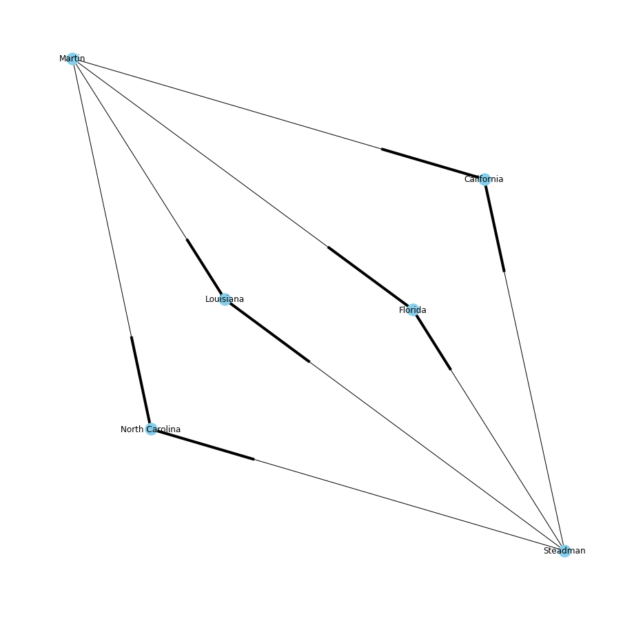
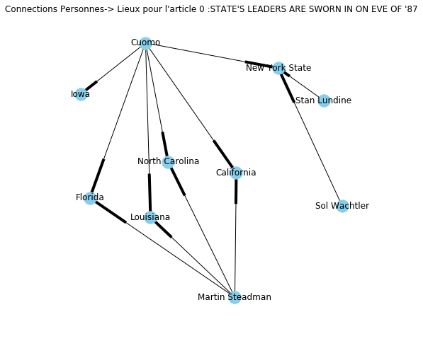
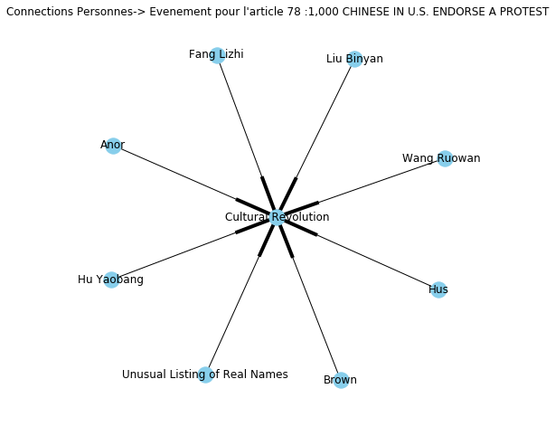

# Projet Text Mining

## Apport de données


les données quand a importé sont separés par des tabulation


```python
import pandas as pd 

# Read data from file 'filename.csv' 
# (in the same directory that your python process is based)
# Control delimiters, rows, column names with read_csv (see later) 
data = pd.read_csv("/home/toutou/nyt.csv/nyt.csv",sep='\t') 
# Preview the first 5 lines of the loaded data 
data.head()

```


<div>
<style scoped>
    .dataframe tbody tr th:only-of-type {
        vertical-align: middle;
    }

    .dataframe tbody tr th {
        vertical-align: top;
    }

    .dataframe thead th {
        text-align: right;
    }
</style>
<table border="1" class="dataframe">
  <thead>
    <tr style="text-align: right;">
      <th></th>
      <th>dates</th>
      <th>texts</th>
      <th>titles</th>
      <th>principal_classifier</th>
      <th>second_classifier</th>
      <th>third_classifier</th>
      <th>week</th>
    </tr>
  </thead>
  <tbody>
    <tr>
      <th>0</th>
      <td>1987-01-01</td>
      <td>LEAD: Governor Cuomo, with a possible Preside...</td>
      <td>STATE'S LEADERS ARE SWORN IN ON EVE OF '87</td>
      <td>politics and government</td>
      <td>LIEUTENANT GOVERNORS (US)</td>
      <td>GOVERNORS (US)</td>
      <td>1987001</td>
    </tr>
    <tr>
      <th>1</th>
      <td>1987-01-02</td>
      <td>LEAD: Fifty-eight days after winning re-elect...</td>
      <td>SECOND INAUGUAL BY CUOMO SUMS UP ACCOMPLISHMENTS</td>
      <td>politics and government</td>
      <td>INAUGURATIONS</td>
      <td>GOVERNORS (US)</td>
      <td>1987001</td>
    </tr>
    <tr>
      <th>2</th>
      <td>1987-01-02</td>
      <td>LEAD: Coming the day after Governor Cuomo ann...</td>
      <td>ALBANY PAGEANT: POMP AND POLITICS</td>
      <td>politics and government</td>
      <td>INAUGURATIONS</td>
      <td>Top/News/U.S./U.S. States</td>
      <td>1987001</td>
    </tr>
    <tr>
      <th>3</th>
      <td>1987-01-02</td>
      <td>LEAD: For the first time in two years, New Yo...</td>
      <td>LUNDINE OPTIMISTIC ABOUT NEW ROLE</td>
      <td>politics and government</td>
      <td>LIEUTENANT GOVERNORS (US)</td>
      <td>INAUGURATIONS</td>
      <td>1987001</td>
    </tr>
    <tr>
      <th>4</th>
      <td>1987-01-02</td>
      <td>LEAD: To the Editor: LEAD: To the Editor: To ...</td>
      <td>Let's Scrap That Indefensible Board of Estimate</td>
      <td>politics and government</td>
      <td>Letter</td>
      <td>Top/Opinion/Opinion/Letters</td>
      <td>1987001</td>
    </tr>
  </tbody>
</table>
</div>


```python
data.describe
```


    <bound method NDFrame.describe of            dates                                              texts  \
    0     1987-01-01   LEAD: Governor Cuomo, with a possible Preside...   
    1     1987-01-02   LEAD: Fifty-eight days after winning re-elect...   
    2     1987-01-02   LEAD: Coming the day after Governor Cuomo ann...   
    3     1987-01-02   LEAD: For the first time in two years, New Yo...   
    4     1987-01-02   LEAD: To the Editor: LEAD: To the Editor: To ...   
    5     1987-01-02   LEAD: Officially, New York State Senators and...   
    6     1987-01-02   LEAD: A six-day session of Vietnam's National...   
    7     1987-01-02   LEAD: Following is a transcript of Governor C...   
    8     1987-01-02   LEAD: West German television executives were ...   
    9     1987-01-03   LEAD: The increasing harshness of official cr...   
    10    1987-01-04   LEAD: DURING one of his periodic radio call-i...   
    11    1987-01-04   LEAD: ONE year ago this Friday, Donald R. Man...   
    12    1987-01-04   LEAD: AS Governor Cuomo was in mid news confe...   
    13    1987-01-04   LEAD: THE coming year will see the state gove...   
    14    1987-01-04   LEAD: In the address inaugurating his second ...   
    15    1987-01-05   LEAD: To the Editor: LEAD: To the Editor: To ...   
    16    1987-01-05   LEAD: With well-organized fanfare, Corazon C....   
    17    1987-01-05   LEAD: Illegal wall posters reappeared at Beij...   
    18    1987-01-06   LEAD: Claire Shulman with her husband, Melvin...   
    19    1987-01-06   LEAD: Claire Shulman, sworn in yesterday as Q...   
    20    1987-01-06   LEAD: Representative Stephen J. Solarz met wi...   
    21    1987-01-06   LEAD: Paul Keating, Australia's Treasurer, ha...   
    22    1987-01-06   LEAD: Chancellor Helmut Kohl of West Germany,...   
    23    1987-01-07   LEAD: Mayor Koch, who has been at odds with A...   
    24    1987-01-07   LEAD: Government and Communist negotiators ag...   
    25    1987-01-07   LEAD: Continuing a break with Mayor Koch, the...   
    26    1987-01-07   LEAD: Federal prosecutors met yesterday with ...   
    27    1987-01-07   LEAD: Prime Minister Leon Mebiane submitted t...   
    28    1987-01-08   LEAD: Two hours after he was elected Speaker ...   
    29    1987-01-08   LEAD: Following are excerpts from Governor Cu...   
    ...          ...                                                ...   
    7116  1994-06-16   To the Editor: "The Ghost of Mussolini Keeps ...   
    7117  1994-06-16   The Egyptian Government has arrested five mor...   
    7118  1994-06-16   President Leonid M. Kravchuk of Ukraine asked...   
    7119  1994-06-19   Twenty-five years ago, planners designed a ne...   
    7120  1994-06-20   To the Editor: You report June 12 that the po...   
    7121  1994-06-20   After a humiliating vote of no-confidence, Mi...   
    7122  1994-06-21   By a 5-to-3 margin, New Yorkers approve of th...   
    7123  1994-06-23   Some imagined that President Nelson Mandela w...   
    7124  1994-06-23   Hoping to buy leniency from the future Colomb...   
    7125  1994-06-23   Sudanese security forces have detained former...   
    7126  1994-06-24   After two months in office that were marked b...   
    7127  1994-06-25   A year after being ousted from power, Japan's...   
    7128  1994-06-26                                NEIGHBORHOOD REPORT   
    7129  1994-06-26   Last week, in the busy, final days of budget ...   
    7130  1994-06-26   There was a time when nations all over Asia t...   
    7131  1994-06-26   People in this part of Europe may yearn for t...   
    7132  1994-06-26   Ukraine has one of the weakest and least refo...   
    7133  1994-06-26   To save the reform movement he helped ignite,...   
    7134  1994-06-27   Although Haiti's army has outwardly responded...   
    7135  1994-06-28   Haiti's military strongman has said he will s...   
    7136  1994-06-29   New York State has a healthy policy requiring...   
    7137  1994-06-30   When the Socialist Party leader, Tomiichi Mur...   
    7138  1994-06-30   When the Socialist Party leader, Tomiichi Mur...   
    7139  1994-06-30   After a mayoral campaign last fall that featu...   
    7140  1994-06-30   Leon E. Panetta, President Clinton's new chie...   
    7141  1994-07-01   To the Editor: Re "Survival Test: Can Africa ...   
    7142  1994-07-01                                                NaN   
    7143  1994-07-01   Despite the magnitude of their loss Wednesday...   
    7144  1994-07-02   Reeling from electoral defeat, Italy's former...   
    7145  1994-07-02   The words rolled soberly off Gov. Pete Wilson...   
    
                                                     titles  \
    0            STATE'S LEADERS ARE SWORN IN ON EVE OF '87   
    1      SECOND INAUGUAL BY CUOMO SUMS UP ACCOMPLISHMENTS   
    2                     ALBANY PAGEANT: POMP AND POLITICS   
    3                     LUNDINE OPTIMISTIC ABOUT NEW ROLE   
    4       Let's Scrap That Indefensible Board of Estimate   
    5                                   In Lieu of the Lulu   
    6                                  LEADERS AREN'T NAMED   
    7     TRANSCRIPT OF CUOMO'S INAUGURAL ADDRESS FOR HI...   
    8                KOHL'S WRONG TAPE, AND THE CABBAGE PUN   
    9                               BEHIND CHINA'S PROTESTS   
    10    Koch Seems Little Damaged, Except for Loss of ...   
    11            A Yearlong Look at Government's Underside   
    12    ASSEMBLYMAN STANELY FINK: Quotes From the Spea...   
    13                  GOVERNOR PUSHING STATEWIDE PLANNING   
    14                                Franklin Delano Cuomo   
    15        New York Court Should Set Up Corruption Panel   
    16                 AQUINO IS WELCOMED ON CAMPAIGN TRAIL   
    17                     BEIJING POSTER ASKS A DENG REPLY   
    18      Shulman Inaugurated as Queens Borough President   
    19           SHULMAN, TAKING OFFICE, PROMISES NEW START   
    20       SOLARZ MEETS WITH PHILIPPINE COMMUNIST LEADERS   
    21    TAX TABLES SUDDENLY TURN ON THE AUSTRALIAN TRE...   
    22                                PRE-ELECTION MEETING:   
    23               Koch's Fading Links With County Chiefs   
    24           MANILA AND REBELS REACH AGREEMENT ON TALKS   
    25    BOARD OF ESTIMATE, MINUS KOCH, RETAINS PRIVATE...   
    26        TRANSPORTATION AGENCY HEARS GIULIANI'S ADVICE   
    27                              Gabon's Cabinet Resigns   
    28          ASSEMBLY'S NEW SPEAKER DISAGREES WITH CUOMO   
    29    EXCERPTS CUOMO'S STATE STATE ADDRESS TO LEGISL...   
    ...                                                 ...   
    7116  Behind Italy's Sunny Smile Hides the Whirlwind...   
    7117                                        No Headline   
    7118       Ex-Communist In Ukraine Gets President's Aid   
    7119        In Search of Democracy for Roosevelt Island   
    7120        Don't Throw History In With the Paper Clips   
    7121                    French Socialist Leader Resigns   
    7122                                Mayor's Report Card   
    7123        Mandela Is Mr. Nice Guy, Irking Some Allies   
    7124               Drug Cartel Tied to Vote In Colombia   
    7125                           Sudan Detains Ex-Premier   
    7126                Japan Leader Faces Move To Oust Him   
    7127  OPPOSITION FORCES JAPANESE PREMIER TO LEAVE OF...   
    7128        Rockefeller, Javits, Lindsay . . . Millard?   
    7129  A Reconditioned East Side G. O. P. Flexes Its ...   
    7130  June 19-25: 0 for 3 in Tokyo; Political Warfar...   
    7131           Leaders Back Free Hungary Plus Stability   
    7132               Ukrainians Voting Today In Sour Mood   
    7133  Hata's Gambit: Resignation Is Part of Bid to R...   
    7134  Split Reported in Haiti's Army, With Chief Urg...   
    7135  Haiti's Strongman Reported Ready to Retire in ...   
    7136                      Beef Up the Open Meetings Law   
    7137  TURNOVER IN JAPAN: A Startling Choice; Sociali...   
    7138  TURNOVER IN JAPAN: A Startling Choice; Sociali...   
    7139  Campaign Finance Board Offers Proposal for Vol...   
    7140   New Chief of Staff Gets Lesson on Who's the Boss   
    7141  Before We Applaud France's Mission to Rwanda;R...   
    7142            Deputy Mayor's Remark Draws Racial Fire   
    7143    Japan's Realignment: Reformers Remain Confident   
    7144                        Party in Italy Picks Leader   
    7145  Bland but Tough, Gov. Wilson Uses Lessons of N...   
    
             principal_classifier                     second_classifier  \
    0     politics and government             LIEUTENANT GOVERNORS (US)   
    1     politics and government                         INAUGURATIONS   
    2     politics and government                         INAUGURATIONS   
    3     politics and government             LIEUTENANT GOVERNORS (US)   
    4     politics and government                                Letter   
    5     politics and government                            EDITORIALS   
    6     politics and government                              Top/News   
    7     politics and government                        GOVERNORS (US)   
    8     politics and government                              NEW YEAR   
    9     politics and government              DEMONSTRATIONS AND RIOTS   
    10    politics and government                                ETHICS   
    11    politics and government                                ETHICS   
    12    politics and government                          LEGISLATURES   
    13    politics and government                      LOCAL GOVERNMENT   
    14    politics and government                            EDITORIALS   
    15    politics and government                                Letter   
    16    politics and government                         CONSTITUTIONS   
    17    politics and government                   NEWS AND NEWS MEDIA   
    18    politics and government                    BOROUGH PRESIDENTS   
    19    politics and government                    BOROUGH PRESIDENTS   
    20    politics and government                              Top/News   
    21    politics and government                              TAXATION   
    22    politics and government                             ELECTIONS   
    23    politics and government                             PATRONAGE   
    24    politics and government                              Top/News   
    25    politics and government   SUITS AND CLAIMS AGAINST GOVERNMENT   
    26    politics and government                                ETHICS   
    27    politics and government             CABINETS AND SUB-CABINETS   
    28    politics and government                              FINANCES   
    29    politics and government      STATE OF THE STATE MESSAGE (NYS)   
    ...                       ...                                   ...   
    7116  politics and government                                Letter   
    7117  politics and government                      LEGAL PROFESSION   
    7118  politics and government                             ELECTIONS   
    7119  politics and government          Top/News/New York and Region   
    7120  politics and government                                MAYORS   
    7121  politics and government                           SUSPENSIONS   
    7122  politics and government                        PUBLIC OPINION   
    7123  politics and government                              Top/News   
    7124  politics and government                               BRIBERY   
    7125  politics and government                              ARMAMENT   
    7126  politics and government                              Top/News   
    7127  politics and government                              Top/News   
    7128  politics and government          Top/News/New York and Region   
    7129  politics and government          Top/News/New York and Region   
    7130  politics and government                           SUSPENSIONS   
    7131  politics and government          LEGISLATURES AND PARLIAMENTS   
    7132  politics and government                             ELECTIONS   
    7133  politics and government                           SUSPENSIONS   
    7134  politics and government                  SANCTIONS (ECONOMIC)   
    7135  politics and government                           SUSPENSIONS   
    7136  politics and government                   LAW AND LEGISLATION   
    7137  politics and government                             Biography   
    7138  politics and government                             Biography   
    7139  politics and government                              DEBATING   
    7140  politics and government                   AIDES AND EMPLOYEES   
    7141  politics and government                                Letter   
    7142  politics and government                   NEWS AND NEWS MEDIA   
    7143  politics and government                             ELECTIONS   
    7144  politics and government                              Top/News   
    7145  politics and government                             ELECTIONS   
    
                                           third_classifier     week  
    0                                        GOVERNORS (US)  1987001  
    1                                        GOVERNORS (US)  1987001  
    2                             Top/News/U.S./U.S. States  1987001  
    3                                         INAUGURATIONS  1987001  
    4                           Top/Opinion/Opinion/Letters  1987001  
    5                                          LEGISLATURES  1987001  
    6      Top/News/World/Countries and Territories/Vietnam  1987001  
    7                                         INAUGURATIONS  1987001  
    8                                            TELEVISION  1987001  
    9                        ECONOMIC CONDITIONS AND TRENDS  1987001  
    10                          Top/Features/Week in Review  1987001  
    11                          Top/Features/Week in Review  1987001  
    12                                            Interview  1987001  
    13                                            HOME RULE  1987001  
    14                        PRESIDENTIAL ELECTION OF 1988  1987001  
    15                          Top/Opinion/Opinion/Letters  1987002  
    16                                            ELECTIONS  1987002  
    17                                             Top/News  1987002  
    18                                              Caption  1987002  
    19                                               ETHICS  1987002  
    20     Top/News/World/Countries and Territories/Phil...  1987002  
    21                                           INCOME TAX  1987002  
    22                                              Caption  1987002  
    23                                               ETHICS  1987002  
    24     Top/News/World/Countries and Territories/Phil...  1987002  
    25                                        CONSTITUTIONS  1987002  
    26                            REFORM AND REORGANIZATION  1987002  
    27                                          SUSPENSIONS  1987002  
    28                                BUDGETS AND BUDGETING  1987002  
    29                                                 Text  1987002  
    ...                                                 ...      ...  
    7116                        Top/Opinion/Opinion/Letters  1994024  
    7117                           FREEDOM AND HUMAN RIGHTS  1994024  
    7118                 APPOINTMENTS AND EXECUTIVE CHANGES  1994024  
    7119              Top/News/New York and Region/The City  1994024  
    7120                              BUDGETS AND BUDGETING  1994025  
    7121                        DISMISSALS AND RESIGNATIONS  1994025  
    7122                                             MAYORS  1994025  
    7123                                     Top/News/World  1994025  
    7124                               FRAUDS AND SWINDLING  1994025  
    7125                        DEFENSE AND MILITARY FORCES  1994025  
    7126     Top/News/World/Countries and Territories/Japan  1994025  
    7127     Top/News/World/Countries and Territories/Japan  1994025  
    7128              Top/News/New York and Region/The City  1994025  
    7129              Top/News/New York and Region/The City  1994025  
    7130                        DISMISSALS AND RESIGNATIONS  1994025  
    7131                                          ELECTIONS  1994025  
    7132                     ECONOMIC CONDITIONS AND TRENDS  1994025  
    7133                        DISMISSALS AND RESIGNATIONS  1994025  
    7134              UNITED STATES INTERNATIONAL RELATIONS  1994026  
    7135                        DISMISSALS AND RESIGNATIONS  1994026  
    7136                                         EDITORIALS  1994026  
    7137                                      News Analysis  1994026  
    7138                                      News Analysis  1994026  
    7139                                           FINANCES  1994026  
    7140   Top/News/World/Countries and Territories/Unit...  1994026  
    7141                        Top/Opinion/Opinion/Letters  1994026  
    7142                                            Caption  1994026  
    7143             REGULATION AND DEREGULATION OFINDUSTRY  1994026  
    7144     Top/News/World/Countries and Territories/Italy  1994026  
    7145                                     GOVERNORS (US)  1994026  
    
    [7146 rows x 7 columns]>


```python
data.texts[0]

```


    " LEAD: Governor Cuomo, with a possible Presidential campaign waiting in the wings, took the oath of office New Year's Eve for a second term as New York's chief executive. LEAD: Governor Cuomo, with a possible Presidential campaign waiting in the wings, took the oath of office New Year's Eve for a second term as New York's chief executive. Governor Cuomo, with a possible Presidential campaign waiting in the wings, took the oath of office New Year's Eve for a second term as New York's chief executive. The official oath was administered to Mr. Cuomo by Sol Wachtler, Chief Judge of New York State, during a private ceremony tonight at the Governor's Mansion. ''What we have to do now is spend four more years trying to provide other people in this state with the kind of magnificent opportunities that we've had,'' Mr. Cuomo told a small group of friends and relatives after taking his oath. ''We worked very hard the last four years, we'll work even harder in the four years ahead.'' Before taking his oath of office, Mr. Cuomo, a licensed notary public, swore in his new lieutenant governor, Stan Lundine. While the two Democrats took their official oaths of office on New Year's Eve to meet requirements of the state constitution, a public inauguration ceremony was to be held on New Year's Day at the Empire State Plaza adjacent to the State Capitol. State workers were busy today putting up the last of the red, white and blue bunting for the event. Mr. Cuomo spent some time in the Convention Center hall practicing his speech. Mr. Cuomo said a few days after his re-election that he was going to begin thinking about running for President. He has yet to announce any decision. Nonetheless, just before the ceremony tonight, aides to the Governor said that he would be traveling to five other states, including Iowa, in the next several months. Iowa is the site of the nation's first Presidential party caucuses. Cuomo also plans to travel to California, Florida, Louisiana and North Carolina, said a spokesman, Martin Steadman."


## Exploration des differentes possiblités pour exploiter la librairy Spacy pour extraire les entités (Descripteur de Personnes des Lieux et des Evenements)

On commence par appliquer les differents traitements sur un seul fichier


```python
import spacy
from collections import Counter
#from collections import Counter
#import en_core_web_sm
nlp = spacy.load('en')
article = nlp(data.texts[0])
#article = nlp(ny_bb)
#print(doc.text)
for token in article:
    print(token.text, token.pos_, token.dep_,token.ent_type_,token.tag_)


```

      SPACE   _SP
    LEAD NOUN ROOT  NN
    : PUNCT punct  :
    Governor PROPN compound  NNP
    Cuomo PROPN nsubj PERSON NNP
    , PUNCT punct  ,
    with ADP prep  IN
    a DET det  DT
    possible ADJ amod  JJ
    Presidential ADJ amod  JJ
    campaign NOUN pobj  NN
    waiting VERB acl  VBG
    in ADP prep  IN
    the DET det  DT
    wings NOUN pobj  NNS
    , PUNCT punct  ,
    took VERB ROOT  VBD
    the DET det  DT
    oath NOUN dobj  NN
    of ADP prep  IN
    office NOUN nmod  NN
    New PROPN compound EVENT NNP
    Year PROPN poss EVENT NNP
    's PART case EVENT POS
    Eve PROPN pobj EVENT NNP
    for ADP prep  IN
    a DET det  DT
    second ADJ amod ORDINAL JJ
    term NOUN pobj  NN
    as SCONJ prep  IN
    New PROPN compound GPE NNP
    York PROPN poss GPE NNP
    's PART case GPE POS
    chief ADJ amod  JJ
    executive NOUN pobj  NN
    . PUNCT punct  .
    LEAD PROPN ROOT  NNP
    : PUNCT punct  :
    Governor PROPN compound  NNP
    Cuomo PROPN nsubj PERSON NNP
    , PUNCT punct  ,
    with ADP prep  IN
    a DET det  DT
    possible ADJ amod  JJ
    Presidential ADJ amod  JJ
    campaign NOUN pobj  NN
    waiting VERB acl  VBG
    in ADP prep  IN
    the DET det  DT
    wings NOUN pobj  NNS
    , PUNCT punct  ,
    took VERB ROOT  VBD
    the DET det  DT
    oath NOUN dobj  NN
    of ADP prep  IN
    office NOUN nmod  NN
    New PROPN compound EVENT NNP
    Year PROPN poss EVENT NNP
    's PART case EVENT POS
    Eve PROPN pobj EVENT NNP
    for ADP prep  IN
    a DET det  DT
    second ADJ amod ORDINAL JJ
    term NOUN pobj  NN
    as SCONJ prep  IN
    New PROPN compound GPE NNP
    York PROPN poss GPE NNP
    's PART case GPE POS
    chief ADJ amod  JJ
    executive NOUN pobj  NN
    . PUNCT punct  .
    Governor PROPN compound  NNP
    Cuomo PROPN nsubj PERSON NNP
    , PUNCT punct  ,
    with ADP prep  IN
    a DET det  DT
    possible ADJ amod  JJ
    Presidential ADJ amod  JJ
    campaign NOUN pobj  NN
    waiting VERB acl  VBG
    in ADP prep  IN
    the DET det  DT
    wings NOUN pobj  NNS
    , PUNCT punct  ,
    took VERB ROOT  VBD
    the DET det  DT
    oath NOUN dobj  NN
    of ADP prep  IN
    office NOUN nmod  NN
    New PROPN compound EVENT NNP
    Year PROPN poss EVENT NNP
    's PART case EVENT POS
    Eve PROPN pobj EVENT NNP
    for ADP prep  IN
    a DET det  DT
    second ADJ amod ORDINAL JJ
    term NOUN pobj  NN
    as SCONJ prep  IN
    New PROPN compound GPE NNP
    York PROPN poss GPE NNP
    's PART case GPE POS
    chief ADJ amod  JJ
    executive NOUN pobj  NN
    . PUNCT punct  .
    The DET det  DT
    official ADJ amod  JJ
    oath NOUN nsubjpass  NN
    was AUX auxpass  VBD
    administered VERB ROOT  VBN
    to ADP prep  IN
    Mr. PROPN compound  NNP
    Cuomo PROPN pobj PERSON NNP
    by ADP agent  IN
    Sol PROPN compound PERSON NNP
    Wachtler PROPN pobj PERSON NNP
    , PUNCT punct  ,
    Chief PROPN compound  NNP
    Judge PROPN appos  NNP
    of ADP prep  IN
    New PROPN compound GPE NNP
    York PROPN compound GPE NNP
    State PROPN pobj GPE NNP
    , PUNCT punct  ,
    during ADP prep  IN
    a DET det  DT
    private ADJ amod  JJ
    ceremony NOUN pobj  NN
    tonight NOUN npadvmod TIME NN
    at ADP prep  IN
    the DET det FAC DT
    Governor PROPN poss FAC NNP
    's PART case FAC POS
    Mansion PROPN pobj FAC NNP
    . PUNCT punct  .
    ' PUNCT punct  ''
    ' PUNCT ROOT  ''
    What PRON dobj  WP
    we PRON nsubj  PRP
    have AUX csubj  VBP
    to PART aux  TO
    do AUX xcomp  VB
    now ADV advmod  RB
    is AUX auxpass  VBZ
    spend VERB ROOT  VB
    four NUM nummod DATE CD
    more ADJ amod DATE JJR
    years NOUN dobj DATE NNS
    trying VERB xcomp  VBG
    to PART aux  TO
    provide VERB xcomp  VB
    other ADJ amod  JJ
    people NOUN dobj  NNS
    in ADP prep  IN
    this DET det  DT
    state NOUN pobj  NN
    with ADP prep  IN
    the DET det  DT
    kind NOUN pobj  NN
    of ADP prep  IN
    magnificent ADJ amod  JJ
    opportunities NOUN pobj  NNS
    that DET dobj  WDT
    we PRON nsubj  PRP
    've AUX aux  VB
    had VERB relcl  VBN
    , PUNCT punct  ,
    ' PUNCT punct  ''
    ' PUNCT punct  ''
    Mr. PROPN compound  NNP
    Cuomo PROPN nsubj PERSON NNP
    told VERB ROOT  VBD
    a DET det  DT
    small ADJ amod  JJ
    group NOUN dobj  NN
    of ADP prep  IN
    friends NOUN pobj  NNS
    and CCONJ cc  CC
    relatives NOUN conj  NNS
    after ADP prep  IN
    taking VERB pcomp  VBG
    his DET poss  PRP$
    oath NOUN dobj  NN
    . PUNCT punct  .
    ' PUNCT punct  ''
    ' PUNCT ROOT  ''
    We PRON nsubj  PRP
    worked VERB ccomp  VBD
    very ADV advmod  RB
    hard ADV advmod  RB
    the DET det DATE DT
    last ADJ amod DATE JJ
    four NUM nummod DATE CD
    years NOUN npadvmod DATE NNS
    , PUNCT punct  ,
    we PRON nsubj  PRP
    'll VERB aux  MD
    work VERB ROOT  VB
    even ADV advmod  RB
    harder ADV advmod  RBR
    in ADP prep  IN
    the DET det DATE DT
    four NUM nummod DATE CD
    years NOUN pobj DATE NNS
    ahead ADV advmod DATE RB
    . PUNCT punct  .
    ' PUNCT punct  ''
    ' PUNCT punct  ''
    Before ADP prep  IN
    taking VERB pcomp  VBG
    his DET poss  PRP$
    oath NOUN dobj  NN
    of ADP prep  IN
    office NOUN pobj  NN
    , PUNCT punct  ,
    Mr. PROPN compound  NNP
    Cuomo PROPN nsubj PERSON NNP
    , PUNCT punct  ,
    a DET det  DT
    licensed ADJ amod  JJ
    notary ADJ amod  JJ
    public NOUN appos  NN
    , PUNCT punct  ,
    swore VERB ROOT  VBD
    in ADP prep  IN
    his DET poss  PRP$
    new ADJ amod  JJ
    lieutenant NOUN compound  NN
    governor NOUN pobj  NN
    , PUNCT punct  ,
    Stan PROPN compound PERSON NNP
    Lundine PROPN appos PERSON NNP
    . PUNCT punct  .
    While SCONJ mark  IN
    the DET det  DT
    two NUM nummod CARDINAL CD
    Democrats PROPN nsubj NORP NNPS
    took VERB advcl  VBD
    their DET poss  PRP$
    official ADJ amod  JJ
    oaths NOUN dobj  NNS
    of ADP prep  IN
    office NOUN pobj  NN
    on ADP prep  IN
    New PROPN compound EVENT NNP
    Year PROPN poss EVENT NNP
    's PART case EVENT POS
    Eve PROPN pobj EVENT NNP
    to PART aux  TO
    meet VERB advcl  VB
    requirements NOUN dobj  NNS
    of ADP prep  IN
    the DET det  DT
    state NOUN compound  NN
    constitution NOUN pobj  NN
    , PUNCT punct  ,
    a DET det  DT
    public ADJ amod  JJ
    inauguration NOUN compound  NN
    ceremony NOUN nsubj  NN
    was AUX ROOT  VBD
    to PART aux  TO
    be AUX auxpass  VB
    held VERB xcomp  VBN
    on ADP prep  IN
    New PROPN compound EVENT NNP
    Year PROPN poss EVENT NNP
    's PART case EVENT POS
    Day NOUN pobj EVENT NN
    at ADP prep  IN
    the DET det FAC DT
    Empire PROPN compound FAC NNP
    State PROPN compound FAC NNP
    Plaza PROPN pobj FAC NNP
    adjacent ADJ advmod  JJ
    to ADP prep  IN
    the DET det  DT
    State PROPN compound ORG NNP
    Capitol PROPN pobj PRODUCT NNP
    . PUNCT punct  .
    State NOUN compound  NN
    workers NOUN nsubj  NNS
    were AUX ROOT  VBD
    busy ADJ acomp  JJ
    today NOUN npadvmod DATE NN
    putting VERB advcl  VBG
    up ADP prt  RP
    the DET det  DT
    last NOUN dobj  NN
    of ADP prep  IN
    the DET det  DT
    red ADJ amod  JJ
    , PUNCT punct  ,
    white ADJ conj  JJ
    and CCONJ cc  CC
    blue ADJ conj  JJ
    bunting NOUN pobj  NN
    for ADP prep  IN
    the DET det  DT
    event NOUN pobj  NN
    . PUNCT punct  .
    Mr. PROPN compound  NNP
    Cuomo PROPN nsubj PERSON NNP
    spent VERB ROOT  VBD
    some DET det  DT
    time NOUN dobj  NN
    in ADP prep  IN
    the DET det  DT
    Convention PROPN compound FAC NNP
    Center PROPN compound FAC NNP
    hall NOUN pobj  NN
    practicing VERB advcl  VBG
    his DET poss  PRP$
    speech NOUN dobj  NN
    . PUNCT punct  .
    Mr. PROPN compound  NNP
    Cuomo PROPN nsubj PERSON NNP
    said VERB ROOT  VBD
    a DET det DATE DT
    few ADJ amod DATE JJ
    days NOUN npadvmod DATE NNS
    after ADP prep  IN
    his DET poss  PRP$
    re NOUN dep  NN
    - NOUN dep  NN
    election NOUN pobj  NN
    that DET dobj  WDT
    he PRON nsubj  PRP
    was AUX aux  VBD
    going VERB relcl  VBG
    to PART aux  TO
    begin VERB xcomp  VB
    thinking VERB xcomp  VBG
    about ADP prep  IN
    running VERB pcomp  VBG
    for ADP prep  IN
    President PROPN pobj  NNP
    . PUNCT punct  .
    He PRON nsubj  PRP
    has AUX ROOT  VBZ
    yet ADV advmod  RB
    to PART aux  TO
    announce VERB xcomp  VB
    any DET det  DT
    decision NOUN dobj  NN
    . PUNCT punct  .
    Nonetheless ADV advmod  RB
    , PUNCT punct  ,
    just ADV advmod  RB
    before ADP prep  IN
    the DET det  DT
    ceremony NOUN pobj  NN
    tonight NOUN npadvmod TIME NN
    , PUNCT punct  ,
    aides NOUN nsubj  NNS
    to ADP prep  IN
    the DET det  DT
    Governor PROPN pobj  NNP
    said VERB ROOT  VBD
    that SCONJ mark  IN
    he PRON nsubj  PRP
    would VERB aux  MD
    be AUX aux  VB
    traveling VERB ccomp  VBG
    to ADP prep  IN
    five NUM nummod CARDINAL CD
    other ADJ amod  JJ
    states NOUN pobj  NNS
    , PUNCT punct  ,
    including VERB prep  VBG
    Iowa PROPN pobj GPE NNP
    , PUNCT punct  ,
    in ADP prep  IN
    the DET det DATE DT
    next ADJ amod DATE JJ
    several ADJ amod DATE JJ
    months NOUN pobj DATE NNS
    . PUNCT punct  .
    Iowa PROPN nsubj GPE NNP
    is AUX ROOT  VBZ
    the DET det  DT
    site NOUN attr  NN
    of ADP prep  IN
    the DET det  DT
    nation NOUN poss  NN
    's PART case  POS
    first ADJ amod ORDINAL JJ
    Presidential ADJ amod  JJ
    party NOUN compound  NN
    caucuses NOUN pobj  NNS
    . PUNCT punct  .
    Cuomo PROPN nsubj PERSON NNP
    also ADV advmod  RB
    plans VERB ccomp  VBZ
    to PART aux  TO
    travel VERB xcomp  VB
    to ADP prep  IN
    California PROPN pobj GPE NNP
    , PUNCT punct  ,
    Florida PROPN conj GPE NNP
    , PUNCT punct  ,
    Louisiana PROPN conj GPE NNP
    and CCONJ cc  CC
    North PROPN compound GPE NNP
    Carolina PROPN conj GPE NNP
    , PUNCT punct  ,
    said VERB ROOT  VBD
    a DET det  DT
    spokesman NOUN nsubj  NN
    , PUNCT punct  ,
    Martin PROPN compound PERSON NNP
    Steadman PROPN appos PERSON NNP
    . PUNCT punct  .


```python
(article.ents)

```


    (Cuomo,
     New Year's Eve,
     second,
     New York's,
     Cuomo,
     New Year's Eve,
     second,
     New York's,
     Cuomo,
     New Year's Eve,
     second,
     New York's,
     Cuomo,
     Sol Wachtler,
     New York State,
     tonight,
     the Governor's Mansion,
     four more years,
     Cuomo,
     the last four years,
     the four years ahead,
     Cuomo,
     Stan Lundine,
     two,
     Democrats,
     New Year's Eve,
     New Year's Day,
     the Empire State Plaza,
     State,
     Capitol,
     today,
     Cuomo,
     Convention Center,
     Cuomo,
     a few days,
     tonight,
     five,
     Iowa,
     the next several months,
     Iowa,
     first,
     Cuomo,
     California,
     Florida,
     Louisiana,
     North Carolina,
     Martin Steadman)


```python
labels = [x.label_ for x in article.ents]
Counter(labels)
```


    Counter({'CARDINAL': 2,
             'DATE': 6,
             'EVENT': 5,
             'FAC': 3,
             'GPE': 10,
             'NORP': 1,
             'ORDINAL': 4,
             'ORG': 1,
             'PERSON': 12,
             'PRODUCT': 1,
             'TIME': 2})


```python
from spacy import displacy
sentences = [x for x in article.sents]
#sentences
displacy.render(nlp(str(sentences[1])), jupyter=True, style='dep')
```


<svg xmlns="http://www.w3.org/2000/svg" xmlns:xlink="http://www.w3.org/1999/xlink" xml:lang="en" id="6000273eff574bdc84bb5996bf2b7292-0" class="displacy" width="5300" height="749.5" direction="ltr" style="max-width: none; height: 749.5px; color: #000000; background: #ffffff; font-family: Arial; direction: ltr">
<text class="displacy-token" fill="currentColor" text-anchor="middle" y="659.5">
    <tspan class="displacy-word" fill="currentColor" x="50">Governor</tspan>
    <tspan class="displacy-tag" dy="2em" fill="currentColor" x="50">PROPN</tspan>
</text>

<text class="displacy-token" fill="currentColor" text-anchor="middle" y="659.5">
    <tspan class="displacy-word" fill="currentColor" x="225">Cuomo,</tspan>
    <tspan class="displacy-tag" dy="2em" fill="currentColor" x="225">PROPN</tspan>
</text>

<text class="displacy-token" fill="currentColor" text-anchor="middle" y="659.5">
    <tspan class="displacy-word" fill="currentColor" x="400">with</tspan>
    <tspan class="displacy-tag" dy="2em" fill="currentColor" x="400">ADP</tspan>
</text>

<text class="displacy-token" fill="currentColor" text-anchor="middle" y="659.5">
    <tspan class="displacy-word" fill="currentColor" x="575">a</tspan>
    <tspan class="displacy-tag" dy="2em" fill="currentColor" x="575">DET</tspan>
</text>

<text class="displacy-token" fill="currentColor" text-anchor="middle" y="659.5">
    <tspan class="displacy-word" fill="currentColor" x="750">possible</tspan>
    <tspan class="displacy-tag" dy="2em" fill="currentColor" x="750">ADJ</tspan>
</text>

<text class="displacy-token" fill="currentColor" text-anchor="middle" y="659.5">
    <tspan class="displacy-word" fill="currentColor" x="925">Presidential</tspan>
    <tspan class="displacy-tag" dy="2em" fill="currentColor" x="925">ADJ</tspan>
</text>

<text class="displacy-token" fill="currentColor" text-anchor="middle" y="659.5">
    <tspan class="displacy-word" fill="currentColor" x="1100">campaign</tspan>
    <tspan class="displacy-tag" dy="2em" fill="currentColor" x="1100">NOUN</tspan>
</text>

<text class="displacy-token" fill="currentColor" text-anchor="middle" y="659.5">
    <tspan class="displacy-word" fill="currentColor" x="1275">waiting</tspan>
    <tspan class="displacy-tag" dy="2em" fill="currentColor" x="1275">VERB</tspan>
</text>

<text class="displacy-token" fill="currentColor" text-anchor="middle" y="659.5">
    <tspan class="displacy-word" fill="currentColor" x="1450">in</tspan>
    <tspan class="displacy-tag" dy="2em" fill="currentColor" x="1450">ADP</tspan>
</text>

<text class="displacy-token" fill="currentColor" text-anchor="middle" y="659.5">
    <tspan class="displacy-word" fill="currentColor" x="1625">the</tspan>
    <tspan class="displacy-tag" dy="2em" fill="currentColor" x="1625">DET</tspan>
</text>

<text class="displacy-token" fill="currentColor" text-anchor="middle" y="659.5">
    <tspan class="displacy-word" fill="currentColor" x="1800">wings,</tspan>
    <tspan class="displacy-tag" dy="2em" fill="currentColor" x="1800">NOUN</tspan>
</text>

<text class="displacy-token" fill="currentColor" text-anchor="middle" y="659.5">
    <tspan class="displacy-word" fill="currentColor" x="1975">took</tspan>
    <tspan class="displacy-tag" dy="2em" fill="currentColor" x="1975">VERB</tspan>
</text>

<text class="displacy-token" fill="currentColor" text-anchor="middle" y="659.5">
    <tspan class="displacy-word" fill="currentColor" x="2150">the</tspan>
    <tspan class="displacy-tag" dy="2em" fill="currentColor" x="2150">DET</tspan>
</text>

<text class="displacy-token" fill="currentColor" text-anchor="middle" y="659.5">
    <tspan class="displacy-word" fill="currentColor" x="2325">oath</tspan>
    <tspan class="displacy-tag" dy="2em" fill="currentColor" x="2325">NOUN</tspan>
</text>

<text class="displacy-token" fill="currentColor" text-anchor="middle" y="659.5">
    <tspan class="displacy-word" fill="currentColor" x="2500">of</tspan>
    <tspan class="displacy-tag" dy="2em" fill="currentColor" x="2500">ADP</tspan>
</text>

<text class="displacy-token" fill="currentColor" text-anchor="middle" y="659.5">
    <tspan class="displacy-word" fill="currentColor" x="2675">office</tspan>
    <tspan class="displacy-tag" dy="2em" fill="currentColor" x="2675">NOUN</tspan>
</text>

<text class="displacy-token" fill="currentColor" text-anchor="middle" y="659.5">
    <tspan class="displacy-word" fill="currentColor" x="2850">New</tspan>
    <tspan class="displacy-tag" dy="2em" fill="currentColor" x="2850">PROPN</tspan>
</text>

<text class="displacy-token" fill="currentColor" text-anchor="middle" y="659.5">
    <tspan class="displacy-word" fill="currentColor" x="3025">Year</tspan>
    <tspan class="displacy-tag" dy="2em" fill="currentColor" x="3025">PROPN</tspan>
</text>

<text class="displacy-token" fill="currentColor" text-anchor="middle" y="659.5">
    <tspan class="displacy-word" fill="currentColor" x="3200">'s</tspan>
    <tspan class="displacy-tag" dy="2em" fill="currentColor" x="3200">PART</tspan>
</text>

<text class="displacy-token" fill="currentColor" text-anchor="middle" y="659.5">
    <tspan class="displacy-word" fill="currentColor" x="3375">Eve</tspan>
    <tspan class="displacy-tag" dy="2em" fill="currentColor" x="3375">PROPN</tspan>
</text>

<text class="displacy-token" fill="currentColor" text-anchor="middle" y="659.5">
    <tspan class="displacy-word" fill="currentColor" x="3550">for</tspan>
    <tspan class="displacy-tag" dy="2em" fill="currentColor" x="3550">ADP</tspan>
</text>

<text class="displacy-token" fill="currentColor" text-anchor="middle" y="659.5">
    <tspan class="displacy-word" fill="currentColor" x="3725">a</tspan>
    <tspan class="displacy-tag" dy="2em" fill="currentColor" x="3725">DET</tspan>
</text>

<text class="displacy-token" fill="currentColor" text-anchor="middle" y="659.5">
    <tspan class="displacy-word" fill="currentColor" x="3900">second</tspan>
    <tspan class="displacy-tag" dy="2em" fill="currentColor" x="3900">ADJ</tspan>
</text>

<text class="displacy-token" fill="currentColor" text-anchor="middle" y="659.5">
    <tspan class="displacy-word" fill="currentColor" x="4075">term</tspan>
    <tspan class="displacy-tag" dy="2em" fill="currentColor" x="4075">NOUN</tspan>
</text>

<text class="displacy-token" fill="currentColor" text-anchor="middle" y="659.5">
    <tspan class="displacy-word" fill="currentColor" x="4250">as</tspan>
    <tspan class="displacy-tag" dy="2em" fill="currentColor" x="4250">SCONJ</tspan>
</text>

<text class="displacy-token" fill="currentColor" text-anchor="middle" y="659.5">
    <tspan class="displacy-word" fill="currentColor" x="4425">New</tspan>
    <tspan class="displacy-tag" dy="2em" fill="currentColor" x="4425">PROPN</tspan>
</text>

<text class="displacy-token" fill="currentColor" text-anchor="middle" y="659.5">
    <tspan class="displacy-word" fill="currentColor" x="4600">York</tspan>
    <tspan class="displacy-tag" dy="2em" fill="currentColor" x="4600">PROPN</tspan>
</text>

<text class="displacy-token" fill="currentColor" text-anchor="middle" y="659.5">
    <tspan class="displacy-word" fill="currentColor" x="4775">'s</tspan>
    <tspan class="displacy-tag" dy="2em" fill="currentColor" x="4775">PART</tspan>
</text>

<text class="displacy-token" fill="currentColor" text-anchor="middle" y="659.5">
    <tspan class="displacy-word" fill="currentColor" x="4950">chief</tspan>
    <tspan class="displacy-tag" dy="2em" fill="currentColor" x="4950">ADJ</tspan>
</text>

<text class="displacy-token" fill="currentColor" text-anchor="middle" y="659.5">
    <tspan class="displacy-word" fill="currentColor" x="5125">executive.</tspan>
    <tspan class="displacy-tag" dy="2em" fill="currentColor" x="5125">NOUN</tspan>
</text>

<g class="displacy-arrow">
    <path class="displacy-arc" id="arrow-6000273eff574bdc84bb5996bf2b7292-0-0" stroke-width="2px" d="M70,614.5 C70,527.0 195.0,527.0 195.0,614.5" fill="none" stroke="currentColor"/>
    <text dy="1.25em" style="font-size: 0.8em; letter-spacing: 1px">
        <textPath xlink:href="#arrow-6000273eff574bdc84bb5996bf2b7292-0-0" class="displacy-label" startOffset="50%" side="left" fill="currentColor" text-anchor="middle">compound</textPath>
    </text>
    <path class="displacy-arrowhead" d="M70,616.5 L62,604.5 78,604.5" fill="currentColor"/>
</g>

<g class="displacy-arrow">
    <path class="displacy-arc" id="arrow-6000273eff574bdc84bb5996bf2b7292-0-1" stroke-width="2px" d="M245,614.5 C245,2.0 1975.0,2.0 1975.0,614.5" fill="none" stroke="currentColor"/>
    <text dy="1.25em" style="font-size: 0.8em; letter-spacing: 1px">
        <textPath xlink:href="#arrow-6000273eff574bdc84bb5996bf2b7292-0-1" class="displacy-label" startOffset="50%" side="left" fill="currentColor" text-anchor="middle">nsubj</textPath>
    </text>
    <path class="displacy-arrowhead" d="M245,616.5 L237,604.5 253,604.5" fill="currentColor"/>
</g>

<g class="displacy-arrow">
    <path class="displacy-arc" id="arrow-6000273eff574bdc84bb5996bf2b7292-0-2" stroke-width="2px" d="M245,614.5 C245,527.0 370.0,527.0 370.0,614.5" fill="none" stroke="currentColor"/>
    <text dy="1.25em" style="font-size: 0.8em; letter-spacing: 1px">
        <textPath xlink:href="#arrow-6000273eff574bdc84bb5996bf2b7292-0-2" class="displacy-label" startOffset="50%" side="left" fill="currentColor" text-anchor="middle">prep</textPath>
    </text>
    <path class="displacy-arrowhead" d="M370.0,616.5 L378.0,604.5 362.0,604.5" fill="currentColor"/>
</g>

<g class="displacy-arrow">
    <path class="displacy-arc" id="arrow-6000273eff574bdc84bb5996bf2b7292-0-3" stroke-width="2px" d="M595,614.5 C595,352.0 1080.0,352.0 1080.0,614.5" fill="none" stroke="currentColor"/>
    <text dy="1.25em" style="font-size: 0.8em; letter-spacing: 1px">
        <textPath xlink:href="#arrow-6000273eff574bdc84bb5996bf2b7292-0-3" class="displacy-label" startOffset="50%" side="left" fill="currentColor" text-anchor="middle">det</textPath>
    </text>
    <path class="displacy-arrowhead" d="M595,616.5 L587,604.5 603,604.5" fill="currentColor"/>
</g>

<g class="displacy-arrow">
    <path class="displacy-arc" id="arrow-6000273eff574bdc84bb5996bf2b7292-0-4" stroke-width="2px" d="M770,614.5 C770,439.5 1075.0,439.5 1075.0,614.5" fill="none" stroke="currentColor"/>
    <text dy="1.25em" style="font-size: 0.8em; letter-spacing: 1px">
        <textPath xlink:href="#arrow-6000273eff574bdc84bb5996bf2b7292-0-4" class="displacy-label" startOffset="50%" side="left" fill="currentColor" text-anchor="middle">amod</textPath>
    </text>
    <path class="displacy-arrowhead" d="M770,616.5 L762,604.5 778,604.5" fill="currentColor"/>
</g>

<g class="displacy-arrow">
    <path class="displacy-arc" id="arrow-6000273eff574bdc84bb5996bf2b7292-0-5" stroke-width="2px" d="M945,614.5 C945,527.0 1070.0,527.0 1070.0,614.5" fill="none" stroke="currentColor"/>
    <text dy="1.25em" style="font-size: 0.8em; letter-spacing: 1px">
        <textPath xlink:href="#arrow-6000273eff574bdc84bb5996bf2b7292-0-5" class="displacy-label" startOffset="50%" side="left" fill="currentColor" text-anchor="middle">amod</textPath>
    </text>
    <path class="displacy-arrowhead" d="M945,616.5 L937,604.5 953,604.5" fill="currentColor"/>
</g>

<g class="displacy-arrow">
    <path class="displacy-arc" id="arrow-6000273eff574bdc84bb5996bf2b7292-0-6" stroke-width="2px" d="M420,614.5 C420,264.5 1085.0,264.5 1085.0,614.5" fill="none" stroke="currentColor"/>
    <text dy="1.25em" style="font-size: 0.8em; letter-spacing: 1px">
        <textPath xlink:href="#arrow-6000273eff574bdc84bb5996bf2b7292-0-6" class="displacy-label" startOffset="50%" side="left" fill="currentColor" text-anchor="middle">pobj</textPath>
    </text>
    <path class="displacy-arrowhead" d="M1085.0,616.5 L1093.0,604.5 1077.0,604.5" fill="currentColor"/>
</g>

<g class="displacy-arrow">
    <path class="displacy-arc" id="arrow-6000273eff574bdc84bb5996bf2b7292-0-7" stroke-width="2px" d="M1120,614.5 C1120,527.0 1245.0,527.0 1245.0,614.5" fill="none" stroke="currentColor"/>
    <text dy="1.25em" style="font-size: 0.8em; letter-spacing: 1px">
        <textPath xlink:href="#arrow-6000273eff574bdc84bb5996bf2b7292-0-7" class="displacy-label" startOffset="50%" side="left" fill="currentColor" text-anchor="middle">acl</textPath>
    </text>
    <path class="displacy-arrowhead" d="M1245.0,616.5 L1253.0,604.5 1237.0,604.5" fill="currentColor"/>
</g>

<g class="displacy-arrow">
    <path class="displacy-arc" id="arrow-6000273eff574bdc84bb5996bf2b7292-0-8" stroke-width="2px" d="M1295,614.5 C1295,527.0 1420.0,527.0 1420.0,614.5" fill="none" stroke="currentColor"/>
    <text dy="1.25em" style="font-size: 0.8em; letter-spacing: 1px">
        <textPath xlink:href="#arrow-6000273eff574bdc84bb5996bf2b7292-0-8" class="displacy-label" startOffset="50%" side="left" fill="currentColor" text-anchor="middle">prep</textPath>
    </text>
    <path class="displacy-arrowhead" d="M1420.0,616.5 L1428.0,604.5 1412.0,604.5" fill="currentColor"/>
</g>

<g class="displacy-arrow">
    <path class="displacy-arc" id="arrow-6000273eff574bdc84bb5996bf2b7292-0-9" stroke-width="2px" d="M1645,614.5 C1645,527.0 1770.0,527.0 1770.0,614.5" fill="none" stroke="currentColor"/>
    <text dy="1.25em" style="font-size: 0.8em; letter-spacing: 1px">
        <textPath xlink:href="#arrow-6000273eff574bdc84bb5996bf2b7292-0-9" class="displacy-label" startOffset="50%" side="left" fill="currentColor" text-anchor="middle">det</textPath>
    </text>
    <path class="displacy-arrowhead" d="M1645,616.5 L1637,604.5 1653,604.5" fill="currentColor"/>
</g>

<g class="displacy-arrow">
    <path class="displacy-arc" id="arrow-6000273eff574bdc84bb5996bf2b7292-0-10" stroke-width="2px" d="M1470,614.5 C1470,439.5 1775.0,439.5 1775.0,614.5" fill="none" stroke="currentColor"/>
    <text dy="1.25em" style="font-size: 0.8em; letter-spacing: 1px">
        <textPath xlink:href="#arrow-6000273eff574bdc84bb5996bf2b7292-0-10" class="displacy-label" startOffset="50%" side="left" fill="currentColor" text-anchor="middle">pobj</textPath>
    </text>
    <path class="displacy-arrowhead" d="M1775.0,616.5 L1783.0,604.5 1767.0,604.5" fill="currentColor"/>
</g>

<g class="displacy-arrow">
    <path class="displacy-arc" id="arrow-6000273eff574bdc84bb5996bf2b7292-0-11" stroke-width="2px" d="M2170,614.5 C2170,527.0 2295.0,527.0 2295.0,614.5" fill="none" stroke="currentColor"/>
    <text dy="1.25em" style="font-size: 0.8em; letter-spacing: 1px">
        <textPath xlink:href="#arrow-6000273eff574bdc84bb5996bf2b7292-0-11" class="displacy-label" startOffset="50%" side="left" fill="currentColor" text-anchor="middle">det</textPath>
    </text>
    <path class="displacy-arrowhead" d="M2170,616.5 L2162,604.5 2178,604.5" fill="currentColor"/>
</g>

<g class="displacy-arrow">
    <path class="displacy-arc" id="arrow-6000273eff574bdc84bb5996bf2b7292-0-12" stroke-width="2px" d="M1995,614.5 C1995,439.5 2300.0,439.5 2300.0,614.5" fill="none" stroke="currentColor"/>
    <text dy="1.25em" style="font-size: 0.8em; letter-spacing: 1px">
        <textPath xlink:href="#arrow-6000273eff574bdc84bb5996bf2b7292-0-12" class="displacy-label" startOffset="50%" side="left" fill="currentColor" text-anchor="middle">dobj</textPath>
    </text>
    <path class="displacy-arrowhead" d="M2300.0,616.5 L2308.0,604.5 2292.0,604.5" fill="currentColor"/>
</g>

<g class="displacy-arrow">
    <path class="displacy-arc" id="arrow-6000273eff574bdc84bb5996bf2b7292-0-13" stroke-width="2px" d="M2345,614.5 C2345,527.0 2470.0,527.0 2470.0,614.5" fill="none" stroke="currentColor"/>
    <text dy="1.25em" style="font-size: 0.8em; letter-spacing: 1px">
        <textPath xlink:href="#arrow-6000273eff574bdc84bb5996bf2b7292-0-13" class="displacy-label" startOffset="50%" side="left" fill="currentColor" text-anchor="middle">prep</textPath>
    </text>
    <path class="displacy-arrowhead" d="M2470.0,616.5 L2478.0,604.5 2462.0,604.5" fill="currentColor"/>
</g>

<g class="displacy-arrow">
    <path class="displacy-arc" id="arrow-6000273eff574bdc84bb5996bf2b7292-0-14" stroke-width="2px" d="M2695,614.5 C2695,264.5 3360.0,264.5 3360.0,614.5" fill="none" stroke="currentColor"/>
    <text dy="1.25em" style="font-size: 0.8em; letter-spacing: 1px">
        <textPath xlink:href="#arrow-6000273eff574bdc84bb5996bf2b7292-0-14" class="displacy-label" startOffset="50%" side="left" fill="currentColor" text-anchor="middle">nmod</textPath>
    </text>
    <path class="displacy-arrowhead" d="M2695,616.5 L2687,604.5 2703,604.5" fill="currentColor"/>
</g>

<g class="displacy-arrow">
    <path class="displacy-arc" id="arrow-6000273eff574bdc84bb5996bf2b7292-0-15" stroke-width="2px" d="M2870,614.5 C2870,527.0 2995.0,527.0 2995.0,614.5" fill="none" stroke="currentColor"/>
    <text dy="1.25em" style="font-size: 0.8em; letter-spacing: 1px">
        <textPath xlink:href="#arrow-6000273eff574bdc84bb5996bf2b7292-0-15" class="displacy-label" startOffset="50%" side="left" fill="currentColor" text-anchor="middle">compound</textPath>
    </text>
    <path class="displacy-arrowhead" d="M2870,616.5 L2862,604.5 2878,604.5" fill="currentColor"/>
</g>

<g class="displacy-arrow">
    <path class="displacy-arc" id="arrow-6000273eff574bdc84bb5996bf2b7292-0-16" stroke-width="2px" d="M3045,614.5 C3045,439.5 3350.0,439.5 3350.0,614.5" fill="none" stroke="currentColor"/>
    <text dy="1.25em" style="font-size: 0.8em; letter-spacing: 1px">
        <textPath xlink:href="#arrow-6000273eff574bdc84bb5996bf2b7292-0-16" class="displacy-label" startOffset="50%" side="left" fill="currentColor" text-anchor="middle">poss</textPath>
    </text>
    <path class="displacy-arrowhead" d="M3045,616.5 L3037,604.5 3053,604.5" fill="currentColor"/>
</g>

<g class="displacy-arrow">
    <path class="displacy-arc" id="arrow-6000273eff574bdc84bb5996bf2b7292-0-17" stroke-width="2px" d="M3045,614.5 C3045,527.0 3170.0,527.0 3170.0,614.5" fill="none" stroke="currentColor"/>
    <text dy="1.25em" style="font-size: 0.8em; letter-spacing: 1px">
        <textPath xlink:href="#arrow-6000273eff574bdc84bb5996bf2b7292-0-17" class="displacy-label" startOffset="50%" side="left" fill="currentColor" text-anchor="middle">case</textPath>
    </text>
    <path class="displacy-arrowhead" d="M3170.0,616.5 L3178.0,604.5 3162.0,604.5" fill="currentColor"/>
</g>

<g class="displacy-arrow">
    <path class="displacy-arc" id="arrow-6000273eff574bdc84bb5996bf2b7292-0-18" stroke-width="2px" d="M2520,614.5 C2520,177.0 3365.0,177.0 3365.0,614.5" fill="none" stroke="currentColor"/>
    <text dy="1.25em" style="font-size: 0.8em; letter-spacing: 1px">
        <textPath xlink:href="#arrow-6000273eff574bdc84bb5996bf2b7292-0-18" class="displacy-label" startOffset="50%" side="left" fill="currentColor" text-anchor="middle">pobj</textPath>
    </text>
    <path class="displacy-arrowhead" d="M3365.0,616.5 L3373.0,604.5 3357.0,604.5" fill="currentColor"/>
</g>

<g class="displacy-arrow">
    <path class="displacy-arc" id="arrow-6000273eff574bdc84bb5996bf2b7292-0-19" stroke-width="2px" d="M1995,614.5 C1995,89.5 3545.0,89.5 3545.0,614.5" fill="none" stroke="currentColor"/>
    <text dy="1.25em" style="font-size: 0.8em; letter-spacing: 1px">
        <textPath xlink:href="#arrow-6000273eff574bdc84bb5996bf2b7292-0-19" class="displacy-label" startOffset="50%" side="left" fill="currentColor" text-anchor="middle">prep</textPath>
    </text>
    <path class="displacy-arrowhead" d="M3545.0,616.5 L3553.0,604.5 3537.0,604.5" fill="currentColor"/>
</g>

<g class="displacy-arrow">
    <path class="displacy-arc" id="arrow-6000273eff574bdc84bb5996bf2b7292-0-20" stroke-width="2px" d="M3745,614.5 C3745,439.5 4050.0,439.5 4050.0,614.5" fill="none" stroke="currentColor"/>
    <text dy="1.25em" style="font-size: 0.8em; letter-spacing: 1px">
        <textPath xlink:href="#arrow-6000273eff574bdc84bb5996bf2b7292-0-20" class="displacy-label" startOffset="50%" side="left" fill="currentColor" text-anchor="middle">det</textPath>
    </text>
    <path class="displacy-arrowhead" d="M3745,616.5 L3737,604.5 3753,604.5" fill="currentColor"/>
</g>

<g class="displacy-arrow">
    <path class="displacy-arc" id="arrow-6000273eff574bdc84bb5996bf2b7292-0-21" stroke-width="2px" d="M3920,614.5 C3920,527.0 4045.0,527.0 4045.0,614.5" fill="none" stroke="currentColor"/>
    <text dy="1.25em" style="font-size: 0.8em; letter-spacing: 1px">
        <textPath xlink:href="#arrow-6000273eff574bdc84bb5996bf2b7292-0-21" class="displacy-label" startOffset="50%" side="left" fill="currentColor" text-anchor="middle">amod</textPath>
    </text>
    <path class="displacy-arrowhead" d="M3920,616.5 L3912,604.5 3928,604.5" fill="currentColor"/>
</g>

<g class="displacy-arrow">
    <path class="displacy-arc" id="arrow-6000273eff574bdc84bb5996bf2b7292-0-22" stroke-width="2px" d="M3570,614.5 C3570,352.0 4055.0,352.0 4055.0,614.5" fill="none" stroke="currentColor"/>
    <text dy="1.25em" style="font-size: 0.8em; letter-spacing: 1px">
        <textPath xlink:href="#arrow-6000273eff574bdc84bb5996bf2b7292-0-22" class="displacy-label" startOffset="50%" side="left" fill="currentColor" text-anchor="middle">pobj</textPath>
    </text>
    <path class="displacy-arrowhead" d="M4055.0,616.5 L4063.0,604.5 4047.0,604.5" fill="currentColor"/>
</g>

<g class="displacy-arrow">
    <path class="displacy-arc" id="arrow-6000273eff574bdc84bb5996bf2b7292-0-23" stroke-width="2px" d="M4095,614.5 C4095,527.0 4220.0,527.0 4220.0,614.5" fill="none" stroke="currentColor"/>
    <text dy="1.25em" style="font-size: 0.8em; letter-spacing: 1px">
        <textPath xlink:href="#arrow-6000273eff574bdc84bb5996bf2b7292-0-23" class="displacy-label" startOffset="50%" side="left" fill="currentColor" text-anchor="middle">prep</textPath>
    </text>
    <path class="displacy-arrowhead" d="M4220.0,616.5 L4228.0,604.5 4212.0,604.5" fill="currentColor"/>
</g>

<g class="displacy-arrow">
    <path class="displacy-arc" id="arrow-6000273eff574bdc84bb5996bf2b7292-0-24" stroke-width="2px" d="M4445,614.5 C4445,527.0 4570.0,527.0 4570.0,614.5" fill="none" stroke="currentColor"/>
    <text dy="1.25em" style="font-size: 0.8em; letter-spacing: 1px">
        <textPath xlink:href="#arrow-6000273eff574bdc84bb5996bf2b7292-0-24" class="displacy-label" startOffset="50%" side="left" fill="currentColor" text-anchor="middle">compound</textPath>
    </text>
    <path class="displacy-arrowhead" d="M4445,616.5 L4437,604.5 4453,604.5" fill="currentColor"/>
</g>

<g class="displacy-arrow">
    <path class="displacy-arc" id="arrow-6000273eff574bdc84bb5996bf2b7292-0-25" stroke-width="2px" d="M4620,614.5 C4620,352.0 5105.0,352.0 5105.0,614.5" fill="none" stroke="currentColor"/>
    <text dy="1.25em" style="font-size: 0.8em; letter-spacing: 1px">
        <textPath xlink:href="#arrow-6000273eff574bdc84bb5996bf2b7292-0-25" class="displacy-label" startOffset="50%" side="left" fill="currentColor" text-anchor="middle">poss</textPath>
    </text>
    <path class="displacy-arrowhead" d="M4620,616.5 L4612,604.5 4628,604.5" fill="currentColor"/>
</g>

<g class="displacy-arrow">
    <path class="displacy-arc" id="arrow-6000273eff574bdc84bb5996bf2b7292-0-26" stroke-width="2px" d="M4620,614.5 C4620,527.0 4745.0,527.0 4745.0,614.5" fill="none" stroke="currentColor"/>
    <text dy="1.25em" style="font-size: 0.8em; letter-spacing: 1px">
        <textPath xlink:href="#arrow-6000273eff574bdc84bb5996bf2b7292-0-26" class="displacy-label" startOffset="50%" side="left" fill="currentColor" text-anchor="middle">case</textPath>
    </text>
    <path class="displacy-arrowhead" d="M4745.0,616.5 L4753.0,604.5 4737.0,604.5" fill="currentColor"/>
</g>

<g class="displacy-arrow">
    <path class="displacy-arc" id="arrow-6000273eff574bdc84bb5996bf2b7292-0-27" stroke-width="2px" d="M4970,614.5 C4970,527.0 5095.0,527.0 5095.0,614.5" fill="none" stroke="currentColor"/>
    <text dy="1.25em" style="font-size: 0.8em; letter-spacing: 1px">
        <textPath xlink:href="#arrow-6000273eff574bdc84bb5996bf2b7292-0-27" class="displacy-label" startOffset="50%" side="left" fill="currentColor" text-anchor="middle">amod</textPath>
    </text>
    <path class="displacy-arrowhead" d="M4970,616.5 L4962,604.5 4978,604.5" fill="currentColor"/>
</g>

<g class="displacy-arrow">
    <path class="displacy-arc" id="arrow-6000273eff574bdc84bb5996bf2b7292-0-28" stroke-width="2px" d="M4270,614.5 C4270,177.0 5115.0,177.0 5115.0,614.5" fill="none" stroke="currentColor"/>
    <text dy="1.25em" style="font-size: 0.8em; letter-spacing: 1px">
        <textPath xlink:href="#arrow-6000273eff574bdc84bb5996bf2b7292-0-28" class="displacy-label" startOffset="50%" side="left" fill="currentColor" text-anchor="middle">pobj</textPath>
    </text>
    <path class="displacy-arrowhead" d="M5115.0,616.5 L5123.0,604.5 5107.0,604.5" fill="currentColor"/>
</g>
</svg>


```python
displacy.render(nlp(str(sentences)), jupyter=True, style='ent')
```


<div class="entities" style="line-height: 2.5; direction: ltr">[ LEAD:, Governor 
<mark class="entity" style="background: #aa9cfc; padding: 0.45em 0.6em; margin: 0 0.25em; line-height: 1; border-radius: 0.35em;">
    Cuomo
    <span style="font-size: 0.8em; font-weight: bold; line-height: 1; border-radius: 0.35em; text-transform: uppercase; vertical-align: middle; margin-left: 0.5rem">PERSON</span>
</mark>
, with a possible Presidential campaign waiting in the wings, took the oath of office 
<mark class="entity" style="background: #ffeb80; padding: 0.45em 0.6em; margin: 0 0.25em; line-height: 1; border-radius: 0.35em;">
    New Year's Eve
    <span style="font-size: 0.8em; font-weight: bold; line-height: 1; border-radius: 0.35em; text-transform: uppercase; vertical-align: middle; margin-left: 0.5rem">EVENT</span>
</mark>
 for a 
<mark class="entity" style="background: #e4e7d2; padding: 0.45em 0.6em; margin: 0 0.25em; line-height: 1; border-radius: 0.35em;">
    second
    <span style="font-size: 0.8em; font-weight: bold; line-height: 1; border-radius: 0.35em; text-transform: uppercase; vertical-align: middle; margin-left: 0.5rem">ORDINAL</span>
</mark>
 term as 
<mark class="entity" style="background: #feca74; padding: 0.45em 0.6em; margin: 0 0.25em; line-height: 1; border-radius: 0.35em;">
    New York's
    <span style="font-size: 0.8em; font-weight: bold; line-height: 1; border-radius: 0.35em; text-transform: uppercase; vertical-align: middle; margin-left: 0.5rem">GPE</span>
</mark>
 chief executive., LEAD:, Governor 
<mark class="entity" style="background: #aa9cfc; padding: 0.45em 0.6em; margin: 0 0.25em; line-height: 1; border-radius: 0.35em;">
    Cuomo
    <span style="font-size: 0.8em; font-weight: bold; line-height: 1; border-radius: 0.35em; text-transform: uppercase; vertical-align: middle; margin-left: 0.5rem">PERSON</span>
</mark>
, with a possible Presidential campaign waiting in the wings, took the oath of office 
<mark class="entity" style="background: #ffeb80; padding: 0.45em 0.6em; margin: 0 0.25em; line-height: 1; border-radius: 0.35em;">
    New Year's Eve
    <span style="font-size: 0.8em; font-weight: bold; line-height: 1; border-radius: 0.35em; text-transform: uppercase; vertical-align: middle; margin-left: 0.5rem">EVENT</span>
</mark>
 for a 
<mark class="entity" style="background: #e4e7d2; padding: 0.45em 0.6em; margin: 0 0.25em; line-height: 1; border-radius: 0.35em;">
    second
    <span style="font-size: 0.8em; font-weight: bold; line-height: 1; border-radius: 0.35em; text-transform: uppercase; vertical-align: middle; margin-left: 0.5rem">ORDINAL</span>
</mark>
 term as 
<mark class="entity" style="background: #feca74; padding: 0.45em 0.6em; margin: 0 0.25em; line-height: 1; border-radius: 0.35em;">
    New York's
    <span style="font-size: 0.8em; font-weight: bold; line-height: 1; border-radius: 0.35em; text-transform: uppercase; vertical-align: middle; margin-left: 0.5rem">GPE</span>
</mark>
 chief executive., Governor 
<mark class="entity" style="background: #aa9cfc; padding: 0.45em 0.6em; margin: 0 0.25em; line-height: 1; border-radius: 0.35em;">
    Cuomo
    <span style="font-size: 0.8em; font-weight: bold; line-height: 1; border-radius: 0.35em; text-transform: uppercase; vertical-align: middle; margin-left: 0.5rem">PERSON</span>
</mark>
, with a possible Presidential campaign waiting in the wings, took the oath of office 
<mark class="entity" style="background: #ffeb80; padding: 0.45em 0.6em; margin: 0 0.25em; line-height: 1; border-radius: 0.35em;">
    New Year's Eve
    <span style="font-size: 0.8em; font-weight: bold; line-height: 1; border-radius: 0.35em; text-transform: uppercase; vertical-align: middle; margin-left: 0.5rem">EVENT</span>
</mark>
 for a 
<mark class="entity" style="background: #e4e7d2; padding: 0.45em 0.6em; margin: 0 0.25em; line-height: 1; border-radius: 0.35em;">
    second
    <span style="font-size: 0.8em; font-weight: bold; line-height: 1; border-radius: 0.35em; text-transform: uppercase; vertical-align: middle; margin-left: 0.5rem">ORDINAL</span>
</mark>
 term as 
<mark class="entity" style="background: #feca74; padding: 0.45em 0.6em; margin: 0 0.25em; line-height: 1; border-radius: 0.35em;">
    New York's
    <span style="font-size: 0.8em; font-weight: bold; line-height: 1; border-radius: 0.35em; text-transform: uppercase; vertical-align: middle; margin-left: 0.5rem">GPE</span>
</mark>
 chief executive., The official oath was administered to Mr. 
<mark class="entity" style="background: #aa9cfc; padding: 0.45em 0.6em; margin: 0 0.25em; line-height: 1; border-radius: 0.35em;">
    Cuomo
    <span style="font-size: 0.8em; font-weight: bold; line-height: 1; border-radius: 0.35em; text-transform: uppercase; vertical-align: middle; margin-left: 0.5rem">PERSON</span>
</mark>
 by 
<mark class="entity" style="background: #aa9cfc; padding: 0.45em 0.6em; margin: 0 0.25em; line-height: 1; border-radius: 0.35em;">
    Sol Wachtler
    <span style="font-size: 0.8em; font-weight: bold; line-height: 1; border-radius: 0.35em; text-transform: uppercase; vertical-align: middle; margin-left: 0.5rem">PERSON</span>
</mark>
, Chief Judge of 
<mark class="entity" style="background: #feca74; padding: 0.45em 0.6em; margin: 0 0.25em; line-height: 1; border-radius: 0.35em;">
    New York State
    <span style="font-size: 0.8em; font-weight: bold; line-height: 1; border-radius: 0.35em; text-transform: uppercase; vertical-align: middle; margin-left: 0.5rem">GPE</span>
</mark>
, during a private ceremony 
<mark class="entity" style="background: #bfe1d9; padding: 0.45em 0.6em; margin: 0 0.25em; line-height: 1; border-radius: 0.35em;">
    tonight
    <span style="font-size: 0.8em; font-weight: bold; line-height: 1; border-radius: 0.35em; text-transform: uppercase; vertical-align: middle; margin-left: 0.5rem">TIME</span>
</mark>
 at 
<mark class="entity" style="background: #ddd; padding: 0.45em 0.6em; margin: 0 0.25em; line-height: 1; border-radius: 0.35em;">
    the Governor's Mansion
    <span style="font-size: 0.8em; font-weight: bold; line-height: 1; border-radius: 0.35em; text-transform: uppercase; vertical-align: middle; margin-left: 0.5rem">FAC</span>
</mark>
. ', ', What we have to do now is spend 
<mark class="entity" style="background: #bfe1d9; padding: 0.45em 0.6em; margin: 0 0.25em; line-height: 1; border-radius: 0.35em;">
    four more years
    <span style="font-size: 0.8em; font-weight: bold; line-height: 1; border-radius: 0.35em; text-transform: uppercase; vertical-align: middle; margin-left: 0.5rem">DATE</span>
</mark>
 trying to provide other people in this state with the kind of magnificent opportunities that we've had,'', Mr. 
<mark class="entity" style="background: #aa9cfc; padding: 0.45em 0.6em; margin: 0 0.25em; line-height: 1; border-radius: 0.35em;">
    Cuomo
    <span style="font-size: 0.8em; font-weight: bold; line-height: 1; border-radius: 0.35em; text-transform: uppercase; vertical-align: middle; margin-left: 0.5rem">PERSON</span>
</mark>
 told a small group of friends and relatives after taking his oath. ', ', We worked very hard 
<mark class="entity" style="background: #bfe1d9; padding: 0.45em 0.6em; margin: 0 0.25em; line-height: 1; border-radius: 0.35em;">
    the last four years
    <span style="font-size: 0.8em; font-weight: bold; line-height: 1; border-radius: 0.35em; text-transform: uppercase; vertical-align: middle; margin-left: 0.5rem">DATE</span>
</mark>
, we'll work even harder in 
<mark class="entity" style="background: #bfe1d9; padding: 0.45em 0.6em; margin: 0 0.25em; line-height: 1; border-radius: 0.35em;">
    the four years ahead
    <span style="font-size: 0.8em; font-weight: bold; line-height: 1; border-radius: 0.35em; text-transform: uppercase; vertical-align: middle; margin-left: 0.5rem">DATE</span>
</mark>
.'', Before taking his oath of office, Mr. 
<mark class="entity" style="background: #aa9cfc; padding: 0.45em 0.6em; margin: 0 0.25em; line-height: 1; border-radius: 0.35em;">
    Cuomo
    <span style="font-size: 0.8em; font-weight: bold; line-height: 1; border-radius: 0.35em; text-transform: uppercase; vertical-align: middle; margin-left: 0.5rem">PERSON</span>
</mark>
, a licensed notary public, swore in his new lieutenant governor, 
<mark class="entity" style="background: #aa9cfc; padding: 0.45em 0.6em; margin: 0 0.25em; line-height: 1; border-radius: 0.35em;">
    Stan Lundine
    <span style="font-size: 0.8em; font-weight: bold; line-height: 1; border-radius: 0.35em; text-transform: uppercase; vertical-align: middle; margin-left: 0.5rem">PERSON</span>
</mark>
., While the 
<mark class="entity" style="background: #e4e7d2; padding: 0.45em 0.6em; margin: 0 0.25em; line-height: 1; border-radius: 0.35em;">
    two
    <span style="font-size: 0.8em; font-weight: bold; line-height: 1; border-radius: 0.35em; text-transform: uppercase; vertical-align: middle; margin-left: 0.5rem">CARDINAL</span>
</mark>
 
<mark class="entity" style="background: #c887fb; padding: 0.45em 0.6em; margin: 0 0.25em; line-height: 1; border-radius: 0.35em;">
    Democrats
    <span style="font-size: 0.8em; font-weight: bold; line-height: 1; border-radius: 0.35em; text-transform: uppercase; vertical-align: middle; margin-left: 0.5rem">NORP</span>
</mark>
 took their official oaths of office on 
<mark class="entity" style="background: #ffeb80; padding: 0.45em 0.6em; margin: 0 0.25em; line-height: 1; border-radius: 0.35em;">
    New Year's Eve
    <span style="font-size: 0.8em; font-weight: bold; line-height: 1; border-radius: 0.35em; text-transform: uppercase; vertical-align: middle; margin-left: 0.5rem">EVENT</span>
</mark>
 to meet requirements of the state constitution, a public inauguration ceremony was to be held on 
<mark class="entity" style="background: #ffeb80; padding: 0.45em 0.6em; margin: 0 0.25em; line-height: 1; border-radius: 0.35em;">
    New Year's Day
    <span style="font-size: 0.8em; font-weight: bold; line-height: 1; border-radius: 0.35em; text-transform: uppercase; vertical-align: middle; margin-left: 0.5rem">EVENT</span>
</mark>
 at 
<mark class="entity" style="background: #ddd; padding: 0.45em 0.6em; margin: 0 0.25em; line-height: 1; border-radius: 0.35em;">
    the Empire State Plaza
    <span style="font-size: 0.8em; font-weight: bold; line-height: 1; border-radius: 0.35em; text-transform: uppercase; vertical-align: middle; margin-left: 0.5rem">FAC</span>
</mark>
 adjacent to the State 
<mark class="entity" style="background: #ddd; padding: 0.45em 0.6em; margin: 0 0.25em; line-height: 1; border-radius: 0.35em;">
    Capitol
    <span style="font-size: 0.8em; font-weight: bold; line-height: 1; border-radius: 0.35em; text-transform: uppercase; vertical-align: middle; margin-left: 0.5rem">FAC</span>
</mark>
., State workers were busy 
<mark class="entity" style="background: #bfe1d9; padding: 0.45em 0.6em; margin: 0 0.25em; line-height: 1; border-radius: 0.35em;">
    today
    <span style="font-size: 0.8em; font-weight: bold; line-height: 1; border-radius: 0.35em; text-transform: uppercase; vertical-align: middle; margin-left: 0.5rem">DATE</span>
</mark>
 putting up the last of the red, white and blue bunting for the event., Mr. 
<mark class="entity" style="background: #aa9cfc; padding: 0.45em 0.6em; margin: 0 0.25em; line-height: 1; border-radius: 0.35em;">
    Cuomo
    <span style="font-size: 0.8em; font-weight: bold; line-height: 1; border-radius: 0.35em; text-transform: uppercase; vertical-align: middle; margin-left: 0.5rem">PERSON</span>
</mark>
 spent some time in the 
<mark class="entity" style="background: #ddd; padding: 0.45em 0.6em; margin: 0 0.25em; line-height: 1; border-radius: 0.35em;">
    Convention Center
    <span style="font-size: 0.8em; font-weight: bold; line-height: 1; border-radius: 0.35em; text-transform: uppercase; vertical-align: middle; margin-left: 0.5rem">FAC</span>
</mark>
 hall practicing his speech., Mr. 
<mark class="entity" style="background: #aa9cfc; padding: 0.45em 0.6em; margin: 0 0.25em; line-height: 1; border-radius: 0.35em;">
    Cuomo
    <span style="font-size: 0.8em; font-weight: bold; line-height: 1; border-radius: 0.35em; text-transform: uppercase; vertical-align: middle; margin-left: 0.5rem">PERSON</span>
</mark>
 said 
<mark class="entity" style="background: #bfe1d9; padding: 0.45em 0.6em; margin: 0 0.25em; line-height: 1; border-radius: 0.35em;">
    a few days
    <span style="font-size: 0.8em; font-weight: bold; line-height: 1; border-radius: 0.35em; text-transform: uppercase; vertical-align: middle; margin-left: 0.5rem">DATE</span>
</mark>
 after his re-election that he was going to begin thinking about running for President., He has yet to announce any decision., Nonetheless, just before the ceremony 
<mark class="entity" style="background: #bfe1d9; padding: 0.45em 0.6em; margin: 0 0.25em; line-height: 1; border-radius: 0.35em;">
    tonight
    <span style="font-size: 0.8em; font-weight: bold; line-height: 1; border-radius: 0.35em; text-transform: uppercase; vertical-align: middle; margin-left: 0.5rem">TIME</span>
</mark>
, aides to the Governor said that he would be traveling to 
<mark class="entity" style="background: #e4e7d2; padding: 0.45em 0.6em; margin: 0 0.25em; line-height: 1; border-radius: 0.35em;">
    five
    <span style="font-size: 0.8em; font-weight: bold; line-height: 1; border-radius: 0.35em; text-transform: uppercase; vertical-align: middle; margin-left: 0.5rem">CARDINAL</span>
</mark>
 other states, including 
<mark class="entity" style="background: #feca74; padding: 0.45em 0.6em; margin: 0 0.25em; line-height: 1; border-radius: 0.35em;">
    Iowa
    <span style="font-size: 0.8em; font-weight: bold; line-height: 1; border-radius: 0.35em; text-transform: uppercase; vertical-align: middle; margin-left: 0.5rem">GPE</span>
</mark>
, in 
<mark class="entity" style="background: #bfe1d9; padding: 0.45em 0.6em; margin: 0 0.25em; line-height: 1; border-radius: 0.35em;">
    the next several months
    <span style="font-size: 0.8em; font-weight: bold; line-height: 1; border-radius: 0.35em; text-transform: uppercase; vertical-align: middle; margin-left: 0.5rem">DATE</span>
</mark>
., 
<mark class="entity" style="background: #feca74; padding: 0.45em 0.6em; margin: 0 0.25em; line-height: 1; border-radius: 0.35em;">
    Iowa
    <span style="font-size: 0.8em; font-weight: bold; line-height: 1; border-radius: 0.35em; text-transform: uppercase; vertical-align: middle; margin-left: 0.5rem">GPE</span>
</mark>
 is the site of the nation's 
<mark class="entity" style="background: #e4e7d2; padding: 0.45em 0.6em; margin: 0 0.25em; line-height: 1; border-radius: 0.35em;">
    first
    <span style="font-size: 0.8em; font-weight: bold; line-height: 1; border-radius: 0.35em; text-transform: uppercase; vertical-align: middle; margin-left: 0.5rem">ORDINAL</span>
</mark>
 Presidential party caucuses., 
<mark class="entity" style="background: #aa9cfc; padding: 0.45em 0.6em; margin: 0 0.25em; line-height: 1; border-radius: 0.35em;">
    Cuomo
    <span style="font-size: 0.8em; font-weight: bold; line-height: 1; border-radius: 0.35em; text-transform: uppercase; vertical-align: middle; margin-left: 0.5rem">PERSON</span>
</mark>
 also plans to travel to 
<mark class="entity" style="background: #feca74; padding: 0.45em 0.6em; margin: 0 0.25em; line-height: 1; border-radius: 0.35em;">
    California
    <span style="font-size: 0.8em; font-weight: bold; line-height: 1; border-radius: 0.35em; text-transform: uppercase; vertical-align: middle; margin-left: 0.5rem">GPE</span>
</mark>
, 
<mark class="entity" style="background: #feca74; padding: 0.45em 0.6em; margin: 0 0.25em; line-height: 1; border-radius: 0.35em;">
    Florida
    <span style="font-size: 0.8em; font-weight: bold; line-height: 1; border-radius: 0.35em; text-transform: uppercase; vertical-align: middle; margin-left: 0.5rem">GPE</span>
</mark>
, 
<mark class="entity" style="background: #feca74; padding: 0.45em 0.6em; margin: 0 0.25em; line-height: 1; border-radius: 0.35em;">
    Louisiana
    <span style="font-size: 0.8em; font-weight: bold; line-height: 1; border-radius: 0.35em; text-transform: uppercase; vertical-align: middle; margin-left: 0.5rem">GPE</span>
</mark>
 and 
<mark class="entity" style="background: #feca74; padding: 0.45em 0.6em; margin: 0 0.25em; line-height: 1; border-radius: 0.35em;">
    North Carolina
    <span style="font-size: 0.8em; font-weight: bold; line-height: 1; border-radius: 0.35em; text-transform: uppercase; vertical-align: middle; margin-left: 0.5rem">GPE</span>
</mark>
, said a spokesman, 
<mark class="entity" style="background: #aa9cfc; padding: 0.45em 0.6em; margin: 0 0.25em; line-height: 1; border-radius: 0.35em;">
    Martin Steadman
    <span style="font-size: 0.8em; font-weight: bold; line-height: 1; border-radius: 0.35em; text-transform: uppercase; vertical-align: middle; margin-left: 0.5rem">PERSON</span>
</mark>
.]</div>


## Detection Des Entités; les lieux "GPE", les personnes "PERSON" et les evenements "EVENT" sur un seul document


```python

import numpy as np
places = [x for x in article.ents if x.label_=='GPE']
people = [x for x in article.ents if x.label_=='PERSON']
events= [x for x in article.ents if x.label_=='EVENT']
#list_loc = [token.i for token in article if token.ent_type_=='GPE' ]

used = []
for x in sorted(people):
    if str(x) not in used:
        used.append(str(x))
        
        
people=used
###################
used = []
for x in sorted(places):
    if str(x) not in used:
        used.append(str(x))
        
        
places=used
###################
used = []
for x in sorted(events):
    if str(x) not in used:
        used.append(str(x))
        
        
events=used

people,events,places
```


    (['Cuomo', 'Sol Wachtler', 'Stan Lundine', 'Martin Steadman'],
     ["New Year's Eve", "New Year's Day"],
     ["New York's",
      'New York State',
      'Iowa',
      'California',
      'Florida',
      'Louisiana',
      'North Carolina'])


Now we redo the same process for every article then create a colomn for every meta data we're aiming to add places, events and people 


```python
len(data)
```


    7146


## Elimination des entités dupliquées ou similaires


```python
p=[ 'Mai Chi Tho','Chi Mai Tho','Mai DO Tho','Mai Tho','Tho',"Hing Mai Do tho","Sara T","T Sara"]
import numpy as np

from sklearn.feature_extraction.text import CountVectorizer

vectorizer = CountVectorizer(ngram_range=(1, 2))
vectorizer.fit(p)
X_bag_of_words = vectorizer.transform(p)
X_bag_of_words.shape
vectorizer.get_feature_names()
D = X_bag_of_words.toarray()

import math

# fonction calculant le cosinus entre deux vecteurs
def cosinus(i, j):
    num = np.dot(i, j)
    den = math.sqrt(sum(i*i))*math.sqrt(sum(j*j))
    if (den>0):    
        return (num/den)
    else:
        return 0

ones_array = np.ones( (len(D), len(D)), dtype=np.float64 ) 
    
for i in range(len(D)):
    for j in range(len(D)):
        ones_array[i][j]=(cosinus(D[i, :], D[j, :]))
        
print(ones_array)
indexes=np.where(ones_array >0.4)
print(indexes)
repeated=[]
for i,j in zip(indexes[0],indexes[1]) :
    if (i!=j and len(p[i])>len(p[j])):
        repeated.append(p[j])
        #print(repeated)
        #p.pop(i)
        #print("+",p[i],"+",p[j],ones_array[i][j],"+++++",len(p[i]),"++",i,"++++++++",len(p[j]),"++",j)
        print("+",p[i],"+",p[j],"++similarité++ :",ones_array[i][j])

print("liste initiale",p)
print("element à eliminer",repeated)
```

    [[1.         0.6        0.4        0.51639778 0.4472136  0.3380617
      0.         0.        ]
     [0.6        1.         0.4        0.77459667 0.4472136  0.3380617
      0.         0.        ]
     [0.4        0.4        1.         0.51639778 0.4472136  0.84515425
      0.         0.        ]
     [0.51639778 0.77459667 0.51639778 1.         0.57735027 0.43643578
      0.         0.        ]
     [0.4472136  0.4472136  0.4472136  0.57735027 1.         0.37796447
      0.         0.        ]
     [0.3380617  0.3380617  0.84515425 0.43643578 0.37796447 1.
      0.         0.        ]
     [0.         0.         0.         0.         0.         0.
      1.         1.        ]
     [0.         0.         0.         0.         0.         0.
      1.         1.        ]]
    (array([0, 0, 0, 0, 1, 1, 1, 1, 2, 2, 2, 2, 3, 3, 3, 3, 3, 3, 4, 4, 4, 4,
           4, 5, 5, 5, 6, 6, 7, 7]), array([0, 1, 3, 4, 0, 1, 3, 4, 2, 3, 4, 5, 0, 1, 2, 3, 4, 5, 0, 1, 2, 3,
           4, 2, 3, 5, 6, 7, 6, 7]))
    + Mai Chi Tho + Mai Tho ++similarité++ : 0.5163977794943222
    + Mai Chi Tho + Tho ++similarité++ : 0.4472135954999579
    + Chi Mai Tho + Mai Tho ++similarité++ : 0.7745966692414834
    + Chi Mai Tho + Tho ++similarité++ : 0.4472135954999579
    + Mai DO Tho + Mai Tho ++similarité++ : 0.5163977794943222
    + Mai DO Tho + Tho ++similarité++ : 0.4472135954999579
    + Mai Tho + Tho ++similarité++ : 0.5773502691896258
    + Hing Mai Do tho + Mai DO Tho ++similarité++ : 0.8451542547285165
    + Hing Mai Do tho + Mai Tho ++similarité++ : 0.4364357804719848
    liste initiale ['Mai Chi Tho', 'Chi Mai Tho', 'Mai DO Tho', 'Mai Tho', 'Tho', 'Hing Mai Do tho', 'Sara T', 'T Sara']
    element à eliminer ['Mai Tho', 'Tho', 'Mai Tho', 'Tho', 'Mai Tho', 'Tho', 'Tho', 'Mai DO Tho', 'Mai Tho']


les entités tel "Mai Chi Tho" et  "Chi Mai Tho" et "Mai Tho" represente la même chose d'où la chaine la plus grande est celle à garder 

Les entités tel "Chi Mai Tho" et "Mai DO Tho" ayant une similarité de 0.3999999999999999  
ne represente pas la même personne du coup on les garde les deux ce qui explique pour qoi on a prit le seuil de 0.4


```python
# proccessing still in progress
new_people=[x for x in sorted(p) if x not in repeated]
print("nouvelle liste",new_people)
final_entity=[]
used=[]
used2=[]

for i in (range(len(new_people))):
    for j in (range(len(new_people))):
        #print("++++++++",i,"+",j)

        if i!=j and (sorted((new_people[i]).split(" "))==sorted((new_people[j]).split(" "))) and i not in used:
            print(new_people[i],"+",(new_people[j]),"les memes!")
            #new_people.remove(new_people[i])
            used.append(i)
            used.append(j)
            final_entity.append(new_people[i])  
            #print(final_entity,"en progres")
for i in (range(len(new_people))):             
    if i not in used:
        #print(new_people[i])
        final_entity.append(new_people[i])
        #print(final_entity,"en progres")
print("Liste de Personnes finale",final_entity)
```

    nouvelle liste ['Andrew J. Stein', 'Andy', 'Arthur Liman', 'Cuomo', 'David Garth', 'David N. Dinkins', 'Jerry Finkelstein', 'Kochs', 'Philip Friedman', 'Robert F. Wagner Jr.   ', 'Steins', 'an Ed Koch']
    Liste de Personnes finale ['Andrew J. Stein', 'Andy', 'Arthur Liman', 'Cuomo', 'David Garth', 'David N. Dinkins', 'Jerry Finkelstein', 'Kochs', 'Philip Friedman', 'Robert F. Wagner Jr.   ', 'Steins', 'an Ed Koch']


## Traitement des Articles: (sprint 1)

On a choisit de traiter que les 1000 documents premiers represantant l'année 1987


```python
import en_core_web_sm
import numpy as np
from sklearn.feature_extraction.text import CountVectorizer
import math

    # fonction calculant le cosinus entre deux vecteurs
def cosinus(i, j):
    num = np.dot(i, j)
    den = math.sqrt(sum(i*i))*math.sqrt(sum(j*j))
    if (den>0):    
        return (num/den)
    else:
        return 0
    
nlp = spacy.load('en')
all_people=[0 for i in range(1000)]
all_places=[0 for i in range(1000)]
all_events=[0 for i in range(1000)]

for k in range(1000):
    txt_propre = data.texts[k]
    for c in clean_unicode:
        txt_propre = re.sub(c, clean_unicode[c], txt_propre)

#    print(txt_propre)
    article = nlp(txt_propre)
    
    #article = nlp(data.texts[k])
    places = [x for x in article.ents if x.label_=='GPE']
    people = [x for x in article.ents if x.label_=='PERSON']
    events= [x for x in article.ents if x.label_=='EVENT']
    print("++++++events ",k," ",events)
    print("++++++places ",k," ",places)

    #list_loc = [token.i for token in article if token.ent_type_=='GPE' ]
    ########### enlever les elements dupliqués
    if len(people)>0:
        used = []
        for x in sorted(people):
            if str(x) not in used:
                used.append(str(x))


    people=used
    ###################
    if len(places)>0:
        used1 = []
        for x in sorted(places):
            if str(x) not in used1:
                used1.append(str(x))


    places=used1
    ###################
    print(events)

    if len(events)>0:  
        used2 = []
        for x in sorted(events):
            if str(x) not in used2:
                used2.append(str(x))

    events=used2
    print(events)

   
    ###############################people preprocessing in progress reducing names based on similarity of words 
    if len(people)>0:
        p=people
      #print("article ",k,"+","people avant traitement",p)
        vectorizer = CountVectorizer(ngram_range=(1, 2))
        vectorizer.fit(p)
        X_bag_of_words = vectorizer.transform(p)
        X_bag_of_words.shape
        vectorizer.get_feature_names()
        D = X_bag_of_words.toarray()

        ones_array = np.ones( (len(D), len(D)), dtype=np.float64 ) 

        for i in range(len(D)):
            for j in range(len(D)):
                ones_array[i][j]=(cosinus(D[i, :], D[j, :]))

        #print(ones_array)
        indexes=np.where(ones_array >0.4)
        #print("indexes",indexes)
        repeated=[]
        for i,j in zip(indexes[0],indexes[1]) :
            if (i!=j and len(p[i])>len(p[j])):
                repeated.append(p[j])    
    #    indexes=np.where(ones_array >0.4)
    #    print("indexes",indexes)
    #    used=[]
    #    repeated=[]
    #    for i,j in zip(indexes[0],indexes[1]) :
    #        if (i!=j and len(p[i])>len(p[j])):
    #            repeated.append(p[j])
                #print(repeated)            #print(used)
                #p.pop(i)
                #print(p[i],p[j])

    #    new_people=[x for x in sorted(p) if x not in repeated]
        new_people=[x for x in sorted(p) if x not in repeated]
 #       print("nouvelle liste",new_people)
        final_entity=[]
        used=[]
        used2=[]

        for i in (range(len(new_people))):
            for j in (range(len(new_people))):
    #            print("++++++++",i,"+",j)

                if i!=j and (sorted((new_people[i]).split(" "))==sorted((new_people[j]).split(" "))) and i not in used:
     #               print(new_people[i],"+",(new_people[j]),"les memes!")
                    #new_people.remove(new_people[i])
                    used.append(i)
                    used.append(j)
                    final_entity.append(new_people[i])  
    #                print(final_entity,"en progres")
        for i in (range(len(new_people))):             
            if i not in used:
    #            print(new_people[i])
                final_entity.append(new_people[i])
    #            print(final_entity,"en progres")
        final_entity_people=final_entity
        all_people[k]=final_entity_people # if len(final_entity_people)>0 else 0)

  #      print("Liste de Personnes finale",final_entity_people)
    #    print("people apres traitement",new_people)
    ########################event's
    ###############################event's preprocessing in progress reducing names based on similarity of words 
    if len(events)>1:
        p=events
        #print("article ",k,"+","people avant traitement",p)
        vectorizer = CountVectorizer(ngram_range=(1, 2))
        vectorizer.fit(p)
        X_bag_of_words = vectorizer.transform(p)
        X_bag_of_words.shape
        vectorizer.get_feature_names()
        D = X_bag_of_words.toarray()

        ones_array = np.ones( (len(D), len(D)), dtype=np.float64 ) 

        for i in range(len(D)):
            for j in range(len(D)):
                ones_array[i][j]=(cosinus(D[i, :], D[j, :]))

        #print(ones_array)
        indexes=np.where(ones_array >0.4)
        #print("indexes",indexes)
        repeated=[]
        for i,j in zip(indexes[0],indexes[1]) :
            if (i!=j and len(p[i])>len(p[j])):
                repeated.append(p[j])    
    #    indexes=np.where(ones_array >0.4)
    #    print("indexes",indexes)
    #    used=[]
    #    repeated=[]
    #    for i,j in zip(indexes[0],indexes[1]) :
    #        if (i!=j and len(p[i])>len(p[j])):
    #            repeated.append(p[j])
                #print(repeated)            #print(used)
                #p.pop(i)
                #print(p[i],p[j])

    #    new_people=[x for x in sorted(p) if x not in repeated]
        new_people=[x for x in sorted(p) if x not in repeated]
  #      print("nouvelle liste",new_people)
        final_entity=[]
        used=[]
        used2=[]

        for i in (range(len(new_people))):
            for j in (range(len(new_people))):
    #            print("++++++++",i,"+",j)

                if i!=j and (sorted((new_people[i]).split(" "))==sorted((new_people[j]).split(" "))) and i not in used:
                    #print(new_people[i],"+",(new_people[j]),"les memes!")
                    #new_people.remove(new_people[i])
                    used.append(i)
                    used.append(j)
                    final_entity.append(new_people[i])  
    #                print(final_entity,"en progres")
        for i in (range(len(new_people))):             
            if i not in used:
    #            print(new_people[i])
                final_entity.append(new_people[i])
    #            print(final_entity,"en progres")
        final_entity_events=final_entity
        all_events[k]=final_entity_events# if len(final_entity_events)>0 else 0)
        
        
 #       print("Liste de events finale",final_entity_events)
    ###############################
    ###############################places preprocessing in progress reducing names based on similarity of words 
    if len(places)>1:
        p=places
        #print("article ",k,"+","people avant traitement",p)
        vectorizer = CountVectorizer(ngram_range=(1, 2))
        vectorizer.fit(p)
        X_bag_of_words = vectorizer.transform(p)
        X_bag_of_words.shape
        vectorizer.get_feature_names()
        D = X_bag_of_words.toarray()

        ones_array = np.ones( (len(D), len(D)), dtype=np.float64 ) 

        for i in range(len(D)):
            for j in range(len(D)):
                ones_array[i][j]=(cosinus(D[i, :], D[j, :]))

        #print(ones_array)
        indexes=np.where(ones_array >0.4)
        #print("indexes",indexes)
        repeated=[]
        for i,j in zip(indexes[0],indexes[1]) :
            if (i!=j and len(p[i])>len(p[j])):
                repeated.append(p[j])    
    #    indexes=np.where(ones_array >0.4)
    #    print("indexes",indexes)
    #    used=[]
    #    repeated=[]
    #    for i,j in zip(indexes[0],indexes[1]) :
    #        if (i!=j and len(p[i])>len(p[j])):
    #            repeated.append(p[j])
                #print(repeated)            #print(used)
                #p.pop(i)
                #print(p[i],p[j])

    #    new_people=[x for x in sorted(p) if x not in repeated]
        new_people=[x for x in sorted(p) if x not in repeated]
  #      print("nouvelle liste",new_people)
        final_entity=[]
        used=[]
        used2=[]

        for i in (range(len(new_people))):
            for j in (range(len(new_people))):
    #            print("++++++++",i,"+",j)

                if i!=j and (sorted((new_people[i]).split(" "))==sorted((new_people[j]).split(" "))) and i not in used:
                    #print(new_people[i],"+",(new_people[j]),"les memes!")
                    #new_people.remove(new_people[i])
                    used.append(i)
                    used.append(j)
                    final_entity.append(new_people[i])  
    #                print(final_entity,"en progres")
        for i in (range(len(new_people))):             
            if i not in used:
    #            print(new_people[i])
                final_entity.append(new_people[i])
    #            print(final_entity,"en progres")
        final_entity_places=final_entity
        all_places[k]=final_entity_places #if len(final_entity_places)>0 else 0)

  #      print("Liste de lieux finale",final_entity_places)
    #    print("people apres traitement",new_people)    
    ###############################


```

    ++++++events  0   [New Years Eve, New Years Eve, New Years Eve, New Years Eve, New Years Day]
    ++++++places  0   [New York State, Iowa, Iowa, California, Florida, Louisiana, North Carolina]
    [New Years Eve, New Years Eve, New Years Eve, New Years Eve, New Years Day]
    ['New Years Eve', 'New Years Day']
    ++++++events  1   []
    ++++++places  1   [New York State, New York State, New York State, New York, New York, Washington, Washington, Washington, New York, Albany, Lieut, P.M., Queens]
    []
    []
    ++++++events  2   [New Years Eve]
    ++++++places  2   [California, Florida, Louisiana, New York, Washington, New York, New York City, New York State, Stan, Jamestown, New York, Jamaica, Albany]
    [New Years Eve]
    ['New Years Eve']
    ++++++events  3   []
    ++++++places  3   [New York State, New York State, New York State, Stan, Long Island, Washington, Loudonville, Albany, Jamestown, Ohio, Washington]
    []
    []
    ++++++events  4   []
    ++++++places  4   [Manhattan, Manhattan, Manhattan, Brooklyn, Manhattan, Bronx, Manhattan, New York, New York]
    []
    []
    ++++++events  5   []
    ++++++places  5   [Assemblymen, Assemblymen, Assemblymen]
    []
    []
    ++++++events  6   []
    ++++++places  6   [Hanoi, Hanoi, Hanoi, Vietnam, Vietnam, Cambodia, Bangkok]
    []
    []
    ++++++events  7   [Superfund]
    ++++++places  7   [Albany, Albany, Albany, Stan, New York, the Empire State, America, Liberty, New York, the United States, New York, New York, Washington, America, New York, New York, New York, South Jamaica, Queens, Manhattan, New York State, New York, Lady, us]
    [Superfund]
    ['Superfund']
    ++++++events  8   [New Years, New Years, New Years]
    ++++++places  8   []
    [New Years, New Years, New Years]
    ['New Years']
    ++++++events  9   [New Years, the Cultural Revolution]
    ++++++places  9   [Beijing, China, Chinas, China]
    [New Years, the Cultural Revolution]
    ['New Years', 'the Cultural Revolution']
    ++++++events  10   []
    ++++++places  10   [Brooklyn Borough, Howard Beach]
    []
    []
    ++++++events  11   []
    ++++++places  11   [New York, New York, New York, New York City, New York, New Yorks, Brooklyn, Queens, Chicago, New York, New York, Chicago, Brooklyn, New York City, Chicago, New York, Chicago, New York Citys Parking, Queens, Queens, Shafran, Kaplan, Brooklyn, Brooklyn, Hyfin, Need, Bronx, The United States, Manhattan, Bronx, Bronx, Bronx, Bronx, Manhattan, Bronx, Brooklyn, Brooklyn]
    []
    []
    ++++++events  12   []
    ++++++places  12   [New York City, New York City, New York City, Albany, Brooklyn, Albany, Albany, New York State, New York State]
    []
    []
    ++++++events  13   []
    ++++++places  13   [New Jerseys, New Jerseys, New Jerseys, New Jersey, New Jersey, New Jerseys, the United States 1, New Brunswick, Princeton, Transplan, Iowa, New Jersey, United States 1]
    []
    []
    ++++++events  14   []
    ++++++places  14   [New York, the United States, New York, the United States, New York, the United States, New York, New York, New York]
    []
    []
    ++++++events  15   []
    ++++++places  15   [New York Citys, New York City, Queens]
    []
    []
    ++++++events  16   []
    ++++++places  16   [Zamboanga City, Mindanao, Bicol]
    []
    []
    ++++++events  17   []
    ++++++places  17   [China]
    []
    []
    ++++++events  18   []
    ++++++places  18   [Borough, Borough, Borough]
    []
    []
    ++++++events  19   [Flushing Meadows Corona Park]
    ++++++places  19   [Queens Borough, Queens Borough, Queens Borough, Howard Beach, Borough, Queens, Boston, California]
    [Flushing Meadows Corona Park]
    ['Flushing Meadows Corona Park']
    ++++++events  20   []
    ++++++places  20   [Philippines, Philippines, Philippines, Brooklyn, the United States, the United States, Philippines, the United States, the United States, Philippines, the United States, the United States, the Republic of the Philippines, Saudi Arabia, Mindanao]
    []
    []
    ++++++events  21   []
    ++++++places  21   [London, Australia, Australia, Canberra, Sydney]
    []
    []
    ++++++events  22   []
    ++++++places  22   [West Germany, Bonn, West Germany, Bonn, West Germany, Bonn]
    []
    []
    ++++++events  23   []
    ++++++places  23   [Manhattan, Manhattan, Manhattan, Bronx, Bronx county, Borough, Brooklyn, Queens, Staten Island, Bronx County, Bronx]
    []
    []
    ++++++events  24   []
    ++++++places  24   [Jidda, Saudi Arabia, the United States]
    []
    []
    ++++++events  25   []
    ++++++places  25   []
    []
    []
    ++++++events  26   []
    ++++++places  26   [the United States, Manhattan, United States, Bronx, New York City]
    []
    []
    ++++++events  27   []
    ++++++places  27   []
    []
    []
    ++++++events  28   []
    ++++++places  28   [Brooklyn, Brooklyn, Brooklyn, Queens, Long Beach, New York, New York City, New York, Manhattan, Garden City]
    []
    []
    ++++++events  29   []
    ++++++places  29   [Legislature, New York, New York, M.T.A., the State of New York, New York, Shoreham, Long Island, New York, New York, the United States of America, South Africa]
    []
    []
    ++++++events  30   [the Super Bowl, the Super Bowl]
    ++++++places  30   [Queens, Albany, Washington, New York, New Jersey]
    [the Super Bowl, the Super Bowl]
    ['the Super Bowl']
    ++++++events  31   []
    ++++++places  31   [Iran, Iran, Iran, Jerusalem, Lebanon, Minnesota]
    []
    []
    ++++++events  32   []
    ++++++places  32   [New York, New York, New York, New Haven, New Haven, Connecticut, New Haven]
    []
    []
    ++++++events  33   []
    ++++++places  33   [Bronx, Brooklyn]
    []
    []
    ++++++events  34   []
    ++++++places  34   []
    []
    []
    ++++++events  35   []
    ++++++places  35   [New York Citys, New York Citys, New York Citys, Jersey City, New York]
    []
    []
    ++++++events  36   []
    ++++++places  36   [New York City, Queens, Queens, Howard Beach, Queens, New York City]
    []
    []
    ++++++events  37   []
    ++++++places  37   [Queens, Queens, Queens, New Haven, Astoria, Queens, Councils, the Queens District, Borough, Queens, Queens, Manes, Queens]
    []
    []
    ++++++events  38   []
    ++++++places  38   [Long Beach, L.I., Brooklyn, Queens, Manhattan, Queens, Queens, Manhattan, Manhattan, Manhattan, Bronx]
    []
    []
    ++++++events  39   []
    ++++++places  39   [New York City, New York City, New York City]
    []
    []
    ++++++events  40   []
    ++++++places  40   [France, France, France, Paris, France, France, France, France, France]
    []
    []
    ++++++events  41   []
    ++++++places  41   [Bronx, Brooklyn, The United States, Manhattan]
    []
    []
    ++++++events  42   [the Fifth Amendment, the Fifth Amendment, the Fifth Amendment]
    ++++++places  42   [Manhattan, Brooklyn, Manhattan]
    [the Fifth Amendment, the Fifth Amendment, the Fifth Amendment]
    ['the Fifth Amendment']
    ++++++events  43   []
    ++++++places  43   [Manhattan, Brooklyn]
    []
    []
    ++++++events  44   []
    ++++++places  44   [Hefei, Hefei, Anhui Province, China, Hefei]
    []
    []
    ++++++events  45   [the cold war]
    ++++++places  45   [Bavaria, Bonn, china, West Germany, Bonn, Munich, Bonn, Bonn, Munich, West Germany, Bonn, West Germany, Saudi Arabia]
    [the cold war]
    ['the cold war']
    ++++++events  46   []
    ++++++places  46   [Brooklyn, Iran]
    []
    []
    ++++++events  47   [World War II]
    ++++++places  47   [New York Citys Cultural Affairs, New York Citys Cultural Affairs, New York Citys Cultural Affairs, Bronx]
    [World War II]
    ['World War II']
    ++++++events  48   []
    ++++++places  48   [New York Citys Cultural Affairs, New York Citys Cultural Affairs, Mayor, Brooklyn, Manhattan]
    []
    []
    ++++++events  49   []
    ++++++places  49   [Barricada, Managua, North Carolina State University, Managua, Managua]
    []
    []
    ++++++events  50   []
    ++++++places  50   [Bonn, Bonn]
    []
    []
    ++++++events  51   []
    ++++++places  51   [Shanghai, Shanghai, Shanghai, Hefei, China, Beijing, Chinas, China, Chinas, China, China]
    []
    []
    ++++++events  52   []
    ++++++places  52   [Bonn, Bonn, Bonn, Bavaria, East Germany, West Germanys, Bonn, the United States]
    []
    []
    ++++++events  53   []
    ++++++places  53   [Manes, Manes, Wheels]
    []
    []
    ++++++events  54   [the Cultural Revolution, the Cultural Revolution, the Cultural Revolution, the Cultural Revolution]
    ++++++places  54   [Chinas, Chinas, Chinas, China, Beijing, Shanghai, China, Chinas, Beijing, Chinas, Japan, Maos, Maos, China, China, China, Beijing, Chinas]
    [the Cultural Revolution, the Cultural Revolution, the Cultural Revolution, the Cultural Revolution]
    ['the Cultural Revolution']
    ++++++events  55   []
    ++++++places  55   [New York Citys, New York Citys, New York Citys, New York City]
    []
    []
    ++++++events  56   []
    ++++++places  56   [Manhattan, the United States Attorneys, Manhattan, Milberg]
    []
    []
    ++++++events  57   []
    ++++++places  57   [New York Citys, New York, New York Citys]
    []
    []
    ++++++events  58   []
    ++++++places  58   [Nicaragua, Moscow, Nicaragua, Managua, Nicaragua, United States, Nicaragua, Nicaragua, Nicaragua, the Soviet Union, Nicaragua]
    []
    []
    ++++++events  59   []
    ++++++places  59   [Chinas, Chinas, Chinas, Chinas, Beijing, Hefei, Shanghai, China]
    []
    []
    ++++++events  60   []
    ++++++places  60   [New York State, New York State, New York State, United States, Flushing, Albany, Brooklyn, Albany, Queens County, Rockaway Park, Albany, Florida]
    []
    []
    ++++++events  61   []
    ++++++places  61   [Bronx, Bronx, Manhattan, Manhattan, the New York County District, Bronx, Washington]
    []
    []
    ++++++events  62   []
    ++++++places  62   []
    []
    []
    ++++++events  63   []
    ++++++places  63   [New York City, New York City, New York City]
    []
    []
    ++++++events  64   []
    ++++++places  64   [Brooklyn, Washington, New York, New York Citys]
    []
    []
    ++++++events  65   []
    ++++++places  65   [New York City, the United States Attorneys, Manhattan, Buffalo, New York]
    []
    []
    ++++++events  66   []
    ++++++places  66   [Rockaway Park, Brooklyn, Hitler Germany, Albany]
    []
    []
    ++++++events  67   []
    ++++++places  67   []
    []
    []
    ++++++events  68   []
    ++++++places  68   [New York Citys, New York Citys, New York Citys, Brooklyn, Flushing, Albany]
    []
    []
    ++++++events  69   []
    ++++++places  69   []
    []
    []
    ++++++events  70   []
    ++++++places  70   []
    []
    []
    ++++++events  71   []
    ++++++places  71   [Newsforum]
    []
    []
    ++++++events  72   []
    ++++++places  72   [Beijing, the United States, Beijing, the United States, Beijing, the United States, China, Princeton, the United States, New York, the United States, China, Beijing, the United States, Beijing, Beijing, Japan, Japan, the United States, France, China, New York, China, New York, China, China, China, China, China, China, Beijing, Beijing, Beijing, Shanghai]
    []
    []
    ++++++events  73   []
    ++++++places  73   [Chinas, Chinas, Chinas, Chinas, the United States, Chinas, China, China]
    []
    []
    ++++++events  74   []
    ++++++places  74   [Ecuador, Ecuador, Ecuador, Vargas, Quito]
    []
    []
    ++++++events  75   []
    ++++++places  75   [the Soviet Union, the Soviet Union, the Soviet Union]
    []
    []
    ++++++events  76   []
    ++++++places  76   [Alabama, Alabama, Alabama, Alabama, Alabama, Alabama, Alabama]
    []
    []
    ++++++events  77   []
    ++++++places  77   [Hefei, Anhui Province, Anhui]
    []
    []
    ++++++events  78   [the Cultural Revolution, the Cultural Revolution]
    ++++++places  78   [Beijing, Beijing, Beijing, China, New York, the United States, China, China, China, China, New York, China, New York, New York, Boston, China, Hefei, Shanghai, Chinas, China]
    [the Cultural Revolution, the Cultural Revolution]
    ['the Cultural Revolution']
    ++++++events  79   []
    ++++++places  79   [New Delhi, Ferozepore]
    []
    []
    ++++++events  80   []
    ++++++places  80   [Ireland, Ireland, Ireland, the United States, Dublin, Washington, the United States]
    []
    []
    ++++++events  81   []
    ++++++places  81   [Ecuador, Ecuador, Ecuador, the picturesque streets, The United States, Ecuador]
    []
    []
    ++++++events  82   []
    ++++++places  82   [West Germany, Bonn, West Germanys, West Germanys, Bitburg, Austria, West Germanys, the United States, the Federal Republic, Bonn, Ludwigshafen, Wurzburg, the Soviet Union, East Germany, the Federal Republic, Bonn, West Germany]
    []
    []
    ++++++events  83   []
    ++++++places  83   [New York Citys]
    []
    []
    ++++++events  84   []
    ++++++places  84   [Texas, Texas, Texas, Texas, Texas, Dallas, Texas, New York, Texass, Texas, Texas, Texas]
    []
    []
    ++++++events  85   []
    ++++++places  85   [Brooklyn, Brooklyn, Bronx, Brooklyn]
    []
    []
    ++++++events  86   []
    ++++++places  86   [New York City, New York Citys, Howard Beach, Jamaica, Queens, Brooklyn, New York, Washington, New York, New York City]
    []
    []
    ++++++events  87   [Summer Olympic Games]
    ++++++places  87   [Seoul, Seoul]
    [Summer Olympic Games]
    ['Summer Olympic Games']
    ++++++events  88   []
    ++++++places  88   [Brooklyn, Albany, Brooklyn, Albany, Brooklyn, Albany, Queens]
    []
    []
    ++++++events  89   []
    ++++++places  89   [New York City, New York City, New York City, Albany, Bronx, Manhattan, Albany, New York City, New York Citys, New York City, New York City, Brooklyn, Bronx, Manhattan, New York City, New York, Albany, New York Citys, Howard Beach, Jamaica, Maryland, Pennsylvania, New York City, New York, New York State, New York City, New York, New York City, New York City, New York City, London, Paris, New York City]
    []
    []
    ++++++events  90   []
    ++++++places  90   [Baltimore, Marylands, Baltimore, Marylands, Baltimore, Marylands]
    []
    []
    ++++++events  91   []
    ++++++places  91   [the United States, The United States, U.N.T.S., El Salvador]
    []
    []
    ++++++events  92   []
    ++++++places  92   []
    []
    []
    ++++++events  93   []
    ++++++places  93   [Ecuador, Taura, Quito, Taura, Ecuador, Ecuador]
    []
    []
    ++++++events  94   [Watergate, the Cultural Revolution, the Year of the Rabbit]
    ++++++places  94   [the United States, the United States, the United States, Washington, China, China, China, China, the United States, the Soviet Union, Communism, the Soviet Union, China, China, China]
    [Watergate, the Cultural Revolution, the Year of the Rabbit]
    ['Watergate', 'the Cultural Revolution', 'the Year of the Rabbit']
    ++++++events  95   []
    ++++++places  95   [Brussels, Brussels, Brussels]
    []
    []
    ++++++events  96   []
    ++++++places  96   []
    []
    []
    ++++++events  97   []
    ++++++places  97   [China, Hefei, Hefei, China, the United States, the United States, Moscow]
    []
    []
    ++++++events  98   []
    ++++++places  98   []
    []
    []
    ++++++events  99   [the Chinese New Year, the Chinese New Year, the New Year, The Chinese Year, the Year of the Tiger, the New Year, the New Year, the New Year, Chinese New Year]
    ++++++places  99   [China, China, China, Hong Kong, Hong Kong, Britain, Hong Kong, Shanghai, Shenzhen, Hong Kong, Chinas, Hong Kongs, Beijing, Beijing, Hong Kong, China, Hong Kong, Hong Kong, Policemen, Hong Kong, China, Beijing, Queens, Hong Kong, Hong Kong, Hong Kong, Britain, Hong Kong, China, Britain, Hong Kong]
    [the Chinese New Year, the Chinese New Year, the New Year, The Chinese Year, the Year of the Tiger, the New Year, the New Year, the New Year, Chinese New Year]
    ['the Chinese New Year', 'the New Year', 'The Chinese Year', 'the Year of the Tiger', 'Chinese New Year']
    ++++++events  100   []
    ++++++places  100   [Brooklyn, Albany, Albany, Queens County]
    []
    []
    ++++++events  101   []
    ++++++places  101   [London]
    []
    []
    ++++++events  102   []
    ++++++places  102   [Brooklyn, Brooklyn, Brooklyn, Brooklyn, Brooklyn, Brooklyn, Florida]
    []
    []
    ++++++events  103   []
    ++++++places  103   [Manila, Manila, Bataan, Manila]
    []
    []
    ++++++events  104   []
    ++++++places  104   [Manhattan, Manhattan, Manhattan, Manhattan]
    []
    []
    ++++++events  105   [the Cultural Revolution, the Cultural Revolution, the Cultural Revolution, the Cultural Revolution, a Cultural Revolution]
    ++++++places  105   [the United States, the United States, New York, China, the United States, the United States, China, Princeton, Albany, Princeton, China, the United States, China]
    [the Cultural Revolution, the Cultural Revolution, the Cultural Revolution, the Cultural Revolution, a Cultural Revolution]
    ['the Cultural Revolution', 'a Cultural Revolution']
    ++++++events  106   []
    ++++++places  106   []
    []
    []
    ++++++events  107   []
    ++++++places  107   [Barco, Betancur, Barco]
    []
    []
    ++++++events  108   []
    ++++++places  108   [Queens, Queens, Queens, Queens, Queens, Queens, Brooklyn, Brooklyn, Brooklyn, the United States, Brooklyn, United States, Queens, Albany]
    []
    []
    ++++++events  109   []
    ++++++places  109   [A.M., Philippines, Philippines, Washington, Manila, Philippines, Manila]
    []
    []
    ++++++events  110   []
    ++++++places  110   [Afghanistan, Afghanistan, Afghanistan, Kabul, Afghanistan, Kabul, Afghanistan, Washington, Pakistan, the United States, Pakistan, the United States, Pakistan, the United States, Pakistan, Moscow, Pakistan, the United States, Saudi Arabia, Pakistan, Kabul, Pakistan, Kabul, Kabul, Afghanistan, Washington, Kabul, Afghanistan, the Soviet Union, Kabul, Kabul, Herat, Kabul, Kabul, Pakistan, Afghanistan, Kabul, Afghanistan, Paktia Province, Jalalabad, Kandahar, Kabul, Afghanistan]
    []
    []
    ++++++events  111   []
    ++++++places  111   [Brooklyn, New York, Queens, Brooklyn, New York State, Brooklyn, Brooklyn, Long Island, Bronx, New York City, Mount Kisco, Albanys, Albanys, Syracuse, Queens]
    []
    []
    ++++++events  112   []
    ++++++places  112   [Uganda, Uganda, Uganda, Uganda, Kampala, Museveni, Uganda, Britain]
    []
    []
    ++++++events  113   []
    ++++++places  113   [Queens, United States]
    []
    []
    ++++++events  114   []
    ++++++places  114   [Indonesia, Indonesia, California, Berkeley, the United States, Indonesia, the United States, the United States, the United States, South Africa, Philippines]
    []
    []
    ++++++events  115   []
    ++++++places  115   [The Soviet Union, the Soviet Union, the republic of Kazakhstan, Kazakh]
    []
    []
    ++++++events  116   []
    ++++++places  116   []
    []
    []
    ++++++events  117   []
    ++++++places  117   [Taura, Guayaquil, Ecuador]
    []
    []
    ++++++events  118   []
    ++++++places  118   [Brooklyn, Brooklyn, Brooklyn, New York Citys, Bronx, Queens, United States, the United States, Brooklyn]
    []
    []
    ++++++events  119   []
    ++++++places  119   [South Africa, South Africa, South Africa, South Africa, Pretoria, the United States, South Africa, Lusaka, Zambia, Washington, South Africa, Washington, Pretoria, the Soviet Union, Kansas, Washington, the Soviet Union, Norway, Sweden, Italy, Netherlands]
    []
    []
    ++++++events  120   []
    ++++++places  120   [Washington, Saarland, Brotdorf, Germany, Frankfurt, Washington, West Beirut, Hamadei, Beirut]
    []
    []
    ++++++events  121   []
    ++++++places  121   []
    []
    []
    ++++++events  122   []
    ++++++places  122   [United States, Washington, Washington, Honduras, United States, Nicaragua, Miami, Miami, Miami, Nicaragua, Costa Rica]
    []
    []
    ++++++events  123   [the Cultural Revolution, the Cultural Revolution]
    ++++++places  123   [Hefei, Anhui Province, China, Hefei, Anhui Province, China, Hefei, Anhui Province, China, Shanghai, Shenzhen, Beijing, Daqing, Manchuria]
    [the Cultural Revolution, the Cultural Revolution]
    ['the Cultural Revolution']
    ++++++events  124   []
    ++++++places  124   [Canada, Canada, the Soviet Union, Kazakh, Kazakhstan, Kazakhstan]
    []
    []
    ++++++events  125   []
    ++++++places  125   [Westchester County, Westchester County, Westchester County, New York City, America, United States, Scarsdale]
    []
    []
    ++++++events  126   []
    ++++++places  126   [Maputo, Mozambique, Maputo, Mozambique, Maputo, Mozambique, Manhattan, East Berlin, Rhodesia, South Africa, Mozambique]
    []
    []
    ++++++events  127   []
    ++++++places  127   [Hawaii, Manila, the United States]
    []
    []
    ++++++events  128   []
    ++++++places  128   [The Soviet Union, Ukrainian]
    []
    []
    ++++++events  129   []
    ++++++places  129   [Northern Ireland]
    []
    []
    ++++++events  130   []
    ++++++places  130   [New York Citys, Bronx]
    []
    []
    ++++++events  131   []
    ++++++places  131   [Queens, Queens, Queens, Brooklyn]
    []
    []
    ++++++events  132   []
    ++++++places  132   []
    []
    []
    ++++++events  133   []
    ++++++places  133   [China, China, Chinas, et.al., Carlisle, Pa., the United States Military Academy]
    []
    []
    ++++++events  134   [the Chinese New Year]
    ++++++places  134   [Chinas, Chinas, Chinas, Chinas, Chinas, Hefei]
    [the Chinese New Year]
    ['the Chinese New Year']
    ++++++events  135   [the Cultural Revolution, the Cultural Revolution]
    ++++++places  135   [Chinas, China, China, China, China, the United States, United States, Chinas, Chinas, Garden City, L.I.]
    [the Cultural Revolution, the Cultural Revolution]
    ['the Cultural Revolution']
    ++++++events  136   []
    ++++++places  136   [Poland, New York, New York, Budapest, Poland, Hungary, Poland, Howard Beach, Queens, Stan, Stan, A.M., Manhattan]
    []
    []
    ++++++events  137   []
    ++++++places  137   [West Germany, West Germany, West Germany, the Federal Republic of Germany, Bavaria, West Germany, the Social Democrats]
    []
    []
    ++++++events  138   [Independence Day, the Third Congress Battalion, the Bolshevik revolution]
    ++++++places  138   [Angolas, Angolas, Angolas, Angola, Angola, Namibia, South Africa, Angola, Cubas, Angolan, Cubas, Moscow, East Berlin, Angola, Angola, Cuba, Luanda, Angolas, Angola, the United States, Angolas, Washington, Angolan, South Africa, South West Africa, Namibia, South Africa, Washington, South West Africa, South Africa, Angola, South West Africa, South Africa, the United States, Angola, South West Africa, the United States, the United States, Angolan, South Africa, Angolan, South Africa, Angolas, Santos, Angolas, Angolan, Angolas, Africas, Angolan, Angola, Cuba, the Soviet Union, Cuba, Angola, Angolan, Angola, Angola, Angola, Cuba, Angola, Cuba, Angola, Angolas, Angolan, Angolas, the United States, Zaire, Angola, Angola, Angolan, Havana, Angolas, Angola, Cuba, Angolan, Cuba, the Soviet Union, Bulgaria, Kuito, Kuito, Angola, Kuito, Sumbe, Angola, Angola, Luanda, Angola, Angolan, Sonangol, Angola, Angolan, Angola, Moscow, Angolan, Angola, Angola, Angolan, Angolan, Angolan, Angolan, Angola, the Soviet Union, Cuba, the Soviet Union, Angolas, Portugal, Portugal, Unita, Luandas, Angola, Angolas, Angolas, The United States, Angolas, Angola, Angola, United States, Cuba, United States, Angola, Zaire, Zambia, Angola, Kuito, Angolan, Africas, Angola, Luanda, Angolan, the Soviet Union, Angola, Angola]
    [Independence Day, the Third Congress Battalion, the Bolshevik revolution]
    ['Independence Day', 'the Third Congress Battalion', 'the Bolshevik revolution']
    ++++++events  139   []
    ++++++places  139   [New Jersey, Victoria, Cleveland, Gustav Heningburg, Atlanta, Atlanta, New Jerseys, Newark, NEW JERSEY]
    []
    []
    ++++++events  140   []
    ++++++places  140   [Poland, Poland, the Soviet Union, the Soviet Union, Moscow, Leningrad, Chernobyl, Poland, Bucharest, Afghanistan, the Soviet Union]
    []
    []
    ++++++events  141   []
    ++++++places  141   [Kremlin, the Soviet Union, Kremlin, the Soviet Union, the Soviet Union, the Soviet Union, Afghanistan, Moscow, Afghanistan, Ukraine, Chernobyl, the Soviet Union, Moscow, Moscow]
    []
    []
    ++++++events  142   [the Cultural Revolution, the Cultural Revolution, the Cultural Revolution, Chinese New Year]
    ++++++places  142   [China, China, China, China, Japan, China, China, the United States, China, Chinas]
    [the Cultural Revolution, the Cultural Revolution, the Cultural Revolution, Chinese New Year]
    ['the Cultural Revolution', 'Chinese New Year']
    ++++++events  143   []
    ++++++places  143   [the State of New Jersey, Middletown, Westfield]
    []
    []
    ++++++events  144   []
    ++++++places  144   [Albany, Manhattan, Legislatures, Albany, Bronx, Buffalo, Manhattan, Bronx, Erie County, Rensselaer County, Albany, Albany, Manhattan, Manhattan, Queens, Queens, Manhattan, Albany, Albany, Erie County, A.M., Staten Island, Bronx, Bronx, Bronx, Bronx Democratic County, Bronx, Long Beach]
    []
    []
    ++++++events  145   []
    ++++++places  145   [Spending, Cuomo, New York, New Jersey, New York, New Jersey, Connecticut, New York, New Jersey, Hartford, East Hartford, Hartford, Guilford, Berlin, Aging]
    []
    []
    ++++++events  146   []
    ++++++places  146   []
    []
    []
    ++++++events  147   []
    ++++++places  147   [May., Cagayan, the United States, Philippines, Philippines, Manila, Manila, South Cotabato Province, Mindanao, Albay Province, Manila, Lanao del Sur, Mindanao]
    []
    []
    ++++++events  148   [the Cultural Revolution of 1966 76]
    ++++++places  148   [Chinas]
    [the Cultural Revolution of 1966 76]
    ['the Cultural Revolution of 1966 76']
    ++++++events  149   []
    ++++++places  149   [Mobutu, the United States, Zaire, the United States, Zaire, Nigeria, Zaire, Africas, Washington, Mobutu, Washington, Spain, Belgium, Paris, Switzerland, Portgual, the Ivory Coast, Abidjan, Zaire, Africas, Zairianized, Zairian, Mobutu, Banga, the United States, United States, Washington, the United States]
    []
    []
    ++++++events  150   []
    ++++++places  150   [Bronx, Bronx, Bronx, Borough, Bronx, Borough, Borough, Bronx, Bronx]
    []
    []
    ++++++events  151   []
    ++++++places  151   []
    []
    []
    ++++++events  152   []
    ++++++places  152   [Hanoi, Hanoi, Hanoi, Vietnam, Hanoi, Indochina, New York, Vietnam, Hanoi, Hanoi, Vietnam, Vietnam, the Soviet Union, Moscow, the Soviet Unions, Vietnam, Hanoi, the United States, Vietnam, the Soviet Union, Philadelphia, United States, The United States, Hanoi, Indochina, Washington, Vietnam, Cambodia, China, Washington, Hanoi, Vietnam, Chinas, Moscow, Hanoi, Vietnam, Vietnam, Paris, the United States, Vietnam, Hanoi]
    []
    []
    ++++++events  153   []
    ++++++places  153   [Seoul, Park Jong Chul]
    []
    []
    ++++++events  154   []
    ++++++places  154   [Moscow]
    []
    []
    ++++++events  155   []
    ++++++places  155   [Iran, Iran, the United States, Iraq, Iran, immodesty, the United States, Lebanon, Iraq, Washington, Iraq]
    []
    []
    ++++++events  156   []
    ++++++places  156   [Indonesia, Indonesia, Indonesia, Indonesia, Indonesia, Mecca, Mecca, Saudi Arabia, Indonesia, Jakarta, Indonesia]
    []
    []
    ++++++events  157   []
    ++++++places  157   [Moscow, Beijing, China, China, the Soviet Union, Moscow, Moscow, the Soviet Union]
    []
    []
    ++++++events  158   []
    ++++++places  158   [Brazil, France, Brazil, Brazil, France, Brazil]
    []
    []
    ++++++events  159   []
    ++++++places  159   [Stockholm]
    []
    []
    ++++++events  160   []
    ++++++places  160   []
    []
    []
    ++++++events  161   []
    ++++++places  161   []
    []
    []
    ++++++events  162   []
    ++++++places  162   [John Stuart Mill, Moscow, Greece, Rome, the Soviet Union, Warsaw, Poland, Gdansk]
    []
    []
    ++++++events  163   []
    ++++++places  163   [Albany County, The Albany County District, Albany County]
    []
    []
    ++++++events  164   []
    ++++++places  164   [Bronx, Bronx, Bronx, Borough]
    []
    []
    ++++++events  165   []
    ++++++places  165   []
    []
    []
    ++++++events  166   []
    ++++++places  166   [Philippines, the United States, Switzerland, New York, Switzerland, Philippines, Philippines, Philippines, New York]
    []
    []
    ++++++events  167   []
    ++++++places  167   [the United States, Chinas, Heilongjiang Province, China]
    []
    []
    ++++++events  168   []
    ++++++places  168   [Andalusia, Spain]
    []
    []
    ++++++events  169   []
    ++++++places  169   [Moscow, New York, the United States, Maryland, Moscow]
    []
    []
    ++++++events  170   []
    ++++++places  170   [Stalin, Moscow, the United States]
    []
    []
    ++++++events  171   []
    ++++++places  171   [Manhattan, Hempstead, L.I., Manhattan, Hempstead, L.I., Manhattan, Hempstead, L.I.]
    []
    []
    ++++++events  172   []
    ++++++places  172   [Moscow, Sakharovs, Boston, the United States, Moscow]
    []
    []
    ++++++events  173   []
    ++++++places  173   [Bronx, Bronx, Bronx, Bronx, Manhattan, Manhattan, Bronx, the United States, Manhattan, Manhttan, Bronx, Bronx, Borough, Manhattan]
    []
    []
    ++++++events  174   []
    ++++++places  174   [The Soviet Union, The Soviet Union, The Soviet Union, Washington, the Soviet Union, Moscow, Moscow, the Tatar republic, the Soviet Union]
    []
    []
    ++++++events  175   []
    ++++++places  175   []
    []
    []
    ++++++events  176   []
    ++++++places  176   [Albany, Albany, Albany, Albany, Albany]
    []
    []
    ++++++events  177   []
    ++++++places  177   [Lieut, Lieut, Lieut, France, Haiti, United States, the United States, Haiti, Miami, Haiti, Port au Prince, Haiti]
    []
    []
    ++++++events  178   []
    ++++++places  178   [Bronx, Bronx, Borough, Manhattan, Bronx, Bronx, Bronx, Queens, Queens, Bronx, Biaggi, Bronx, Bronx, Bronx]
    []
    []
    ++++++events  179   []
    ++++++places  179   [East Germanys, the Soviet Unions, East Germanys, the Soviet Unions, East Germanys, the Soviet Unions, Moscow, East Berlin, East Germany, the Soviet Union, Moscow, Cologne, the Soviet Union, East Germanys, East Berlin, East Germanys, Moscow, Soviet Unions]
    []
    []
    ++++++events  180   []
    ++++++places  180   [Cairo, Cairo, Cairo]
    []
    []
    ++++++events  181   []
    ++++++places  181   [Capiz Province, Manila, minibus, Davao, Pangasinan]
    []
    []
    ++++++events  182   []
    ++++++places  182   [China, the Soviet Union, China, Sichuan Province, Moscow, the Soviet Union, the United States]
    []
    []
    ++++++events  183   []
    ++++++places  183   [the Soviet Union, Poland, Poland, Poland, Polityka, Warsaw, Poland]
    []
    []
    ++++++events  184   [the Bolshevik Revolution]
    ++++++places  184   [Kansas, The United States, the Soviet Union, Nevada, the Soviet Union, Chernobyl, Kiev, Chernobyl]
    [the Bolshevik Revolution]
    ['the Bolshevik Revolution']
    ++++++events  185   [the Americas Cup]
    ++++++places  185   [Bronx, Borough, Bronx, Bronx, Bronx, Bronx, Bronx, Bronx, Bronx]
    [the Americas Cup]
    ['the Americas Cup']
    ++++++events  186   []
    ++++++places  186   [California, Manhattan, California, California]
    []
    []
    ++++++events  187   []
    ++++++places  187   [Britain, Britain, Britain, South Africas]
    []
    []
    ++++++events  188   []
    ++++++places  188   [Ecuador, Ecuador, the United States, Ecuador, Iran, Nicaragua, Ecuador, Ecuador, the United States, New Jersey, Washington, Nicaragua, the United States, the United States, Quito, Ecuador]
    []
    []
    ++++++events  189   []
    ++++++places  189   [Hawaii]
    []
    []
    ++++++events  190   []
    ++++++places  190   [Manhattan, Albany, Brooklyn]
    []
    []
    ++++++events  191   []
    ++++++places  191   [Bronx, Bronx, Bronx, Bronx, New York, Bronx, Bronx, Federal, Bronx, Queens, Bronx, Brooklyn, Queens]
    []
    []
    ++++++events  192   []
    ++++++places  192   [The United States, The United States, The United States, Washington, the United States Korea Society, New York, United States, Seoul, United States, the United States, South Korea, Seoul, United States, the Republic of Korea]
    []
    []
    ++++++events  193   []
    ++++++places  193   [Queens, Bronx, Queens, Bronx, Queens, Bronx, the United States Open]
    []
    []
    ++++++events  194   []
    ++++++places  194   [Bonn, West Germanys]
    []
    []
    ++++++events  195   []
    ++++++places  195   [Budapest, Rumania, the United States, Hungary]
    []
    []
    ++++++events  196   []
    ++++++places  196   [Federal, Manhattan, Brooklyn, New Rochelle]
    []
    []
    ++++++events  197   []
    ++++++places  197   [New York Citys, New York Citys, New York Citys, Brooklyn, Brooklyn, Brooklyn, United States, Brooklyn, New York City]
    []
    []
    ++++++events  198   [the Vietnam War]
    ++++++places  198   [Vietnam, Hanoi, Vietnam, Hanoi, Vietnam, Hanoi, Cambodia, Laos, Cambodia, South Vietnam, Ho Chi Minh City, the United States, Vietnam, South Vietnam, the Soviet Union, Hanoi]
    [the Vietnam War]
    ['the Vietnam War']
    ++++++events  199   []
    ++++++places  199   [New York, New York City, New York, New York States]
    []
    []
    ++++++events  200   []
    ++++++places  200   [the Soviet Union, the Soviet Union, the Soviet Union, the Soviet Union, the Soviet Union, Moscow, the United States, the Soviet Union, the Soviet Union, Moscow, Soviet Union]
    []
    []
    ++++++events  201   []
    ++++++places  201   [Pakistan, Pakistan, Pakistan, Karachi, the United States, Pakistan, Pakistan, Pakistan, the United States, Pakistan, Pakistan, the Soviet Union, Afghanistan, Pakistan, Pakistan, Pakistan, Pakistan, United States, Pakistan]
    []
    []
    ++++++events  202   []
    ++++++places  202   [A.M., Northern Ireland]
    []
    []
    ++++++events  203   []
    ++++++places  203   [South Korea, South Korea, Korea, Korea, Korea, Kwangju, Korea, Washington]
    []
    []
    ++++++events  204   []
    ++++++places  204   [Chapeu da Mangueira, Copacabana, Copacabana, Chapeu da Mangueira, Copacabana, Brasilia, Rio de Janeiro, Brazils, Rio de Janeiro State]
    []
    []
    ++++++events  205   []
    ++++++places  205   [South Korea, Jong Chul, Kwangju, Alexandria, Va., SEOUL]
    []
    []
    ++++++events  206   []
    ++++++places  206   [United States District Court, Brooklyn, Hyfin, Hyfin, Brooklyn, Brooklyn]
    []
    []
    ++++++events  207   []
    ++++++places  207   [Kharkov, Kharkov, Kharkov, Moscow, the Tatar republic, Chistopol, Kazan, Moscow, Kiev, Kiev, Amsterdam, Canada, the Soviet Union, Switzerland, Kharkov, the Soviet Union]
    []
    []
    ++++++events  208   []
    ++++++places  208   [New York Citys, New York Citys, New York Citys, Brooklyn, Brooklyn, Brooklyn, United States]
    []
    []
    ++++++events  209   [World War]
    ++++++places  209   [Riga, Riga, Riga, Riga, Latvia, Lithuania, Estonia, Russia, the Soviet Union, the Soviet Union, the Soviet Union, Riga]
    [World War]
    ['World War']
    ++++++events  210   [the Cultural Revolution]
    ++++++places  210   [Yelena, the Soviet Union, Yelena, the Soviet Union, Yelena, the Soviet Union, China, China, New York]
    [the Cultural Revolution]
    ['the Cultural Revolution']
    ++++++events  211   []
    ++++++places  211   [the United States, Nicaragua, Miami, Managua, Iran, Miami, Honduras, Costa Rica, Miami, Miami, Miami, Washington, Miami, Iran]
    []
    []
    ++++++events  212   []
    ++++++places  212   [South Korea, the United States, Seoul, Seoul, the United States, Seoul]
    []
    []
    ++++++events  213   []
    ++++++places  213   [Manhasset]
    []
    []
    ++++++events  214   [the Reagan Revolution]
    ++++++places  214   [the Commonwealth of Massachusetts, the Commonwealth of Massachusetts, the Commonwealth of Massachusetts, Washington, Connecticut, Connecticut, Fairfield County, Connecticut, Connecticut, Dixiecrats, Lew Rome]
    [the Reagan Revolution]
    ['the Reagan Revolution']
    ++++++events  215   []
    ++++++places  215   [Italy, France]
    []
    []
    ++++++events  216   []
    ++++++places  216   [Honduras, Lieut, Honduras, Honduras, the United States, Miami, Miami, Iran, Honduras, Chile, the United States, Miami, Florida, United States, Iran, Iran, El Salvador, Chile, the United States, Honduras, the United States, Washington, Tegucigalpa, the United States, Washington, United States, United States, Miami, Honduras, the United States, Miami, Washington, Washington, Iran, Texas, the United States Attorneys, Miami, United States, Lieut, the United States, Honduras]
    []
    []
    ++++++events  217   []
    ++++++places  217   [Paris, Lieut, Paris, Strasbourg, France, Italy, France, Paris, the United States, the United States, France, Paris, Paris, Strasbourg, France, Yugoslavia, Kobayat, Lebanon, Rome, Sinai, Tripoli, Lebanon, France, Paris, Paris, Lebanon, Paris, Paris, United States, Lyons, Paris, Paris, Yugoslavia, Strasbourg]
    []
    []
    ++++++events  218   [the 1974 revolution]
    ++++++places  218   [the Peoples Democratic Republic of Ethiopia, the Peoples Democratic Republic of Ethiopia, the Peoples Democratic Republic of Ethiopia, the Soviet Union, Cuba, Vietnam, Ethiopia, Ethiopia, Somalia, Eritrea, Ethiopia, Shengo, Shengo]
    [the 1974 revolution]
    ['the 1974 revolution']
    ++++++events  219   []
    ++++++places  219   []
    []
    []
    ++++++events  220   []
    ++++++places  220   [Nassau County, Nassau County, Nassau County, the United States, New York]
    []
    []
    ++++++events  221   [the Cultural Revolution]
    ++++++places  221   [Chinas, China, China, Chinas, Middletown, Conn.]
    [the Cultural Revolution]
    ['the Cultural Revolution']
    ++++++events  222   []
    ++++++places  222   [Peredelkino, Moscow, Peredelkino, the Soviet Union, the Soviet Union, Russia, the Soviet Union, Russia, Sweden]
    []
    []
    ++++++events  223   [the Cultural Revolution, Holocaust, the Cultural Revolution, the Cultural Revolution]
    ++++++places  223   [Washington, Han Xu, Chinas, China, Chinas, China, the Soviet Union, Moscow, China, Beijing, China, China, the United States, China, China, China, the United States, Hong Kong, China, Michigan, China, Michigan, China, Michigan, China, Washington, Beijing]
    [the Cultural Revolution, Holocaust, the Cultural Revolution, the Cultural Revolution]
    ['the Cultural Revolution', 'Holocaust']
    ++++++events  224   []
    ++++++places  224   [New York Citys, New York Citys, New York Citys, O.K., New York City, Manhattan, Manhattan, Newport News, Va.]
    []
    []
    ++++++events  225   []
    ++++++places  225   [New York City, New York City, New York City, Brooklyn, Manhattan, Brooklyn, Brooklyn, Manhattan, Manhattan, United States]
    []
    []
    ++++++events  226   []
    ++++++places  226   [the United States, United States, Comdr, United States, Nicaragua]
    []
    []
    ++++++events  227   []
    ++++++places  227   [the United States, South Korea]
    []
    []
    ++++++events  228   []
    ++++++places  228   []
    []
    []
    ++++++events  229   []
    ++++++places  229   [China, Hong Kong, Beijing, China, Hong Kong, Beijing, China, Hong Kong, Beijing, China, China, Beijing, Washington, China, Beijing, China, Hong Kong, Hong Kong, China, China, China, China, Hong Kong, China, Hong Kong, Hong Kong, China]
    []
    []
    ++++++events  230   []
    ++++++places  230   [Latvia, Estonia, Latvia, Estonia]
    []
    []
    ++++++events  231   []
    ++++++places  231   [New York City, New York City, New York City, Brooklyn, Brooklyn, Brooklyn, Manhattan, Poland, Brooklyn, Germany, Manhattan]
    []
    []
    ++++++events  232   []
    ++++++places  232   [Washington, the United States, Moscow, Moscow, the Soviet Union, Moscow, nitroglycerin]
    []
    []
    ++++++events  233   []
    ++++++places  233   []
    []
    []
    ++++++events  234   []
    ++++++places  234   []
    []
    []
    ++++++events  235   []
    ++++++places  235   [Albany, Brooklyn, Utica, the United States, New York City, Bronx, Manhattan, Albany, New York, Manhattan]
    []
    []
    ++++++events  236   [World War II, Watergate]
    ++++++places  236   [Bronx, the United States, Manhattan, Washington, Philadelphia]
    [World War II, Watergate]
    ['World War II', 'Watergate']
    ++++++events  237   []
    ++++++places  237   [Queens, Queens, Rockaways, Manhattan, Albany, Albany, New York City, Brooklyn, Germany, Bayport, Manhattan, Hartsdale]
    []
    []
    ++++++events  238   []
    ++++++places  238   [Niquinohomo, Niquinohomo, Niquinohomo, United States, Nicaragua, Ortegas, Nicaragua, Nicaragua, Niquinohomo, Managua]
    []
    []
    ++++++events  239   []
    ++++++places  239   [Chinas, Chinas]
    []
    []
    ++++++events  240   []
    ++++++places  240   []
    []
    []
    ++++++events  241   []
    ++++++places  241   [Brooklyn, Brooklyn, Brooklyn, Brooklyn, Brooklyn, United States]
    []
    []
    ++++++events  242   []
    ++++++places  242   [Brooklyn, Brooklyn, New York City]
    []
    []
    ++++++events  243   []
    ++++++places  243   [Brooklyn]
    []
    []
    ++++++events  244   []
    ++++++places  244   [Tarlac, Manila]
    []
    []
    ++++++events  245   []
    ++++++places  245   []
    []
    []
    ++++++events  246   []
    ++++++places  246   [Seoul, Seoul, Seoul]
    []
    []
    ++++++events  247   []
    ++++++places  247   [New York Citys, Mayor]
    []
    []
    ++++++events  248   []
    ++++++places  248   [Brooklyn, New York Citys, Brooklyn, New York Citys, Brooklyn, New York Citys, Brooklyn, United States]
    []
    []
    ++++++events  249   []
    ++++++places  249   [Madrid, Trojan]
    []
    []
    ++++++events  250   []
    ++++++places  250   [Argentina, New Haven, Argentina]
    []
    []
    ++++++events  251   []
    ++++++places  251   [New York City, New York City, New York City, Brooklyn, Brooklyn, the United States Attorneys, Brooklyn]
    []
    []
    ++++++events  252   []
    ++++++places  252   [South Korea, South Korea, South Korea]
    []
    []
    ++++++events  253   []
    ++++++places  253   [Westchester, Suffolk, Putnam, Rockland Counties, Westchester, Rockland County, Croton, Mount Vernon]
    []
    []
    ++++++events  254   []
    ++++++places  254   [the State of Connecticut, the State of Connecticut, the State of Connecticut, Connecticut, the State of Connecticut]
    []
    []
    ++++++events  255   []
    ++++++places  255   [Tucson, Tucson, Tucson, Arizona, Arizona, Utah, Arizonas, Arizona Republic, Phoenix Gazette, Ariz.]
    []
    []
    ++++++events  256   []
    ++++++places  256   [Pakistan, Pakistan, Pakistan, Pakistan, Pakistan, Washington]
    []
    []
    ++++++events  257   []
    ++++++places  257   [May., May., May., Philippines]
    []
    []
    ++++++events  258   []
    ++++++places  258   [New Yorks, Bronx Borough, Federal, Bronx, Manhattan, United States, New Jersey]
    []
    []
    ++++++events  259   []
    ++++++places  259   [Brooklyn, Brooklyn, New York State Common]
    []
    []
    ++++++events  260   [a New Coalition]
    ++++++places  260   []
    [a New Coalition]
    ['a New Coalition']
    ++++++events  261   []
    ++++++places  261   [Brooklyn]
    []
    []
    ++++++events  262   []
    ++++++places  262   [New York City, New York City, New York City, Brooklyn, Brooklyn]
    []
    []
    ++++++events  263   []
    ++++++places  263   [Albany, Albany, Albany, Queens, Queens, Rockaways]
    []
    []
    ++++++events  264   [Democratic National Convention]
    ++++++places  264   [New York, New York, New York, New York City, Albany]
    [Democratic National Convention]
    ['Democratic National Convention']
    ++++++events  265   []
    ++++++places  265   [Bronx, New York City, New York City, New York City, Manhattan, Bronx, the United States, Manhattan, Bronx, Lindenauer, United States, Connecticut, New Haven, New York City, United States]
    []
    []
    ++++++events  266   []
    ++++++places  266   [Bronx, Queens, Queens, Bronx]
    []
    []
    ++++++events  267   []
    ++++++places  267   [New York City, Bronx Borough, New York City, Bronx Borough, New York City, Bronx Borough, Queens, Queens, Bronx, Brooklyn, Brooklyn, Bronx, Bronx, Queens, Manhattan, Brooklyn]
    []
    []
    ++++++events  268   []
    ++++++places  268   [Bronx, Bronx, Bronx, Borough, Bronx, Riverdale, Bronx, Bronx, Bronx, Borough, Borough, Borough, Borough, Borough, Bronx, Bronx, New York Universitys Bronx, New York, Borough]
    []
    []
    ++++++events  269   []
    ++++++places  269   [New York City, Bronx, New York City, Bronx, New York City, Bronx, Bronx, Bronx, Manhattan, Borough, Staten Island, Bronx, Bronx, Washington, United States, United States, Bronx, Bronx, Bronx, Bronx, Bronx, Bronx, Bronx, Manhattan, Bronx, Bronx, Bronx, Bronx, Bronx]
    []
    []
    ++++++events  270   []
    ++++++places  270   [Manhattan]
    []
    []
    ++++++events  271   []
    ++++++places  271   [the United States, the United States, the United States, Washington, Tokyo, Japan, the United States, Japan, the United States, Japan, Tokyo, Morocco]
    []
    []
    ++++++events  272   []
    ++++++places  272   [New York, New York, New York, Albany, Queens, Rockaways, Queens, Rockaways, Albany]
    []
    []
    ++++++events  273   []
    ++++++places  273   [New York, the Soviet Union, Moscow, the Soviet Unions]
    []
    []
    ++++++events  274   []
    ++++++places  274   [West Germany, West Germany, West Germany, Bavaria, the Free Democrats, East Germany, the Soviet Union, the Soviet Union, the United States, Bonn, Moscow, East Germany, West Berlin, Berlin, East Germany, West Germanys, Washington, West Germany, West Germanys]
    []
    []
    ++++++events  275   []
    ++++++places  275   [Bronx, Bronx, Borough, Bronx, Bronx, Bronx, Bronx, Atlantic City, Bronx, New York, the United States, Manhattan, Bronx District, The United States, Baltimore, Manhattan]
    []
    []
    ++++++events  276   []
    ++++++places  276   [Bronx, Bronx, Bronx, Borough, Queens, Bronx, Bronx, Riverdale, Co op City, Bronx, Bronx, Queens Borough, Bronx, Riverdale, Co op City, Assemblymen, Bronx, Bronx, Bronx, Puerto Rico, Bronx, Bronx, Bronx, Bronx]
    []
    []
    ++++++events  277   []
    ++++++places  277   [Bronx]
    []
    []
    ++++++events  278   []
    ++++++places  278   []
    []
    []
    ++++++events  279   []
    ++++++places  279   [South Africa, South Africa, South Africa, South Africas, the United States, South Africa, South Africa, South Africa]
    []
    []
    ++++++events  280   []
    ++++++places  280   [Hungary, Hungary, Hungary, Hungary, Budapest, Hungary, Budapest, West Germany, West Germany, Amsterdam, Lyons, France, Rome, the United States, the United States]
    []
    []
    ++++++events  281   []
    ++++++places  281   [Albany, Albany]
    []
    []
    ++++++events  282   []
    ++++++places  282   [Borough, Borough, Borough, Queens Borough, Bronx, Bronx]
    []
    []
    ++++++events  283   []
    ++++++places  283   [Detroit, Phoenix, New Jersey]
    []
    []
    ++++++events  284   []
    ++++++places  284   [New York, New York City, Queens, Bronx, New York, New York City, Queens, Bronx, New York, New York City, Queens, Bronx, Bronx Borough, Queens, Manes, Albany, Bronx, New York City, Queens, Manes, Bronx, Queens, Bronx, Albany]
    []
    []
    ++++++events  285   []
    ++++++places  285   [New York City, New York City, Albany, Queens]
    []
    []
    ++++++events  286   []
    ++++++places  286   [New York City, New York City, New York City, Bronx, Howard Beach, Queens]
    []
    []
    ++++++events  287   []
    ++++++places  287   [Paris, France, France, France]
    []
    []
    ++++++events  288   []
    ++++++places  288   [Lubao, Lubao, Lubao]
    []
    []
    ++++++events  289   []
    ++++++places  289   [Helsinki, Helsinki, Helsinki]
    []
    []
    ++++++events  290   [World War II, the October revolution]
    ++++++places  290   [New York, the Soviet Union, Zinoviev, Kerensky, the Soviet Union, Novosibirsk, Geneva, the Soviet Unions]
    [World War II, the October revolution]
    ['World War II', 'the October revolution']
    ++++++events  291   [the Cultural Revolution]
    ++++++places  291   [Chinas, Chinas, Chinas, Hong Kong, Hong Kong, Rochester, United States, Chinas, China, Beijing, Zhongshan, Chinas]
    [the Cultural Revolution]
    ['the Cultural Revolution']
    ++++++events  292   []
    ++++++places  292   [Washington, Iran, Iran, Monterey, Calif., Nicaragua, Los Angeles, Washington, the United States, Canada, WASHINGTON]
    []
    []
    ++++++events  293   []
    ++++++places  293   [New York City, New York City, New York City]
    []
    []
    ++++++events  294   []
    ++++++places  294   [Bronx, Bronx, Borough, Bronx, Bronx, Borough, Bronx, Bronx, Borough, Bronx, Borough, Borough, Bronx, Bronx, Bronx]
    []
    []
    ++++++events  295   []
    ++++++places  295   []
    []
    []
    ++++++events  296   []
    ++++++places  296   [Bronx Borough, Bronx, Bronx Borough, Bronx, Bronx Borough, Bronx, Bronx Borough, Manhattan]
    []
    []
    ++++++events  297   []
    ++++++places  297   [Finland, the Soviet Union, Moscow, Moscow, Moscow, Moscow, the Soviet Union, Moscow, Moscow, Moscow, The Social Democrats]
    []
    []
    ++++++events  298   []
    ++++++places  298   [Lublin, India]
    []
    []
    ++++++events  299   []
    ++++++places  299   [New York City, Albany, New York City, Albany, New York City, Albany, Queens, Bronx, Brooklyn, New York, Albany]
    []
    []
    ++++++events  300   []
    ++++++places  300   [Finland, Moscow, Finland, The Soviet Union]
    []
    []
    ++++++events  301   []
    ++++++places  301   [Buffalo, Erie County, Buffalo, Erie County, Buffalo, Erie County]
    []
    []
    ++++++events  302   []
    ++++++places  302   [New York City]
    []
    []
    ++++++events  303   []
    ++++++places  303   [Brooklyn, Brooklyn, Brooklyn, Bronx, Brooklyn, Brooklyn, Brooklyn, Brooklyn, Ridgewood, Queens, The United States, Brooklyn, Brooklyn, Brooklyn, Brooklyn, New York City, St. Martin, Fort Lauderdale, Fla., Manhattan, England, Brooklyn]
    []
    []
    ++++++events  304   []
    ++++++places  304   []
    []
    []
    ++++++events  305   []
    ++++++places  305   [Chile, Chile, El Mercurio]
    []
    []
    ++++++events  306   []
    ++++++places  306   [South Korea, Koreas, Medford, Mass., a United States, Seoul]
    []
    []
    ++++++events  307   []
    ++++++places  307   [Rhine, Freiburg, the Federal Republic, Florida, Freiburg, the Federal Republic, Florida, Freiburg, the Federal Republic, Florida, Freiburgs, Chernobyl, Bonn, Freiburg, Freiburg, Baden Wurttemberg, the Federal Republic, West Germany, Freiburg, France, Switzerland, Freiburg, Freiburg, the Social Democrats, the Federal Republic]
    []
    []
    ++++++events  308   []
    ++++++places  308   []
    []
    []
    ++++++events  309   []
    ++++++places  309   [Albany, Queens, Westchester County]
    []
    []
    ++++++events  310   []
    ++++++places  310   []
    []
    []
    ++++++events  311   []
    ++++++places  311   [Bronx, Brooklyn, Bronx, Brooklyn, Bronx, Brooklyn, Bronx, New York, Fort Lauderdale, Fla., Washington, Brooklyn, New York, Brooklyn, Southampton, Bronx, Washington, New York, New York, Harlem, New York, Washington, Queens, New York City, New York, Washington, Iran]
    []
    []
    ++++++events  312   []
    ++++++places  312   [El Salvador, El Paisl Salvador, El Salvador, San Salvador, St. Joseph, United States, El Salvador, St. Joseph]
    []
    []
    ++++++events  313   []
    ++++++places  313   [Johannesburg]
    []
    []
    ++++++events  314   []
    ++++++places  314   [Brooklyn]
    []
    []
    ++++++events  315   []
    ++++++places  315   [Bronx, Bronx, Bronx, Manhattan]
    []
    []
    ++++++events  316   []
    ++++++places  316   [Brooklyn]
    []
    []
    ++++++events  317   []
    ++++++places  317   [Westchester, Westchester, Washington, Albany, Westchester]
    []
    []
    ++++++events  318   []
    ++++++places  318   [Moscow, Moscow, the Soviet Union, Afghanistan, Ukrainian]
    []
    []
    ++++++events  319   []
    ++++++places  319   [The United States, Philippines, Aquino, The United States, Philippines, Aquino, The United States, Philippines, Aquino, United States, Philippines, the United States, Philippines, United States, the United States, Iran, Nicaragua, the United States, the United States, Philippines, the United States, Philippines, Manila]
    []
    []
    ++++++events  320   []
    ++++++places  320   [Ukraine, Ukraine, Ukraine, Ukraine, Ukraine, the Russian republic, Ukrainian, Ukraine, Ukraine, Dnepropetrovsk, Ukraine, the Soviet Union, Chernobyl, Kiev, the Soviet Unions, Ukraine, Ukraine, Voroshilovgrad Province, Ukraine, Voroshilovgrad, Dnepropetrovsk Province, Lvov Province, Ukraine]
    []
    []
    ++++++events  321   []
    ++++++places  321   [New York City, New York City, New York City, The United States, Manhattan, the New York City Parking Violations Bureau, Bronx, New Haven, Manhattan, New Haven, Queens, Brooklyn, Manhattan, New Jersey, Manhattan, Weehawken, N.J, Brooklyn, Brooklyn, Brooklyn, Manhattan, Brooklyn, Queens, Queens, Zaccaro, Bronx, Bronx, Bronx, Brooklyn, Bronx, Brooklyn, New York City, Brooklyn, Bronx, Bronx, Bronx Borough, Manhattan, Manhattan, Brooklyn]
    []
    []
    ++++++events  322   []
    ++++++places  322   [Albany, Brooklyn, Brooklyn, Albanys, Tune, Manhattan, Albany]
    []
    []
    ++++++events  323   []
    ++++++places  323   [Baguio, Manila, Washington, Manila, Criticizes United States, Washington, Lieut, Philippines]
    []
    []
    ++++++events  324   []
    ++++++places  324   [New York, New Frontier, Armonk, Westchester, the United States]
    []
    []
    ++++++events  325   []
    ++++++places  325   [Burma, Burma, Burma, Burma, Burma, Burma, Japan, Burmas, South Korea, Burma, Indochina]
    []
    []
    ++++++events  326   []
    ++++++places  326   [Greece, Greece, Greece, junta, Athens]
    []
    []
    ++++++events  327   []
    ++++++places  327   [Leningrad, Moscow, Leningrad, Moscow, Leningrad, Moscow, Moscow, Moscow, Moscow, Moscow, Off Broadway, Moscows Broadway, Moscow, Anatoly Rybakovs, Moscow, Moscow, Leningrad, Leningrad, Moscow, Leningrad, Moscow, Leningrad, Leningrad, Leningrad, Moscow, Leningrad, Leningrad, Moscows, Leningrad, Leningrad]
    []
    []
    ++++++events  328   []
    ++++++places  328   [Philippines, Philippines, Philippines]
    []
    []
    ++++++events  329   []
    ++++++places  329   [Manhattan, Greenwich Village, New York]
    []
    []
    ++++++events  330   []
    ++++++places  330   []
    []
    []
    ++++++events  331   []
    ++++++places  331   [Manhattan, Manhattan, Manhattan, Manhattan, Manhattan, Manhattan, Manhattan, Nassau County, New York City, Manhattan, the Nassau County District, Albany]
    []
    []
    ++++++events  332   [the October Revolution]
    ++++++places  332   []
    [the October Revolution]
    ['the October Revolution']
    ++++++events  333   [World War II]
    ++++++places  333   [Munich, West Berlin, West Germanys, West Berlin, West Germanys, West Germany, the Social Democrats]
    [World War II]
    ['World War II']
    ++++++events  334   []
    ++++++places  334   [Italy, Italys, Milan, the United States, the United States]
    []
    []
    ++++++events  335   []
    ++++++places  335   [Athens, Athens, Athens, Athens, Athens, Beirut, Athens, Athens, New Democracys, Greece, Athens, Athens, Athens]
    []
    []
    ++++++events  336   []
    ++++++places  336   []
    []
    []
    ++++++events  337   []
    ++++++places  337   []
    []
    []
    ++++++events  338   []
    ++++++places  338   [Bronx, Bronx, Bronx, Bronx, Borough, Bronx, Ferrer, Bronx, Ferrer, Colon, Bronx]
    []
    []
    ++++++events  339   []
    ++++++places  339   [Bronx, Bronx, Bronx, Bronx Borough, New York, Bronx, Bronx, Bronx, Bronx, Bronx]
    []
    []
    ++++++events  340   [the Bolshevik Revolution]
    ++++++places  340   [Russia, Znamya, Znamya]
    [the Bolshevik Revolution]
    ['the Bolshevik Revolution']
    ++++++events  341   []
    ++++++places  341   [India, Kerala, West Bengal, Haryana, West Bengal, Kerala, India, Jammu]
    []
    []
    ++++++events  342   [the Geneva talks, the Geneva talks]
    ++++++places  342   [Geneva, Geneva, Pakistan, Geneva, the Soviet Union, Pakistan, the United States, the Soviet Union, Afghanistan, Afghanistan, Kabul, Kabul, Geneva, Pakistan, Afghanistan, Pakistan, Moscow, Afghanistan, Afghanistan, Kabul, Islamabad, Kabul, Kabul, Kabul, Kabul, Afghanistan, Afghanistan]
    [the Geneva talks, the Geneva talks]
    ['the Geneva talks']
    ++++++events  343   []
    ++++++places  343   [Nairobi, Somalia, Ethiopia, Kenya, Kenya]
    []
    []
    ++++++events  344   []
    ++++++places  344   [Manhattan, District, Manhattan, Manhattan, Manhattan, Manhattan, Manhattan, Manhattan, New York City, Albany, Brooklyn, Queens, Nassau County, the Nassau County District, Albany County, Queens, Bronx, Manhattan, Manhattan, D.A., Comptroller]
    []
    []
    ++++++events  345   []
    ++++++places  345   [Spain, Asturias, Madrid, Spain, Spain, the United States, Spains]
    []
    []
    ++++++events  346   []
    ++++++places  346   [Athens]
    []
    []
    ++++++events  347   [Watergate]
    ++++++places  347   [New York, Albany, Washington, New York, Albany, Washington, New York, Albany, Washington, Albany, Manhattan, Manhattan, Queens, Nassau County, Manhattan, Manhattan, Manhattan, District, Albany, Queens, Brooklyn, Manhattan, Manhattan, Manhattan, Washington, Suffolk County, Washington, Albany]
    [Watergate]
    ['Watergate']
    ++++++events  348   []
    ++++++places  348   [Chinas, Chinas, China]
    []
    []
    ++++++events  349   []
    ++++++places  349   [New York, New York, Lake Forest, Ill.]
    []
    []
    ++++++events  350   []
    ++++++places  350   [Dnepropetrovsk, Lvov, Ukraine, Britain]
    []
    []
    ++++++events  351   []
    ++++++places  351   [Russia, Somerville, Mass.]
    []
    []
    ++++++events  352   []
    ++++++places  352   [Vietnam, Vietnam, Vietnam, Hanoi, Vietnam, Cambodia, Hai Hung Province, Vietnam, Hanoi, Haiphong, Hai Hung, Chi Linh, Hanoi, Laos, Laos, Vietnam, Indochina, Vietnam, Australia, South Vietnam, Thailand, Hanoi]
    []
    []
    ++++++events  353   []
    ++++++places  353   []
    []
    []
    ++++++events  354   []
    ++++++places  354   [Hollywood, Poland, Poland, the Soviet Union, Hungary, Poland, Czechoslovakia, Poland, Poland, Poland, Soviet Union]
    []
    []
    ++++++events  355   []
    ++++++places  355   [Anatoly Koryagin, Switzerland, Kharkov]
    []
    []
    ++++++events  356   []
    ++++++places  356   [Queens, Brooklyn, Rochester, New York State, Queens, Brooklyn, Rochester, New York State, Queens, Brooklyn, Rochester, New York State, the United States Attorneys, Syracuse, Albany, Manhattan, Manhattan, Manhattan, the Nassau County District, Albany County, Brooklyn, Brooklyn, the Queens District, Monroe County, Rochester]
    []
    []
    ++++++events  357   []
    ++++++places  357   [Yugoslan, London, Belgrade]
    []
    []
    ++++++events  358   []
    ++++++places  358   []
    []
    []
    ++++++events  359   [New Spring Obsession]
    ++++++places  359   [Manhattan, Manhattan, Manhattan, Manhattan, Manhattan, Manhattan, Brooklyn, Albany, Nassau County, Brooklyn, Manhattan, Manhattan, Brooklyn, Queens, Albany, Monroe, the United States, Syracuse, The United States, Brooklyn, Brooklyn]
    [New Spring Obsession]
    ['New Spring Obsession']
    ++++++events  360   []
    ++++++places  360   []
    []
    []
    ++++++events  361   []
    ++++++places  361   [Manhattan, Manhattan, Manhattan, Manhattan, Manhattan, Manhattan, Albany, Nassau County, Albany, Albany]
    []
    []
    ++++++events  362   [the American Revolution]
    ++++++places  362   [America, Burlington, Maine, Vermont, Massachusetts, Connecticut, Montana, States, Helena, Litchfield, Litchfield, Manchester, Litchfields, America]
    [the American Revolution]
    ['the American Revolution']
    ++++++events  363   []
    ++++++places  363   [Manhattan, Manhattan, Manhattan, Manhattan, Brooklyn, Staten Island, Manhattan, Queens, Brooklyn, Albany]
    []
    []
    ++++++events  364   []
    ++++++places  364   [New York City, Nassau County, Legislatures, Albany, Manhattan]
    []
    []
    ++++++events  365   []
    ++++++places  365   []
    []
    []
    ++++++events  366   []
    ++++++places  366   [New York State, New York State, New York State]
    []
    []
    ++++++events  367   []
    ++++++places  367   [Israel, West Bank, Gaza Strip]
    []
    []
    ++++++events  368   []
    ++++++places  368   [Brooklyn, Queens, Albany, Manhattan, Manhattan, the Albany County District, Brooklyn, Queens, Nassau County, Manhattan, United States, Manhattan]
    []
    []
    ++++++events  369   []
    ++++++places  369   [Haiti, Haiti, Haiti]
    []
    []
    ++++++events  370   []
    ++++++places  370   [Morocco]
    []
    []
    ++++++events  371   []
    ++++++places  371   []
    []
    []
    ++++++events  372   []
    ++++++places  372   [Alaska, Washington, Moscow, Alaska, Washington, Moscow, Alaska, Washington, Moscow, Magadan Province, Omolon, Bilibino, Moscow, Magadan Province, Vladivostok, Uzbekistan, Moscow, Moscow]
    []
    []
    ++++++events  373   [World War II]
    ++++++places  373   [Italy, Italy, Italy, Rome, Italy, Italy, Italys, Italy]
    [World War II]
    ['World War II']
    ++++++events  374   []
    ++++++places  374   [Italy, Italy, Italy, Rimini, Cossiga, Cossiga, Italy]
    []
    []
    ++++++events  375   [the Popes first day]
    ++++++places  375   [Chile, Santiago, Santiago, Chile, Chile, Rome, Santiagos, Chile, Chile, Uruguay, Argentina, Chile, Chile, Chile, Chile, Santiago]
    [the Popes first day]
    ['the Popes first day']
    ++++++events  376   []
    ++++++places  376   [graffiti, Bronx County, Borough, Bronx, Bronx, Bronx, Brooklyn, Queens, Manhattan]
    []
    []
    ++++++events  377   []
    ++++++places  377   [Manhattan, Manhattan, Manhattan, Albany]
    []
    []
    ++++++events  378   []
    ++++++places  378   [Bronx Borough, Bronx Borough, Bronx Borough, Bronx, Borough, Manhattan, New York, New Jersey, Connecticut, Bronx, Bronx]
    []
    []
    ++++++events  379   []
    ++++++places  379   [Britain, the United States, the Soviet Union, Gorky, Moscow, the Soviet Union, Israel, the Soviet Union, Afghanistan]
    []
    []
    ++++++events  380   []
    ++++++places  380   [Chile, Chile, Chile, Chiles, Chile, Argentina]
    []
    []
    ++++++events  381   []
    ++++++places  381   []
    []
    []
    ++++++events  382   []
    ++++++places  382   [Albany, Albany, Albany]
    []
    []
    ++++++events  383   []
    ++++++places  383   [Newark, Newark, Newark]
    []
    []
    ++++++events  384   []
    ++++++places  384   [Albany County, Albany County, Albany County, Albany, Manhattan, Manhattan, Brooklyn, Brooklyn, Brooklyn, Albany, Queens]
    []
    []
    ++++++events  385   []
    ++++++places  385   [New York State, New York State, New York State, Manhattan, Albany, Albany, Manhattan, Brooklyn, Albany, Manhattan, Bronx]
    []
    []
    ++++++events  386   [World War II, World War II, World War II]
    ++++++places  386   [Hesse, Hesse, Hesse, Hesse, West Germany, Frankfurt, Frankfurt, Bonn]
    [World War II, World War II, World War II]
    ['World War II']
    ++++++events  387   []
    ++++++places  387   [Egypt]
    []
    []
    ++++++events  388   []
    ++++++places  388   [Kwangju, Seoul, Kwangju, firece, Kwangju, Seoul, Kwangju, North and South Korea, United States, Korea]
    []
    []
    ++++++events  389   []
    ++++++places  389   [Santiago]
    []
    []
    ++++++events  390   []
    ++++++places  390   [Argentina, Argentina]
    []
    []
    ++++++events  391   []
    ++++++places  391   [New York City, New York City, New York City, New York City, Brooklyn, Hyfin, Brooklyn]
    []
    []
    ++++++events  392   []
    ++++++places  392   [New York City, New York City, New York City, Manhattan, New York City, Manhattan, Borough, Brooklyn, Queens, Suffolk County]
    []
    []
    ++++++events  393   []
    ++++++places  393   [Brooklyn, the United States, New York, Manhattan]
    []
    []
    ++++++events  394   []
    ++++++places  394   [Argentina, Argentina, Argentina, Chile, Chile, Chile, Chile, Antofagasta, Chile, Santiago, Argentina]
    []
    []
    ++++++events  395   []
    ++++++places  395   [United States, Manhattan, United States, Manhattan]
    []
    []
    ++++++events  396   []
    ++++++places  396   []
    []
    []
    ++++++events  397   []
    ++++++places  397   [Moscow, Moscow, Moscow]
    []
    []
    ++++++events  398   []
    ++++++places  398   [San Antonio, San Antonio, San Antonio, El Paso, Crystal Beach, Tex, Galveston County]
    []
    []
    ++++++events  399   []
    ++++++places  399   [the United States, the United States, the United States, South Korea, South Korea, the United States, Philippines, South Korea, Philippines, the United States, Philippines, the United States, South Korea, South Korea]
    []
    []
    ++++++events  400   []
    ++++++places  400   [Sohag]
    []
    []
    ++++++events  401   []
    ++++++places  401   [Madrid, Spain, Iberia]
    []
    []
    ++++++events  402   []
    ++++++places  402   [Bronx, Bronx, Bronx, Borough, Bronx]
    []
    []
    ++++++events  403   []
    ++++++places  403   [Staten Island, New City, Brooklyn, New York Citys, Manhattan]
    []
    []
    ++++++events  404   []
    ++++++places  404   [Albany, Albany, Albany]
    []
    []
    ++++++events  405   []
    ++++++places  405   [Seoul, New Korea, Seoul, New Korea, New Korea, New Korea, New Korea, New Korea]
    []
    []
    ++++++events  406   []
    ++++++places  406   []
    []
    []
    ++++++events  407   []
    ++++++places  407   [Cairo]
    []
    []
    ++++++events  408   []
    ++++++places  408   [the Soviet Union, Hungary, Poland, the Soviet Union, Moscow, New York]
    []
    []
    ++++++events  409   []
    ++++++places  409   [Legislatures, Washington]
    []
    []
    ++++++events  410   []
    ++++++places  410   [New York Citys, New York Citys, New York Citys, Brooklyn, Brooklyn, New Haven, Queens, Bronx, Brooklyn, Brooklyn]
    []
    []
    ++++++events  411   []
    ++++++places  411   [South Korea, South Korea, South Korea, New Korea, New Korea, New Korea, South Korea]
    []
    []
    ++++++events  412   []
    ++++++places  412   [New York, New York, New York, Holland, Manhattan, Manhattan, Syracuse]
    []
    []
    ++++++events  413   []
    ++++++places  413   [New York City, the United States, Manhattan, the United States Attorneys, the United States]
    []
    []
    ++++++events  414   []
    ++++++places  414   []
    []
    []
    ++++++events  415   []
    ++++++places  415   [New York, New York, New York, New York State, Washington, Manhattan, New York State, New York State, Massachusetts, Legislatures, Manhattan, Albany, New York]
    []
    []
    ++++++events  416   []
    ++++++places  416   []
    []
    []
    ++++++events  417   []
    ++++++places  417   [Belgrade, Yugoslavia, West Germany, Yugoslavia, Yugoslavia, Yugoslavia, Washington]
    []
    []
    ++++++events  418   []
    ++++++places  418   []
    []
    []
    ++++++events  419   [the cold war]
    ++++++places  419   [Britain, California, America, Moscow, the Soviet Union]
    [the cold war]
    ['the cold war']
    ++++++events  420   []
    ++++++places  420   [Legislatures, Legislatures, Legislatures, Albany]
    []
    []
    ++++++events  421   []
    ++++++places  421   [Paraguay, Colorado, West Germany, Paraguay, Paraguay, Argentina, Brazil, Brazil, Argentina]
    []
    []
    ++++++events  422   []
    ++++++places  422   [New York Citys, New York Citys, New York Citys, Brooklyn, New York Citys, Brooklyn, New York Citys, Brooklyn Heights, Brooklyn, the United States, Brooklyn, Esposito, Brooklyn, Brooklyn, Brooklyn, Hyfin, Brooklyn]
    []
    []
    ++++++events  423   []
    ++++++places  423   [Washington, Massachusetts]
    []
    []
    ++++++events  424   []
    ++++++places  424   [New York City, Bronx, Bronx, New York City, Bronx, Bronx, New York City, Bronx, Bronx, Bronx, Bronx, Bronx, Bronx, Albany, Bronx, Surrogate, Bronx, Bronx, Bronx, Puerto Rico, Aramina]
    []
    []
    ++++++events  425   []
    ++++++places  425   [Italy, Italy, Italy, the Social Democrats, Italy, Italys]
    []
    []
    ++++++events  426   []
    ++++++places  426   [Argentina, Argentina, Argentina, Chile, Santiago, Chile, Chile, Nicaragua, Chile, Nicaragua, Nicaragua, Chile, Poland, the Soviet Union, Poland, Argentina]
    []
    []
    ++++++events  427   []
    ++++++places  427   [Albany, New York City, New York City, Albany, New York City, Staten Island, Syracuse]
    []
    []
    ++++++events  428   []
    ++++++places  428   [Moscow, the Magadan Province, Moscow, the Magadan Province, Moscow, the Magadan Province, Moscow, Alaska, Moscow, Moscow, Moscow, Moscow]
    []
    []
    ++++++events  429   [the Lebanon war]
    ++++++places  429   [Israel, Israel, Israel, Iran, Israel, May., Israel, Washington, America, Washington, Iran, Iran, Iran, Iran]
    [the Lebanon war]
    ['the Lebanon war']
    ++++++events  430   []
    ++++++places  430   [Legislatures, New York State, Washington, Massachusetts, Legislatures, Legislatures]
    []
    []
    ++++++events  431   []
    ++++++places  431   [Iran, Mayor]
    []
    []
    ++++++events  432   []
    ++++++places  432   [Va., West Germany, the Soviet Union, India, Uttar, India, Bombay]
    []
    []
    ++++++events  433   []
    ++++++places  433   [Santiago]
    []
    []
    ++++++events  434   [Summer Olympics, Summer Olympics, Summer Olympics, Olympics]
    ++++++places  434   [Seoul, Seoul, Seoul, South Korea, Seoul]
    [Summer Olympics, Summer Olympics, Summer Olympics, Olympics]
    ['Summer Olympics', 'Olympics']
    ++++++events  435   []
    ++++++places  435   [Fukuoka, Hokkaido, Tokyo, Fukuoka, Kyushu island, Fukuoka]
    []
    []
    ++++++events  436   []
    ++++++places  436   [Cooperstown, New York, New York, New York, New York City, The United States, Manhattan]
    []
    []
    ++++++events  437   []
    ++++++places  437   [Poland, Poland, United States, Sacramento, Calif.]
    []
    []
    ++++++events  438   []
    ++++++places  438   [Sudan, Israel, Sudan, Israel, Sudan, Israel, Sudan, Israel, Sudan, Israel, Egypt]
    []
    []
    ++++++events  439   []
    ++++++places  439   [Manhattan, Queens, Manhattan, Queens, Manhattan, Queens, Albany, Manhattan]
    []
    []
    ++++++events  440   []
    ++++++places  440   [Seoul, Seoul, Seoul]
    []
    []
    ++++++events  441   []
    ++++++places  441   [Israel]
    []
    []
    ++++++events  442   []
    ++++++places  442   [New York Citys, New York Citys, New York Citys, New York, New York]
    []
    []
    ++++++events  443   []
    ++++++places  443   [United States, United States, United States, Seoul, South Korea, South Korea, Seoul, South Korea, The United States, Korea, Korea, Brooklyn, South Korea, United States, Korea, South Korea, North Korea, New Jersey, South Korea]
    []
    []
    ++++++events  444   [the Summer Olympic Games, Olympics]
    ++++++places  444   [Seoul, Seoul, the United States, Seoul]
    [the Summer Olympic Games, Olympics]
    ['the Summer Olympic Games', 'Olympics']
    ++++++events  445   []
    ++++++places  445   []
    []
    []
    ++++++events  446   []
    ++++++places  446   [Brooklyn]
    []
    []
    ++++++events  447   []
    ++++++places  447   []
    []
    []
    ++++++events  448   [the 1967 Arusha Declaration]
    ++++++places  448   [Tanzania, Tanzania, Tanzania, Tanzania, Zanzibar, the Republic of Tanzania, Tanzania, Britain, Tanzania, Swahili, Dar es Salaams, Tanzania, Tanzania, Africas]
    [the 1967 Arusha Declaration]
    ['the 1967 Arusha Declaration']
    ++++++events  449   [the Summer Olympics]
    ++++++places  449   [Seoul, Seoul]
    [the Summer Olympics]
    ['the Summer Olympics']
    ++++++events  450   []
    ++++++places  450   [Manhattan, Manhattan, Manhattan, New York, the United States, Haiti, Haitis, Manhattan, Manhattan, the United States, New York]
    []
    []
    ++++++events  451   []
    ++++++places  451   [Italy]
    []
    []
    ++++++events  452   []
    ++++++places  452   [Chile, Chile, the United States, Chile, Santiago, Chile, Santiago, Chile]
    []
    []
    ++++++events  453   []
    ++++++places  453   [Bronx Borough, Bronx, Bronx Borough, Bronx, Bronx Borough, Bronx, Bronx, Bronx, Borough, Bronx, Bronx, Bronx, Bronx, Bronx, Borough, new county, Bronx, Bronx Councilmanic, Bronx, Bronx, Bronx, Aramina, Bronx, Borough, Bronx]
    []
    []
    ++++++events  454   [The New Security Scandal]
    ++++++places  454   [Haaretz]
    [The New Security Scandal]
    ['The New Security Scandal']
    ++++++events  455   []
    ++++++places  455   [Aramina, Aramina, Aramina]
    []
    []
    ++++++events  456   []
    ++++++places  456   [West Bengal, West Bengal, West Bengal, India, West Bengal, Bangladesh, New Delhi, West Bengal, New Delhi, West Bengal, India, India]
    []
    []
    ++++++events  457   []
    ++++++places  457   [New York City]
    []
    []
    ++++++events  458   []
    ++++++places  458   [The New York City, New York State Bar Associations, Staten Island, Brooklyn, Albany]
    []
    []
    ++++++events  459   []
    ++++++places  459   [New York State, Washington, Legislatures, Manhattan, Indiana]
    []
    []
    ++++++events  460   []
    ++++++places  460   [Japans, Japan, the United States, the United States, Japan, Japan, the Liberal Democrats]
    []
    []
    ++++++events  461   []
    ++++++places  461   [Italy]
    []
    []
    ++++++events  462   [the Olympic Games]
    ++++++places  462   [the United States, Brooklyn, Seoul]
    [the Olympic Games]
    ['the Olympic Games']
    ++++++events  463   [Revolution]
    ++++++places  463   [France, Fifth Republic, Paris, Paris, Paris, France, France, Girondin]
    [Revolution]
    ['Revolution']
    ++++++events  464   []
    ++++++places  464   [Seoul, Seoul]
    []
    []
    ++++++events  465   []
    ++++++places  465   [Czechoslovak, Poland, Czechoslovak, Poland, Czechoslovak, Poland, Kultura, Paris, the United States, the United States, Poland, Czechoslovakia, Kultura, Poland, Poland, Czechoslovakia, Poland, the United States, Poland, Warsaw, Czechoslovak, Moscow, Poland, Poland, Rumania, Czechoslovakia, Washington]
    []
    []
    ++++++events  466   [Air Transport Infantry Regiment]
    ++++++places  466   [Argentina, Argentina, Cordoba, Cordoba]
    [Air Transport Infantry Regiment]
    ['Air Transport Infantry Regiment']
    ++++++events  467   []
    ++++++places  467   [Manhattan, Manhattan, Albany, New York, New York City]
    []
    []
    ++++++events  468   []
    ++++++places  468   [New York State, Washington, New York]
    []
    []
    ++++++events  469   []
    ++++++places  469   [Italy, Italy, Italy]
    []
    []
    ++++++events  470   []
    ++++++places  470   []
    []
    []
    ++++++events  471   []
    ++++++places  471   [Haiti, Haiti, Haiti]
    []
    []
    ++++++events  472   []
    ++++++places  472   [Manhattan, Manhattan, Brooklyn, St. Mario, Washington, Bronx]
    []
    []
    ++++++events  473   []
    ++++++places  473   [New York, New York, New York, Legislatures]
    []
    []
    ++++++events  474   []
    ++++++places  474   [South Korea, South Korea, South Korea]
    []
    []
    ++++++events  475   []
    ++++++places  475   []
    []
    []
    ++++++events  476   []
    ++++++places  476   [Nicaragua, Nicaragua, Nicaragua, Newark, Del.]
    []
    []
    ++++++events  477   []
    ++++++places  477   [New York City, Manhattan, New York, Albany, Brooklyn, New York City]
    []
    []
    ++++++events  478   []
    ++++++places  478   [Queens, Queens, Queens, New York City, New York City, Brooklyn, Manhattan]
    []
    []
    ++++++events  479   []
    ++++++places  479   [Vietnam, Vietnam, Vietnam, Hanoi, Hanoi, the United States, Vietnam]
    []
    []
    ++++++events  480   []
    ++++++places  480   []
    []
    []
    ++++++events  481   []
    ++++++places  481   [Manila, Manila, Manila, P.M., Manila]
    []
    []
    ++++++events  482   []
    ++++++places  482   [Managua, Managua, Managua, Costa Rica, United States, Managua, Nicaragua, United States, Nicaragua, Barricada, Nicaragua, Propaganda, Barricada, Barricada, Nicaragua, Matagalpa Province, Barricada, Nicaragua, Nicaragua, Barricada]
    []
    []
    ++++++events  483   []
    ++++++places  483   [Seoul, Seoul]
    []
    []
    ++++++events  484   []
    ++++++places  484   [The United States, The United States, The United States, United States, London, Washington, the United States, Argentina, United States, the United States, anti United States, the United States, Washington, Iran, Nicaragua, Argentina]
    []
    []
    ++++++events  485   []
    ++++++places  485   []
    []
    []
    ++++++events  486   []
    ++++++places  486   []
    []
    []
    ++++++events  487   [the 1969 revolution]
    ++++++places  487   [Chad, Chad, Tripoli, Libya, Tripoli, America, the United States, Libya, Libya, Italy]
    [the 1969 revolution]
    ['the 1969 revolution']
    ++++++events  488   []
    ++++++places  488   [Argentinas, Britain, the Falkland Islands, Malvinas, Argentina, junta]
    []
    []
    ++++++events  489   []
    ++++++places  489   [Brooklyn]
    []
    []
    ++++++events  490   []
    ++++++places  490   [Argentina, Argentina, Argentina, Argentinas, Argentina, Argentina, Britain, the Falkland Islands, Malvinas, Argentina, the United States, Argentina]
    []
    []
    ++++++events  491   []
    ++++++places  491   [New York State, Washington, New York]
    []
    []
    ++++++events  492   []
    ++++++places  492   [New York State, Albany, New York, United States, New York]
    []
    []
    ++++++events  493   [World War II]
    ++++++places  493   [Argentina, United States, Washington, Washington]
    [World War II]
    ['World War II']
    ++++++events  494   [World War II]
    ++++++places  494   [Sri Lanka, Sri Lanka, Sri Lanka, Sri Lanka, India, Britain, India, Sri Lanka, Sri Lanka, India, India, Sri Lanka]
    [World War II]
    ['World War II']
    ++++++events  495   []
    ++++++places  495   [Zanzibars, Pemba, Tanganyika, the United Republic of Tanzania, East Africa, Zanzibaris, Tanzanias, Zanzibar, Tanzania, Oman, Sultan, Britain, Zanzibar, Tanganyika, Zanzibar, East Africa, Zanzibaris, Zanzibar, Dar es Salaam, Zanzibar]
    []
    []
    ++++++events  496   []
    ++++++places  496   [Sri Lanka, Fort, Pettah, Air Lanka, Ceylon, Trincomalee, Madras, Jaffna, Sri Lanka, Sri Lanka, India, West Virginia, Sri Lanka, India, Sri Lanka, India, B.C., Sanskrit, India, Sri Lanka, Ceylon, Sri Lanka]
    []
    []
    ++++++events  497   []
    ++++++places  497   [the United States, Manhattan, Bronx, Queens, the United States Attorneys, Washington]
    []
    []
    ++++++events  498   []
    ++++++places  498   [Salta, San Miguel de Tucuman, Argentina]
    []
    []
    ++++++events  499   []
    ++++++places  499   []
    []
    []
    ++++++events  500   []
    ++++++places  500   [the Soviet Union, Chusovskoy, Kuchino, the Soviet Union, the Soviet Union, the Soviet Union, Moscow, New York, New York]
    []
    []
    ++++++events  501   []
    ++++++places  501   [New York City, Bronx Borough, Bronx Borough, Bronx Borough]
    []
    []
    ++++++events  502   []
    ++++++places  502   [Moscow, the Soviet Unions]
    []
    []
    ++++++events  503   []
    ++++++places  503   [Bronx City, Bronx Borough, Bronx City, Bronx Borough, Bronx City, Bronx Borough, Bronx, Legislatures, Bronx]
    []
    []
    ++++++events  504   []
    ++++++places  504   [Suhartos, Suhartos, Suhartos, Jakarta]
    []
    []
    ++++++events  505   []
    ++++++places  505   [Sri Lanka, Sri Lanka, Sri Lanka, Ceylon, Jaffna, Vavuniya, Jaffna, Jaffna, Sri Lankas]
    []
    []
    ++++++events  506   []
    ++++++places  506   [Chile, Chile, Chile, Chile, Chile, Chile, Chile, Washington]
    []
    []
    ++++++events  507   []
    ++++++places  507   [Karnataka, India, Karnata, New Delhi, India, New Delhi]
    []
    []
    ++++++events  508   []
    ++++++places  508   []
    []
    []
    ++++++events  509   [World War II]
    ++++++places  509   [Washington, Venice, the United States, Washington, the United States, Washington, the United States, Japan, Japan, Washington, the United States]
    [World War II]
    ['World War II']
    ++++++events  510   []
    ++++++places  510   [the Soviet Union, Albany, the Soviet Union, Albany, the Soviet Union, Albany, Albany, New Hampshire, Iowa, Massachusetts, Maryland, New Hampshire, Moscow, Iowa, the Soviet Union, Albany, the Soviet Union, Israel, Italy, Japan, the Soviet Union, Leningrad, New York, New York Citys, Brooklyn]
    []
    []
    ++++++events  511   []
    ++++++places  511   [Washington, Washington, United States, Japan, Venice, Tokyo, Japan]
    []
    []
    ++++++events  512   []
    ++++++places  512   [China, Britain, Hong Kong, China, Britain, Hong Kong, China, Britain, Hong Kong, Hong Kong, Hong Kong, Hong Kong, London, Beijing, Hong Kong, China, Britain, China, China, Hong Kong, Hong Kong, Britain, London, Beijing, Hong Kong, Hong Kongs, Hong Kong, Beijing, China, Hong Kong, Britain, the United States, Hong Kong]
    []
    []
    ++++++events  513   []
    ++++++places  513   [Connecticut, Michigan, Bellmore, L.I., Connecticut, Connecticut, Connecticut, Massachusetts, Cambridge, UConn, Connecticut, Connecticut, Westport, Greece]
    []
    []
    ++++++events  514   []
    ++++++places  514   [Argentina, Argentina, El Salvador, Guatemala, Brazil, Uruguay, Chile, Vietnam, Francos Spain, Argentina]
    []
    []
    ++++++events  515   []
    ++++++places  515   [Poland, Poland, Poland, Gdansk, Poznan, Warsaw, Wroclaw, Krakow, Szczecin, The United States, Warsaw]
    []
    []
    ++++++events  516   []
    ++++++places  516   [LONDON]
    []
    []
    ++++++events  517   []
    ++++++places  517   [Seoul, the United States, South Korea, Washington, Seoul, Kwanju, the United States, the United States, the United States, Washington]
    []
    []
    ++++++events  518   []
    ++++++places  518   [Reykjavik, Reykjavik, Reykjavik]
    []
    []
    ++++++events  519   []
    ++++++places  519   [the United States, the United States, the United States, Washington, Japan, the United States, the United States, Japan, Washington, Japan, Japan, United States, Japan, the United States, Japan, California]
    []
    []
    ++++++events  520   [the April Revolution]
    ++++++places  520   [the United States, Pakistan, Pakistan, Washington, Afghanistan, the Soviet Union, the United States, Logar Province, Kabul, Kandahar, Iran, The Soviet Union, Afghanistan, Geneva, the Soviet Union, Afghanistan, Moscow, Geneva, the Soviet Union, the United States, Pakistan, The United States, Pakistan, the United States, Aghan, Pakistan]
    [the April Revolution]
    ['the April Revolution']
    ++++++events  521   []
    ++++++places  521   [Brooklyn, Franklinville]
    []
    []
    ++++++events  522   []
    ++++++places  522   [Queens]
    []
    []
    ++++++events  523   []
    ++++++places  523   [Queens, Manhattan, Albany, Manhattan, Queens, Toby, Queens]
    []
    []
    ++++++events  524   []
    ++++++places  524   []
    []
    []
    ++++++events  525   []
    ++++++places  525   [New York Citys, New York Citys, New York Citys, Queens, Brooklyn, New Yorks, Salem, the United States, New York]
    []
    []
    ++++++events  526   []
    ++++++places  526   [Jordan, Israel, Israel, Jordan, Egypt, the United States, the United States, Israel, Paris, Israel, Israel, Israel, Egypt, Jordan, Israel, the United States, the United States, the Soviet Union, France, Britain, China, Israel, Jordan, Israel, Syria, Lebanon, the Soviet Union, Israel, Israel, Moscow]
    []
    []
    ++++++events  527   []
    ++++++places  527   [Managua, Nicaragua, United States, Managua]
    []
    []
    ++++++events  528   []
    ++++++places  528   []
    []
    []
    ++++++events  529   []
    ++++++places  529   [the Dominican Republic, the Dominican Republic, the Dominican Republic, Caracas]
    []
    []
    ++++++events  530   []
    ++++++places  530   [New York City, New York City, New York City, Washington, the United States Attorneys, Manhattan]
    []
    []
    ++++++events  531   []
    ++++++places  531   [Brooklyn, Borough, Brooklyn, Borough]
    []
    []
    ++++++events  532   []
    ++++++places  532   [Illinois, Chicago, Chicago, Chicago, Chicago, Chicago, Chicago, Chicago]
    []
    []
    ++++++events  533   [World War II]
    ++++++places  533   [Italy]
    [World War II]
    ['World War II']
    ++++++events  534   []
    ++++++places  534   [New York, New York, New York]
    []
    []
    ++++++events  535   []
    ++++++places  535   [Kabul, Chinas, Kabul, Chinas, Kabul, Chinas, Islamabad, Pakistan, Moscow]
    []
    []
    ++++++events  536   []
    ++++++places  536   [Argentina, Argentina, Foster City, San Francisco, Mendoza, California, Berkeley, Arlington, Va., San Francisco, San Francisco, New York City, San Francisco, Washington, the United States, Argentina]
    []
    []
    ++++++events  537   []
    ++++++places  537   [Lieut, Argentina, Clarin, Argentina]
    []
    []
    ++++++events  538   []
    ++++++places  538   [Sri Lanka, India, Sri Lanka, India, Sri Lanka, India, Sri Lanka, India, New York]
    []
    []
    ++++++events  539   []
    ++++++places  539   [Syria, Beirut, Lebanon, Beirut]
    []
    []
    ++++++events  540   [the Bolshevik Revolution, the Bolshevik Revolution, the Bolshevik Revolution, World War II, World War II]
    ++++++places  540   [Yiddish, the Jewish Autonomous Province, Palestine, Russia, the United States, the Soviet Union, Yiddish, the Soviet Union, the Soviet Union, Yiddish, the United States, Moscow, Mikhoels, Markish]
    [the Bolshevik Revolution, the Bolshevik Revolution, the Bolshevik Revolution, World War II, World War II]
    ['the Bolshevik Revolution', 'World War II']
    ++++++events  541   []
    ++++++places  541   [the Soviet Union, Kabul, the Soviet Union, Kabul, the Soviet Union, Kabul, Islamabad, Islamabad]
    []
    []
    ++++++events  542   []
    ++++++places  542   [Detroit, Brooklyn, Manhattan, Queens]
    []
    []
    ++++++events  543   []
    ++++++places  543   [New York City]
    []
    []
    ++++++events  544   []
    ++++++places  544   [Chicago, Cleveland, Calumet Township, Marked Tree, Miss., Portland, Me, Aspen, Colo., Portland, Colorado, Las Vegas, Nev., Reno, Jacksonville, Fla., Lincoln, Neb.]
    []
    []
    ++++++events  545   []
    ++++++places  545   [New York State, New York State, New York]
    []
    []
    ++++++events  546   [the Tokyo international airport]
    ++++++places  546   [Philippines, Philippines, Philippines, United States, Philippines, Japan, Tokyo, Philippines, Philippines, Lanao del Sur, Mindanao]
    [the Tokyo international airport]
    ['the Tokyo international airport']
    ++++++events  547   []
    ++++++places  547   [South Africa, Cape Town, Lusaka, Zambia, Transvaal Province, Britain, Transvaal Province]
    []
    []
    ++++++events  548   []
    ++++++places  548   [New York State, New York State, New York State, Manhattan, Bronx, Washington, New York]
    []
    []
    ++++++events  549   []
    ++++++places  549   [Costa Rica, Costa Rica, Costa Rica]
    []
    []
    ++++++events  550   []
    ++++++places  550   [Bronx, New York City, New York City, New York City]
    []
    []
    ++++++events  551   []
    ++++++places  551   [New York States, New York States, New York States, New Hampshireto, New York, New Jersey, Brooklyn]
    []
    []
    ++++++events  552   [the Russian Revolution, the 1917 revolution]
    ++++++places  552   [America, Mexico, America, Mexico, America, Mexico, Germany, the Soviet Union]
    [the Russian Revolution, the 1917 revolution]
    ['the Russian Revolution', 'the 1917 revolution']
    ++++++events  553   []
    ++++++places  553   [the County Executive, Boards, Boards, California, the County Executive, the County Executive, Westchester County, Boards, Westchester]
    []
    []
    ++++++events  554   []
    ++++++places  554   [Shoreham, Shoreham]
    []
    []
    ++++++events  555   [World War II]
    ++++++places  555   [the United States, Libya, Egypt, Tunisia, Morocco, Libya, Malta]
    [World War II]
    ['World War II']
    ++++++events  556   []
    ++++++places  556   [United States, Mindanao]
    []
    []
    ++++++events  557   []
    ++++++places  557   [South Africa, South Africa, South Africa, junta]
    []
    []
    ++++++events  558   [the Canadian Constitution]
    ++++++places  558   [British Columbia, Canada, Netherlands, Canada, Vancouver, British Columbians, Canada, Victoria, Netherlands, Netherlands, British Columbia, Vancouver, Toronto, New York, British Columbia, Canada, Canada]
    [the Canadian Constitution]
    ['the Canadian Constitution']
    ++++++events  559   []
    ++++++places  559   [New Delhi, New Delhi, New Delhi, India, New Delhi, Amritsar, Shootout]
    []
    []
    ++++++events  560   []
    ++++++places  560   [New York, New York, New York, Albany, New York City, Manhattan, Borough, Brooklyn, Queens, Manhattan]
    []
    []
    ++++++events  561   []
    ++++++places  561   []
    []
    []
    ++++++events  562   []
    ++++++places  562   []
    []
    []
    ++++++events  563   []
    ++++++places  563   []
    []
    []
    ++++++events  564   []
    ++++++places  564   [Aquino, Philippines, Manila, Arc]
    []
    []
    ++++++events  565   []
    ++++++places  565   [Washington, Washington, Washington, Honduras, Guatemala, Guatemala, Washington, Guatemala, the United States, Washington, Guatemala, United States, Washington, the United States, Nicaragua, Washington, Washington, Washington, Massachusetts, the United States]
    []
    []
    ++++++events  566   []
    ++++++places  566   [Haryana, New Delhi, New Delhi, Amritsar]
    []
    []
    ++++++events  567   [World War II]
    ++++++places  567   [Britain, Britain, Britain, Italy, Brazil, England, England, London, England, Britain]
    [World War II]
    ['World War II']
    ++++++events  568   [World War II, World War II]
    ++++++places  568   [Italy, Italy]
    [World War II, World War II]
    ['World War II']
    ++++++events  569   []
    ++++++places  569   []
    []
    []
    ++++++events  570   []
    ++++++places  570   [New York City, New York City, New York City, Bronx, the United States, Queens, Bronx, Bronx, Brooklyn]
    []
    []
    ++++++events  571   []
    ++++++places  571   [the Soviet Union, the Soviet Union, Chile, Chile, the Soviet Union, Lucerne, Switzerland, the Soviet Union, the Soviet Union, Switzerland, Lucerne]
    []
    []
    ++++++events  572   []
    ++++++places  572   [the United States, Israel, Israel, the West Bank, the United States, Israel, Israel, the West Bank, the United States, Israel, Israel, the West Bank, London, the Soviet Union, The United States, Israel, United States, the Soviet Union, China, Israel, the United States, Judea, Samaria, Golan, Israel, The United States, Israel, Israel]
    []
    []
    ++++++events  573   []
    ++++++places  573   [Brooklyn, Bronx, Florida, Federal, Brooklyn, Florida]
    []
    []
    ++++++events  574   []
    ++++++places  574   [Nadi, Fiji, Britain, Fiji, the British Commonwealth, Washington, Fiji, Australia, Britain, Brig, Perth, Australia]
    []
    []
    ++++++events  575   [the 1988 Seoul Olympics, the Berlin Olympics]
    ++++++places  575   [Seoul, Seoul, Seoul, the United States, Seoul, North Korea]
    [the 1988 Seoul Olympics, the Berlin Olympics]
    ['the 1988 Seoul Olympics', 'the Berlin Olympics']
    ++++++events  576   []
    ++++++places  576   []
    []
    []
    ++++++events  577   []
    ++++++places  577   [Britain, Fiji, Australia, New Zealand, United States TO, WASHINGTON, United States, Fiji]
    []
    []
    ++++++events  578   []
    ++++++places  578   [Israel, Washington, United States, the United States, Washington, Lebanon, West Bank, Gaza Strip]
    []
    []
    ++++++events  579   []
    ++++++places  579   [Queens, New York City, The Queens District Attorneys, Queens, New York City, Queens, Queens, New York City, Brooklyn, Queens, Queens, Recon, Recon, Recon, Recon]
    []
    []
    ++++++events  580   []
    ++++++places  580   [Israel, Israel, Israel]
    []
    []
    ++++++events  581   []
    ++++++places  581   [Argentina, junta, Brazil, Brasilia, France]
    []
    []
    ++++++events  582   [World War II]
    ++++++places  582   [Hamburg, Hamburg, Hamburg, Hamburg, Brussels, Hamburg, Hamburg, Hamburg, West Germany, Hamburg, Hamburg]
    [World War II]
    ['World War II']
    ++++++events  583   []
    ++++++places  583   [Atlanta, Atlanta, Washington, Atlanta, Atlanta, Atlanta, Julia]
    []
    []
    ++++++events  584   []
    ++++++places  584   [Manhattan, Manhattan, Manhattan, Manhattan, the United States, Manhattan, Meyerson]
    []
    []
    ++++++events  585   []
    ++++++places  585   [Portugal, Portugal, Portugal, Portugal, Italys, Portugal, the Social Democrats, Portugal]
    []
    []
    ++++++events  586   []
    ++++++places  586   [Fiji]
    []
    []
    ++++++events  587   []
    ++++++places  587   [Brazil]
    []
    []
    ++++++events  588   []
    ++++++places  588   [Manhattan, Manhattan, Manhattan]
    []
    []
    ++++++events  589   []
    ++++++places  589   [France, France, Germany, France, France, Paris]
    []
    []
    ++++++events  590   []
    ++++++places  590   [Philadelphia, South Africa, Pretoria, South Africa, Pretoria]
    []
    []
    ++++++events  591   []
    ++++++places  591   [Albany, New York State, Albany, New York State, Albany, New York State]
    []
    []
    ++++++events  592   []
    ++++++places  592   [Aquino, The Philippine Star]
    []
    []
    ++++++events  593   []
    ++++++places  593   [Cuba, Cuba, Cuba, Cuba, Cuba, the United States, the United States, Cuba, the United States, Cuba, Cuba, the United States Mission, Washington, Havana, Cuba, Cuba, the United States, Cuba, Geneva, Cuba, Cuba, New York, Cuba, South Africa, Indonesia, China, Cuba, Cuba, Cuba, Cuba, Cuba]
    []
    []
    ++++++events  594   []
    ++++++places  594   [Suva, Fiji, Fiji, Suva, Fiji]
    []
    []
    ++++++events  595   [Civil War Called Unlikely]
    ++++++places  595   [graffiti, graffiti, graffiti, New Caledonia, France, France, Houailou, Hienghene, New Caledonia, Noumea, New Caledonia, Noumea, New Caledonia]
    [Civil War Called Unlikely]
    ['Civil War Called Unlikely']
    ++++++events  596   []
    ++++++places  596   [Jutiapa, Guatemalas, Jutiapa, Guatemalas, Jutiapa, Guatemala, New York City, Guatemala City, Guatemala, Guatemala, Spain, Venezuela, West Germany, Quantico, Va., West Germany, Guatemalas, Guatemala]
    []
    []
    ++++++events  597   []
    ++++++places  597   [Fiji, Suva, Fiji, Suva, Fiji]
    []
    []
    ++++++events  598   []
    ++++++places  598   [Warsaw]
    []
    []
    ++++++events  599   []
    ++++++places  599   [Albany]
    []
    []
    ++++++events  600   [Republican National Convention]
    ++++++places  600   [New York State, Manhattan, Manhattan, Bronx, New York State, the State of New York]
    [Republican National Convention]
    ['Republican National Convention']
    ++++++events  601   []
    ++++++places  601   [New York City, New York City, New York City]
    []
    []
    ++++++events  602   []
    ++++++places  602   [Ocean County, Union County]
    []
    []
    ++++++events  603   []
    ++++++places  603   [South Africas, South Africas, South Africas, Johannesburg, Johannesburg, Hillbrow, Soweto]
    []
    []
    ++++++events  604   []
    ++++++places  604   [Bombay, the United States, India, Washington, Pakistan, the Soviet Union, Washington, Haryana]
    []
    []
    ++++++events  605   []
    ++++++places  605   []
    []
    []
    ++++++events  606   [Depression]
    ++++++places  606   [Borough, Bronx, Queens, Minneapolis]
    [Depression]
    ['Depression']
    ++++++events  607   []
    ++++++places  607   [Britain, London, Britain, New York, Sainsbury, Norwich, London, Britain, America, Britain, Britain, America, Japan, West Germany]
    []
    []
    ++++++events  608   []
    ++++++places  608   []
    []
    []
    ++++++events  609   []
    ++++++places  609   [South Korea, South Korea, South Korea, South Korea, Yong]
    []
    []
    ++++++events  610   []
    ++++++places  610   [Philippines, Philippines, Philippines, the United States, Washington, Nicaragua, Vietnam]
    []
    []
    ++++++events  611   [World War II]
    ++++++places  611   [France, France, France, France, France]
    [World War II]
    ['World War II']
    ++++++events  612   []
    ++++++places  612   [Suvas, Fiji]
    []
    []
    ++++++events  613   []
    ++++++places  613   [New York City, Bronx]
    []
    []
    ++++++events  614   []
    ++++++places  614   []
    []
    []
    ++++++events  615   []
    ++++++places  615   []
    []
    []
    ++++++events  616   []
    ++++++places  616   [Fiji]
    []
    []
    ++++++events  617   []
    ++++++places  617   [Peten Province, Peten Province, Peten Province]
    []
    []
    ++++++events  618   []
    ++++++places  618   [Fiji, Fiji, Fiji, Fiji, Suva, Fiji, Fiji, Australia, New Zealand, New Zealand, Suva]
    []
    []
    ++++++events  619   []
    ++++++places  619   [the Soviet Union, the Soviet Union, the Soviet Union, Moscow, Moscow, the Russian Union of Writers, Afghanistan, Stalin, the United States]
    []
    []
    ++++++events  620   []
    ++++++places  620   [London, the United States, Glasgow, United States, Britain, Britain]
    []
    []
    ++++++events  621   []
    ++++++places  621   [the District of Columbia, the District of Columbia, the District of Columbia, United States, the District of Columbia, Washingtons, New York, B&C]
    []
    []
    ++++++events  622   []
    ++++++places  622   [Queen Elizabeths, Queen Elizabeths, Queen Elizabeths]
    []
    []
    ++++++events  623   []
    ++++++places  623   [Chong Chul]
    []
    []
    ++++++events  624   [United States Open]
    ++++++places  624   [Albany, Albany, Albany]
    [United States Open]
    ['United States Open']
    ++++++events  625   []
    ++++++places  625   [The United States, New Zealand, Fiji, The United States, New Zealand, Fiji, The United States, New Zealand, Fiji, United States]
    []
    []
    ++++++events  626   []
    ++++++places  626   [Brazil, Brazil, Brazil, Brasilia, Sao Paulo, Rio de Janeiro, Sao Paulo]
    []
    []
    ++++++events  627   []
    ++++++places  627   [Albany, New York City, New York, New York]
    []
    []
    ++++++events  628   []
    ++++++places  628   [Cracow, Poland, Cracow, Poland, Cracow, Poland]
    []
    []
    ++++++events  629   []
    ++++++places  629   [New York Citys, Federal, New York Citys, Federal, New York Citys, Federal, Brooklyn, New York Citys, Brooklyn, Brooklyn]
    []
    []
    ++++++events  630   []
    ++++++places  630   [Staten Island, New York, Staten Island, New York, Staten Island, New York, New York State, New York City, Staten Island, Staten Island, Staten Island, Staten Island, Geraldine Ferraro]
    []
    []
    ++++++events  631   []
    ++++++places  631   [British Columbia, British Columbia, Victoria, British Columbia, British Columbia, Victoria, British Columbia, British Columbia, Victoria, Vancouver, British Columbia, British Columbia, Ontario, Quebec, France, Montreal, Alberta, Saskatchewan, Manitoba, Ottawa, Ontario, Quebec, Canada, Ontario, Quebec, Ottawa, Saskatchewan, British Columbia, Toronto, Vancouver, Quebec, Alberta, Quebec, Quebec, Ottawa]
    []
    []
    ++++++events  632   []
    ++++++places  632   [Bihar, India, India, Bihar, India, India, Bihar, India, India]
    []
    []
    ++++++events  633   []
    ++++++places  633   [the Soviet Union, Afghanistan, Cambodia, Delhi, Warsaw, Russia, Russia, Ukraine, Moscow, Leningrad, Russia]
    []
    []
    ++++++events  634   [World War II]
    ++++++places  634   [Chernobyl, the Soviet Union, Khabarovsk, Moscow, the Soviet Union]
    [World War II]
    ['World War II']
    ++++++events  635   []
    ++++++places  635   [Quebec, Quebec, Quebec, Montreal, Quebec, Montreal]
    []
    []
    ++++++events  636   []
    ++++++places  636   [India, India, New Delhi, Sri Lanka, India, India, Sri Lanka, India, New Delhi, Sri Lanka, India, Sri Lanka, Sri Lanka, Sri Lanka, Sri Lanka, Sri Lanka, New Delhi, Jaffna, India]
    []
    []
    ++++++events  637   []
    ++++++places  637   []
    []
    []
    ++++++events  638   []
    ++++++places  638   [Soviet Afghanistan, the United States, Soviet Union, San Francisco, United States, Afghanistan]
    []
    []
    ++++++events  639   []
    ++++++places  639   [Syria, Lebanon, Trauma, Tripoli, Puma, Tripoli, Beirut, Halat, Beirut, Junieh, the Karami Cabinet, Lebanon, WASHINGTON, The United States, United States]
    []
    []
    ++++++events  640   []
    ++++++places  640   [Israel, Israel, Israel, Maariv]
    []
    []
    ++++++events  641   []
    ++++++places  641   [the United States, the United States, the United States, Iran, Rhodesia, Zimbabwe]
    []
    []
    ++++++events  642   []
    ++++++places  642   [South Korea, Seoul, South Korea]
    []
    []
    ++++++events  643   []
    ++++++places  643   []
    []
    []
    ++++++events  644   []
    ++++++places  644   [El Salvador, El Salvador, America, San Francisco Gotera]
    []
    []
    ++++++events  645   []
    ++++++places  645   [Burundi, Burundi, Belgium, Tutsi, Burundi, Barundi, Burundi, Burundi]
    []
    []
    ++++++events  646   []
    ++++++places  646   [Canada, Norway, the United Kingdom, the United States, New York, Washington, Cambodia, Cambodia, Cambodia, the United States, Cambodia, New York]
    []
    []
    ++++++events  647   [World War II]
    ++++++places  647   [Ottawa, Quebecs, Ottawa, Quebecs, Ottawa, Quebecs, Quebecs, Canada, Ottawa, A.M., Quebec, Quebec, Canada, Quebec, Canada, Manitoba, Canada]
    [World War II]
    ['World War II']
    ++++++events  648   [national congress of the party]
    ++++++places  648   [China, China, China, Chinas]
    [national congress of the party]
    ['national congress of the party']
    ++++++events  649   []
    ++++++places  649   [South Korea, South Korea, South Korea, Seoul, Seoul, Rangoon  , Burma, Seoul, South Korea, Kwangju, Taegu, Kyongsang Province, South Vietnam, Seoul]
    []
    []
    ++++++events  650   [the cold war]
    ++++++places  650   [Italy, Rome, Italy, the United States, Italy, Italy, Costa, Italy]
    [the cold war]
    ['the cold war']
    ++++++events  651   []
    ++++++places  651   [Rochester, Queens, Brooklyn]
    []
    []
    ++++++events  652   []
    ++++++places  652   [Queens, Manhattan, Bronx]
    []
    []
    ++++++events  653   []
    ++++++places  653   [Israel, Israel, Israel, Washington, Israel, the United States, Haaretz, the United States, Irangate, Israel, Israel, Iran, Israel, the United States, Israel, Israel, Iran]
    []
    []
    ++++++events  654   []
    ++++++places  654   [New York City, New York City, New York City, Brooklyn, Brooklyn, Brooklyn, Fulton]
    []
    []
    ++++++events  655   []
    ++++++places  655   [Air Lanka, Moscow]
    []
    []
    ++++++events  656   []
    ++++++places  656   [New York Citys, New York Citys, New York Citys, Queens, Flushing  Queens, Bronx, Queens, Queens, New Haven, the United States, Manhattan, the Queens District, Brooklyn, Queens, Manhattan, Manhattan]
    []
    []
    ++++++events  657   []
    ++++++places  657   [Cambridge, America, Cambridge, America, Cambridge, America, America, Jamaica, Cambridge, Brent South, Britain]
    []
    []
    ++++++events  658   []
    ++++++places  658   [Legislatures]
    []
    []
    ++++++events  659   []
    ++++++places  659   [London, Fiji, London, Fiji, London, Fiji]
    []
    []
    ++++++events  660   []
    ++++++places  660   [Chernobyl, Italy, United States, the United States, Libya, Milan, Italy]
    []
    []
    ++++++events  661   []
    ++++++places  661   [France, France, France, Kennedyesque, Frejus, France]
    []
    []
    ++++++events  662   []
    ++++++places  662   []
    []
    []
    ++++++events  663   []
    ++++++places  663   [Manila, Manila, Manila, P.M., Manila]
    []
    []
    ++++++events  664   []
    ++++++places  664   [the United States, United States, Israel, United States, the United States]
    []
    []
    ++++++events  665   []
    ++++++places  665   [Panama, Costa Rica]
    []
    []
    ++++++events  666   [World War II]
    ++++++places  666   [Poland, Poland, Poland, Poland]
    [World War II]
    ['World War II']
    ++++++events  667   []
    ++++++places  667   [Bratislava]
    []
    []
    ++++++events  668   []
    ++++++places  668   [Shanghai, Shanghai, Shanghai, China, China, China, Houston, the United States]
    []
    []
    ++++++events  669   []
    ++++++places  669   [New York City, Albany, New York State, Legislatures]
    []
    []
    ++++++events  670   []
    ++++++places  670   [United States, United States, United States, Brooklyn]
    []
    []
    ++++++events  671   []
    ++++++places  671   [Argentina, Nuremburg, France, Argentina, Argentina, New Haven]
    []
    []
    ++++++events  672   []
    ++++++places  672   [the United States, Panama, Washington, Panama, Panama]
    []
    []
    ++++++events  673   []
    ++++++places  673   [Seoul, Seoul, Seoul, Seoul, Seoul, South Korea]
    []
    []
    ++++++events  674   []
    ++++++places  674   [Poland, Poland, Warsaw, Polands, the Soviet Union, Vatican]
    []
    []
    ++++++events  675   []
    ++++++places  675   [Madrid, the United Left, Reinosa, Seville]
    []
    []
    ++++++events  676   []
    ++++++places  676   [Manhattan, Manhattan, Manhattan, the United States, Manhattan, Westhampton, L.I., Manhattan, the United States Attorneys]
    []
    []
    ++++++events  677   []
    ++++++places  677   [D.C.A., Long Island, D.C.A., D.C.A., D.C.A., D.C.A., Capasso]
    []
    []
    ++++++events  678   []
    ++++++places  678   []
    []
    []
    ++++++events  679   []
    ++++++places  679   []
    []
    []
    ++++++events  680   []
    ++++++places  680   [Manhattan]
    []
    []
    ++++++events  681   []
    ++++++places  681   [New York City, New York City, New York City, Manhattan, the United States, Manhattan, The United States Attorneys, The United States Attorneys, Bronx]
    []
    []
    ++++++events  682   []
    ++++++places  682   [New York City, New York City, New York City, New York City, Bronx, Regan, Manhattan]
    []
    []
    ++++++events  683   []
    ++++++places  683   []
    []
    []
    ++++++events  684   []
    ++++++places  684   [Seoul, Seoul, Seoul, South Korea, Seoul, Pusan, Seoul, Seoul, Seoul, Seoul]
    []
    []
    ++++++events  685   []
    ++++++places  685   [New York, Bronx, Bronx]
    []
    []
    ++++++events  686   []
    ++++++places  686   [The United States, Panama, Panama, Colombia, Panama, Panama, Panama]
    []
    []
    ++++++events  687   []
    ++++++places  687   [New York City Cultural Affairs, New York City Cultural Affairs, New York City Cultural Affairs, Manhattan, Capassos, Manhattan, Manhattan, Manhattan, Capassos, Manhattan, Myrna, the United States, Manhattan]
    []
    []
    ++++++events  688   []
    ++++++places  688   [New York Citys Cultural Affairs, New York Citys Cultural Affairs, New York Citys Cultural Affairs, Queens]
    []
    []
    ++++++events  689   []
    ++++++places  689   [the Soviet Union, the Soviet Union, the Soviet Union]
    []
    []
    ++++++events  690   []
    ++++++places  690   [Sri Lankas, Sri Lankas, Sri Lankas, Trincomalee, Sri Lankas Moslem, India, India, Jaffna, Jaffna, Sri Lankas, New Delhi, Sri Lanka, Jaffna]
    []
    []
    ++++++events  691   []
    ++++++places  691   [India, Switzerland, Sweden, Switzerland, New Delhi, India, India, India, India, India]
    []
    []
    ++++++events  692   []
    ++++++places  692   [Madrid, Valencia, Madrid, Valencia, Madrid, Valencia, Madrid, Seville, Barcelona, Rioja, Valencia, Spain]
    []
    []
    ++++++events  693   []
    ++++++places  693   [Washington, Ligachev, Tomsk, Saratov, Novosibirsk, Novosibirsk, Tomsk, Moscow]
    []
    []
    ++++++events  694   []
    ++++++places  694   [New York, New York, New York, New York, New York, New York, America, New York, Capassos, New York, New York, Washington]
    []
    []
    ++++++events  695   []
    ++++++places  695   [the United States, Manhattan]
    []
    []
    ++++++events  696   []
    ++++++places  696   [New York City, New York City, New York City, Brooklyn, Brooklyn]
    []
    []
    ++++++events  697   [Watergate]
    ++++++places  697   [New York Citys Democratic Party, New York Citys Democratic Party, New York Citys Democratic Party, Manhattan, Mayor, Frick, Manhattan]
    [Watergate]
    ['Watergate']
    ++++++events  698   []
    ++++++places  698   [New Delhi, New Delhi, New Delhi]
    []
    []
    ++++++events  699   []
    ++++++places  699   [United States, United States, United States, Washington, Chilean United States, the United States, the United States, Chile, Washington, the United States, Chile, Washington, Washington, United States, Chile, the United States, the United States, The United States, United States, Washington, the United States, The United States, Washington, the United States, Washington]
    []
    []
    ++++++events  700   []
    ++++++places  700   [Poland, Poland, Poland, Lithuania, Ukraine, Warsaw, Vatican, Warsaw, Poland, Poland, Poland, Poland, Poland, Warsaw, Vatican, Warsaw]
    []
    []
    ++++++events  701   []
    ++++++places  701   [Vatican, Poland, Poland, Warsaw, Poland, Warsaw, Vatican, Warsaw, Gdansk, Vatican, Poland, Vatican, Vatican, Vatican, Poland]
    []
    []
    ++++++events  702   []
    ++++++places  702   [Beijing, Beijing, Beijing, Chinas, Shanghai, Beijing]
    []
    []
    ++++++events  703   []
    ++++++places  703   [Munich, West Berlin, the Social Democrats]
    []
    []
    ++++++events  704   []
    ++++++places  704   [Manila, Manila, Manila]
    []
    []
    ++++++events  705   []
    ++++++places  705   [Uttar, Uttar, Uttar, Uttar]
    []
    []
    ++++++events  706   []
    ++++++places  706   [Naples]
    []
    []
    ++++++events  707   []
    ++++++places  707   [Brooklyn]
    []
    []
    ++++++events  708   []
    ++++++places  708   [South Korea, South Korea, South Korea]
    []
    []
    ++++++events  709   []
    ++++++places  709   [the United States, New York, the United States, New York, United States]
    []
    []
    ++++++events  710   []
    ++++++places  710   [the United States, the United States, the United States, Panama, Panama, Costa Rica, Costa Rica, Colombia, the Dominican Republic, the United States, Panama, Panama, Washington, Iran, Panama, Panama]
    []
    []
    ++++++events  711   []
    ++++++places  711   [Brooklyn, Brooklyn, Brooklyn, Staten Island, Brooklyn, Manhattan, Queens]
    []
    []
    ++++++events  712   []
    ++++++places  712   [New York Citys, New York Citys, New York Citys, Manhattan, the United States, Manhattan, Manhattan]
    []
    []
    ++++++events  713   []
    ++++++places  713   [New York Citys, Manhattan, New York Citys, Manhattan, New York Citys, Manhattan, Queens Borough, New Haven]
    []
    []
    ++++++events  714   []
    ++++++places  714   [United States, the United States, the City of New York, New York]
    []
    []
    ++++++events  715   []
    ++++++places  715   [Borough, Queens, Bronx, New York, New York, Cambridge, Manhattan, Westhampton Beach, Manes]
    []
    []
    ++++++events  716   []
    ++++++places  716   [Manhattan, Manhattan, the United States, Manhattan]
    []
    []
    ++++++events  717   [the 1967 Worlds Fair, the 1976 Olympic Games, Olympics, Olympics, the Olympic Games]
    ++++++places  717   [Mayor, Canada, Montreal, Paris, New Style, Montreal, Montreal, Montreal, Quebec, Quebecs, Quebecers, O.K., Montreal, Quebec, Canada, Toronto, Montreal, Canada, the United States, Montreal, Toronto, Canada, Montreal, United States, Montreal]
    [the 1967 Worlds Fair, the 1976 Olympic Games, Olympics, Olympics, the Olympic Games]
    ['the 1967 Worlds Fair', 'the 1976 Olympic Games', 'Olympics', 'the Olympic Games']
    ++++++events  718   []
    ++++++places  718   [El Salvador, Mindanao]
    []
    []
    ++++++events  719   []
    ++++++places  719   [the New York City Parking Violations Bureau, the New York City Parking Violations Bureau, the New York City Parking Violations Bureau, Manhattan, Lindenauer, United States, Lindenauer]
    []
    []
    ++++++events  720   []
    ++++++places  720   [Panama, Panama, the United States, Costa Rica]
    []
    []
    ++++++events  721   []
    ++++++places  721   [Milan, Latina, Rome]
    []
    []
    ++++++events  722   []
    ++++++places  722   [the Slovenian Republic, the Slovenian Republic, the Slovenian Republic, Mladina, Vienna, Slovenia, Yugoslavia, Slovene, Slovenia, Yugoslavia, Slovenia, Slovenia, Yugoslavia, Slovenia]
    []
    []
    ++++++events  723   []
    ++++++places  723   [Haryana, Haryana, Haryana, New Delhi, Haryana, Haryanas, Haryana, India, New Delhi, Haryana, India, Haryana, Haryanas, New Delhi]
    []
    []
    ++++++events  724   []
    ++++++places  724   [Indochina, Cambodia, Indochina, Cambodia, Indochina, Cambodia, Thailand, Malaysia, Singapore, Indonesia, Philippines, Brunei, Singapore, Cambodia, Cambodia, Cambodia, the Soviet Union, Afghanistan, Hanoi, Hanoi, Phnom Penh, the Soviet Union, Moscow, Cambodia, Vietnam, Moscow, Hanoi, Vietnam, Moscow]
    []
    []
    ++++++events  725   []
    ++++++places  725   [The United States, The United States, The United States, Atlanta, Atlanta, the United States Attorneys, Atlanta, Atlanta, the United States, Atlanta, Atlanta]
    []
    []
    ++++++events  726   []
    ++++++places  726   [Manhattan, Manhattan, Manhattan, New York City, Manhattan, Manhattan]
    []
    []
    ++++++events  727   []
    ++++++places  727   [Dubai, Dubai, Dubai, Sharja, The United Arab Emirates, Sharja, Dubai, the United Arab Emirates, The United Arab Emirates, Abu Dhabi, Dubai, Sharja]
    []
    []
    ++++++events  728   [Olympic Games, Olympic Games, Olympic Games, The Olympics Games, the Olympic Games]
    ++++++places  728   [South Korea, South Korea, South Korea, the United States, Singapore, Washington, South Korea, Pusan, Seoul, Seoul, Seoul, Pusan, Seoul, Philippines, Manila, Philippines, South Korea]
    [Olympic Games, Olympic Games, Olympic Games, The Olympics Games, the Olympic Games]
    ['Olympic Games', 'The Olympics Games', 'the Olympic Games']
    ++++++events  729   [Olympic Games, Olympics, Olympics]
    ++++++places  729   [the United States, South Korea, the United States, South Korea, the United States, South Korea, Seoul, the United States, Seoul, Seoul, the United States, Manila, South Korea, Philippines, South Korea]
    [Olympic Games, Olympics, Olympics]
    ['Olympic Games', 'Olympics']
    ++++++events  730   []
    ++++++places  730   [Jerusalems, Jerusalems, Jerusalems, Jerusalem, Jerusalem, East Jerusalem, Jerusalem, Jerusalem, Jerusalem, Jerusalem, Bethlehem, Jerusalem, Jerusalem, East Jerusalem, Jerusalem]
    []
    []
    ++++++events  731   []
    ++++++places  731   [Washington]
    []
    []
    ++++++events  732   []
    ++++++places  732   [Fiji, Fiji, Fiji, Fiji, Washington, Fiji, Fiji, Fiji]
    []
    []
    ++++++events  733   []
    ++++++places  733   [South Korea, South Korea, South Korea, South Korea, Washington, Korea, Massachusetts, the United States, South Korea, South Korea, Korea, United States, Korea]
    []
    []
    ++++++events  734   []
    ++++++places  734   [Hanoi, Hanoi, Hanoi, Ho Chi Minh, South Vietnam, the United States, Canada, Australia, New Zealand, Hanoi, Vietnam, Thailand, Malaysia, Singapore, Indonesia, Brunei, Philippines, Cambodia, South Vietnam, Saigon]
    []
    []
    ++++++events  735   []
    ++++++places  735   [Canada, Canada, Canada, Ottawa, Quebecs, Canada, Canada, Princeton, N.J.]
    []
    []
    ++++++events  736   []
    ++++++places  736   [South Korea, South Korea, South Korea]
    []
    []
    ++++++events  737   []
    ++++++places  737   [the City of Springfield, Springfield, Springfield, City]
    []
    []
    ++++++events  738   [Olympics]
    ++++++places  738   [Seoul, Seoul, Pusan, Seoul, Pusan, South Korea, North Korea, Pusan, North Korea, Kwangju, I.B.M., Seoul, Pusan, Yondong]
    [Olympics]
    ['Olympics']
    ++++++events  739   []
    ++++++places  739   [Haryana, Haryana, Haryana, India, India, Haryana, Meham, New Delhi, Haryana]
    []
    []
    ++++++events  740   []
    ++++++places  740   [India, India, India, Panama, Brazil, Cuba, Haiti, Panama, Panama, Hermetic, Panama]
    []
    []
    ++++++events  741   []
    ++++++places  741   [Surovikino county, the Soviet Union]
    []
    []
    ++++++events  742   []
    ++++++places  742   [Manhattan, Boston, Manhattan]
    []
    []
    ++++++events  743   []
    ++++++places  743   [the Soviet Union]
    []
    []
    ++++++events  744   []
    ++++++places  744   [Pusan, Taejon, Seoul, Seoul, South Korea, Seoul]
    []
    []
    ++++++events  745   []
    ++++++places  745   [Taipei, Taipei, Taipei]
    []
    []
    ++++++events  746   [the Cultural Revolution of 1966 to 1976, National Congress]
    ++++++places  746   [China, China, China, Chinas, Shanghais]
    [the Cultural Revolution of 1966 to 1976, National Congress]
    ['the Cultural Revolution of 1966 to 1976', 'National Congress']
    ++++++events  747   [the Nuremberg war]
    ++++++places  747   [N.Y., Nuremberg, New Jersey, New Jersey, A.M., Relation, G.L.P.T., Cuba]
    [the Nuremberg war]
    ['the Nuremberg war']
    ++++++events  748   [Constitution]
    ++++++places  748   [NEW York, Haiti, NEW York, Haiti, NEW York, Haiti, Haiti, Haiti, France, Haiti, Miami, New York, Port au Prince, Haiti, Haiti, the United States, the United States, Haiti, Haiti, graffiti, Haiti, Columbus, Haiti, the Dominican Republic, Pas, Haiti, Haiti, Haiti, Haiti, Washington, France, Haiti, Petionville, the Dominican Republic, the United States, Chicago, Haiti, Haiti, Taiwan, Cuba, Nicaragua, Haiti, Haiti, bras, Haiti, America, the United States Agency, Haiti, Haiti, Haiti, Paris, Washington, Delatours mistake, Haiti, Paris]
    [Constitution]
    ['Constitution']
    ++++++events  749   []
    ++++++places  749   [Brooklyn, Manhattan, Bronx]
    []
    []
    ++++++events  750   [Olympics, Olympics]
    ++++++places  750   [South Korea, the United States, South Korea, the United States, South Korea, the United States, Philippines, West Germany, North Korea, the United States, the United States, Moscow, North Korea, Vietnam, China, the Soviet Union, Korea, Germanys, Bonn, Seoul, North Korea, South Korea, Seoul, the United States, Koreas, The United States]
    [Olympics, Olympics]
    ['Olympics']
    ++++++events  751   []
    ++++++places  751   [Iran, Iran, Iran, Libya, Algeria, Africas north coast, Iran, Iran, Tunisia, Paris, Iran, Qum, France, France, Iran, Lebanon]
    []
    []
    ++++++events  752   [Summer Olympics, the Seoul Olympics]
    ++++++places  752   [Seoul, Seoul, Pusan, Pusan, Seoul, Pusan, the United States, Seoul]
    [Summer Olympics, the Seoul Olympics]
    ['Summer Olympics', 'the Seoul Olympics']
    ++++++events  753   []
    ++++++places  753   [South Korea, South Korea, South Korea, Seoul, United States, the United States, South Korea, New York, South Korea, Washington, Sydney, Australia]
    []
    []
    ++++++events  754   []
    ++++++places  754   [Barcelona, Barcelona, Barcelona, Barcelona, Spain, France, Barcelona, E.T.A., E.T.A., E.T.A., Barcelona, Brazil, E.T.A.]
    []
    []
    ++++++events  755   [the 1988 Seoul Olympics]
    ++++++places  755   [the United States, the United States, Seoul, the United States, WASHINGTON, The United States, Koreas]
    [the 1988 Seoul Olympics]
    ['the 1988 Seoul Olympics']
    ++++++events  756   []
    ++++++places  756   [Haryana, India, Haryana, India, Haryana, India, Haryana, New Delhi, Haryanas, Haryanas]
    []
    []
    ++++++events  757   []
    ++++++places  757   [South Korea, South Korea, South Korea, North Korea, Tex]
    []
    []
    ++++++events  758   []
    ++++++places  758   [Texas, Texas, Texas, Texas, Texas, Texas, Texas, Texas, Texas, Legislatures, California, New York, Illinois, Louisiana, Mississippi, a banana republic]
    []
    []
    ++++++events  759   []
    ++++++places  759   [Washington, Washington, the United States, the District of Columbia, Washington, Washington, the United States, the District of Columbia, Washington, Washington, the United States, the District of Columbia]
    []
    []
    ++++++events  760   []
    ++++++places  760   [Seoul, Seoul, Seoul, South Koreas, Myongdong Cathedral, Seoul, South Korea, Kwangju]
    []
    []
    ++++++events  761   []
    ++++++places  761   [Manhattan, Queens, Manhattan, Queens, Manhattan, Queens, New Haven, New Haven, District, Manhattan, United States, New Haven, New York City, New Haven, New York]
    []
    []
    ++++++events  762   []
    ++++++places  762   [Sri Lanka, Sri Lanka, Sri Lanka, Sri Lanka, Ceylon, India, Sri Lanka, New Delhi, India, Sri Lanka, Sri Lanka, Sri Lanka, Sri Lanka, India, Tamil, India, Sri Lanka, Jaffna, Nagareajan, Jaffna, Sri Lanka]
    []
    []
    ++++++events  763   []
    ++++++places  763   [South Korea]
    []
    []
    ++++++events  764   []
    ++++++places  764   [Haiti, Haiti, Haiti, France, Haiti, Grasse]
    []
    []
    ++++++events  765   []
    ++++++places  765   [Yonggwang, Seoul, Seoul, Seoul, The United States, South Korea, Seoul]
    []
    []
    ++++++events  766   []
    ++++++places  766   [Caracas, Caracas, Caracas, Caracas, Caracas, Venezuela, Venezuela, Venezuela, Venezuela, Spain]
    []
    []
    ++++++events  767   []
    ++++++places  767   [Kwangju, Koreas, Myongdong, Namdaemun, Koreas, Seoul, Seoul, Seoul, Seoul, Taiwan, South Korea, Taiwan, Taipei, Taiwan]
    []
    []
    ++++++events  768   []
    ++++++places  768   []
    []
    []
    ++++++events  769   []
    ++++++places  769   [Argentina, junta]
    []
    []
    ++++++events  770   [the Olympic Games]
    ++++++places  770   [South Korea, Korea, Seoul]
    [the Olympic Games]
    ['the Olympic Games']
    ++++++events  771   []
    ++++++places  771   [Maryland, Nassau County, New York, Kentucky, Washington, Iran, United States, Kentucky, Kentucky, Kentucky]
    []
    []
    ++++++events  772   []
    ++++++places  772   [United States, Seoul, Seoul, Kwangju, South Korea]
    []
    []
    ++++++events  773   [the Korean War]
    ++++++places  773   [North Korea, South Korea, North Korea, South Korea, North Korea, South Korea, South Korea, Tokyo, Pyongyang, South Korea, Korea, the United States, Seoul, South Korea, Tokyo, the United States, South Korea]
    [the Korean War]
    ['the Korean War']
    ++++++events  774   []
    ++++++places  774   [Manhattan, Manhattan, Manhattan, Manhattan, Allenwood, Pa., United States, Manhattan]
    []
    []
    ++++++events  775   [the 1988 Olympic Games, the Olympic Games]
    ++++++places  775   [New York, Bronx, Jackson Heights, Queens, New York, Bronx, Jackson Heights, Queens, New York, Bronx, Jackson Heights, Queens, Korea, New York, New York, Korea, America, Korea, Los Angeles, New York, Seoul, Queens, Long Island City, the United States, Korea, Korea]
    [the 1988 Olympic Games, the Olympic Games]
    ['the 1988 Olympic Games', 'the Olympic Games']
    ++++++events  776   []
    ++++++places  776   [France, Tunisia, Algeria, Libya, France, Bourguiba, the United States, Washington, Libya, Algeria, Monastir]
    []
    []
    ++++++events  777   [Olympics, Olympics]
    ++++++places  777   [republics, the Republic of Korea, Korea, South North, North Korea, the Soviet Union, the Soviet Union]
    [Olympics, Olympics]
    ['Olympics']
    ++++++events  778   []
    ++++++places  778   [Cook County, Illinois]
    []
    []
    ++++++events  779   []
    ++++++places  779   [New York, New York, New York, Nassau County, the United States, Manhattan, the United States, Brooklyn, Newark, New Brunswick, N.J., New York, Kentucky, Kentucky, New York, the United States, Brooklyn, New Haven, United States, New York City, New Haven, New York City]
    []
    []
    ++++++events  780   [the Korean War]
    ++++++places  780   [the United States, Kwangju, North Korea, South Korea]
    [the Korean War]
    ['the Korean War']
    ++++++events  781   []
    ++++++places  781   [Amritsar, Punjab State, New Delhi, Punjab State, India, Gurkhas, West Bengal]
    []
    []
    ++++++events  782   []
    ++++++places  782   [Albany]
    []
    []
    ++++++events  783   []
    ++++++places  783   []
    []
    []
    ++++++events  784   []
    ++++++places  784   [El Paso, Houston, El Paso, Houston, El Paso, Houston]
    []
    []
    ++++++events  785   []
    ++++++places  785   [Budapest, Hungary]
    []
    []
    ++++++events  786   []
    ++++++places  786   [Britain, Wales, Scotland, London, England, Britain, Wales, England, England, Wales]
    []
    []
    ++++++events  787   []
    ++++++places  787   [The United States, Manhattan, The United States, Manhattan, The United States, Manhattan, Manhattan, Manhattan]
    []
    []
    ++++++events  788   []
    ++++++places  788   []
    []
    []
    ++++++events  789   []
    ++++++places  789   [New York City, The Nassau County Comptroller, Regan, Manhattan, the United States, Austria, L.I., New York, Queens]
    []
    []
    ++++++events  790   []
    ++++++places  790   [Iran, Iran, the Soviet Union, Poland, Philippines, the Soviet Union, America, Malice, America, Philadelphia, Philadelphia]
    []
    []
    ++++++events  791   []
    ++++++places  791   [Albany, New York State, Long Island, New York, New York City, Suffolk County, Nassau County, Long Island]
    []
    []
    ++++++events  792   [Israels Independence Day]
    ++++++places  792   [Tel Aviv, Leah, Israel, Israel, Israel, Israel, Haredim, Israel, Haredim, Israel, the United States, Torah, Israel, Egypt, Haredim, Torah, Israel, Israel, Israel, the United States, Israel, Torah, Agudat Israel, Torah, Torah, Israel, Tne, Israel, Israel, Haredim, Judaism, Israel, Israel, Israel]
    [Israels Independence Day]
    ['Israels Independence Day']
    ++++++events  793   []
    ++++++places  793   [Washington, South Korea, South Korea, Seoul, South Korea]
    []
    []
    ++++++events  794   []
    ++++++places  794   []
    []
    []
    ++++++events  795   []
    ++++++places  795   [Berkeley, Calif.]
    []
    []
    ++++++events  796   [Guerrilla War Pretorias]
    ++++++places  796   [South Africas, South Africas, South Africas, South Africa, Pretoria, South West Africa, Namibia, South Africa, Pretoria, South Africa, Pretoria, South West Africas, South Africa, Windhoek, South West Africa, Pretoria, Angola, Windhoek, Pretoria, South West Africas, South Africas, Pretoria, South Africas, Pretoria, South West Africa, Namibia, South West Africa, Pretoria, South Africas, South West Africa, South Africa, South Africa, South West Africa, Pretoria]
    [Guerrilla War Pretorias]
    ['Guerrilla War Pretorias']
    ++++++events  797   []
    ++++++places  797   [Seoul, Seoul, Korea, South Vietnam]
    []
    []
    ++++++events  798   [Olympics]
    ++++++places  798   []
    [Olympics]
    ['Olympics']
    ++++++events  799   []
    ++++++places  799   [Washington, Korea, Korea, Korea, Korea, Brooklyn, Ohio, Korea, Korea]
    []
    []
    ++++++events  800   []
    ++++++places  800   [Manhattan, Manhattan, Albany, the United States, Manhattan]
    []
    []
    ++++++events  801   []
    ++++++places  801   [Philippines, North Korea, North Korea, Seoul, Seoul, SEOUL]
    []
    []
    ++++++events  802   []
    ++++++places  802   [Washington, Washington, Washington, the United States, Federal, United States District Court, Bahamas]
    []
    []
    ++++++events  803   []
    ++++++places  803   [Gurkha, India, India, Gurkha, India, West Bengal State]
    []
    []
    ++++++events  804   []
    ++++++places  804   [Yates, Albany]
    []
    []
    ++++++events  805   []
    ++++++places  805   [Petit Goave]
    []
    []
    ++++++events  806   []
    ++++++places  806   [Seoul, Seoul, North Korea, South Korea, The Republic of Koreas, the Third Republic, Source]
    []
    []
    ++++++events  807   []
    ++++++places  807   [Seoul, Seoul, Seoul]
    []
    []
    ++++++events  808   []
    ++++++places  808   [Seoul, Seoul, Seoul, Namdaemun, South Korea]
    []
    []
    ++++++events  809   []
    ++++++places  809   [New York City, New York City, New York City, Manhattan, New York, New Jersey, United States]
    []
    []
    ++++++events  810   [the Mon revolution, the Mon revolution, the Mon revolution]
    ++++++places  810   [Burma, Bangkok, Burma, Karen, Thais, United States, Burmas, the United States, Costa Mesa, Calif., Burma, Rangoon, Thailand, Laos, Burma, China, Beijing, China, Burma]
    [the Mon revolution, the Mon revolution, the Mon revolution]
    ['the Mon revolution']
    ++++++events  811   []
    ++++++places  811   [New York City, New York City, Brooklyn, New York City]
    []
    []
    ++++++events  812   []
    ++++++places  812   [Haiti, Haiti, Haiti, the United States, United States, Haiti, United States, Haiti, United States]
    []
    []
    ++++++events  813   [Olympic Games]
    ++++++places  813   [Korea, United States, Seoul, Washington, the United States, Korea, Seoul, Seoul, Seoul]
    [Olympic Games]
    ['Olympic Games']
    ++++++events  814   []
    ++++++places  814   [South Korea, Koreas, South Korea]
    []
    []
    ++++++events  815   []
    ++++++places  815   [South Korea, South Korea, South Korea]
    []
    []
    ++++++events  816   []
    ++++++places  816   [Brazil, Brazil]
    []
    []
    ++++++events  817   []
    ++++++places  817   [Panama, Panama, Panama, Panama]
    []
    []
    ++++++events  818   [the Korean War]
    ++++++places  818   [Seoul, Seoul, Seoul, South Korea, the Republic of Korea, the United States, Pyongyang, Rangoon  , Burma, Seoul, South Korea, South Korea, Seoul, South Korea, South Korea, Seoul, South Korea, the United States, The United States, Seoul]
    [the Korean War]
    ['the Korean War']
    ++++++events  819   [New Year, the 88 Olympics]
    ++++++places  819   [Korea]
    [New Year, the 88 Olympics]
    ['New Year', 'the 88 Olympics']
    ++++++events  820   []
    ++++++places  820   [Albany, Albany, Manhattan, New York City, Bronx Borough, Bronx, Manhattan, Queens]
    []
    []
    ++++++events  821   []
    ++++++places  821   [South Korea, Berkeley, Calif., Korea, the United States, South Korea, Philippines, South Korea, Norton, Mass.]
    []
    []
    ++++++events  822   []
    ++++++places  822   [Argentina, Argentina, Nuremburg, Argentina, New York]
    []
    []
    ++++++events  823   []
    ++++++places  823   [New York City, New York City, New York City, Manhattan, New Jersey, Weehawken, N.J.]
    []
    []
    ++++++events  824   []
    ++++++places  824   [Chile, Chile, Chile, London, Chile, Chile, Havana, Paris, Paris, Chile, Cristian, Javier, Santiago, Chile, Chile, Paris, the United States, the United States, the United States, Chile]
    []
    []
    ++++++events  825   []
    ++++++places  825   [Washington, South Korea, the United States Consulate, Pusan, Seoul, Chong Chul, the United States State Department]
    []
    []
    ++++++events  826   []
    ++++++places  826   [Korea]
    []
    []
    ++++++events  827   []
    ++++++places  827   [New York City, Legislatures, Albany, Legislatures]
    []
    []
    ++++++events  828   []
    ++++++places  828   [Seoul, South Korea, South Korea, South Korea]
    []
    []
    ++++++events  829   []
    ++++++places  829   [Brooklyn, United States, United States]
    []
    []
    ++++++events  830   []
    ++++++places  830   [Haiti, Haiti, Haiti, Haiti, United States, Washington, United States, United States, Haiti]
    []
    []
    ++++++events  831   []
    ++++++places  831   [Chinas, Chinas, Chinas, Chinas, China, Chinas]
    []
    []
    ++++++events  832   [New Years Eve 1983]
    ++++++places  832   [Nigeria, Nigeria, Nigeria, Africas, Britain, Nigeria]
    [New Years Eve 1983]
    ['New Years Eve 1983']
    ++++++events  833   []
    ++++++places  833   [Panama, Panama, Panama, Panama, the United States, the United States, Panama, Panama, the United States, Panama, Panama, the United States, the United States, Panama, the United States, Panama]
    []
    []
    ++++++events  834   [the Haitian Constitution]
    ++++++places  834   [Haiti, Haiti, Haiti, Haitis, Haiti, Haiti, the United States, Haiti, Haiti, Haiti]
    [the Haitian Constitution]
    ['the Haitian Constitution']
    ++++++events  835   []
    ++++++places  835   [Staten Island, Bronx, The State of New York, Legislatures]
    []
    []
    ++++++events  836   []
    ++++++places  836   []
    []
    []
    ++++++events  837   [World War II]
    ++++++places  837   [Britain, Britain, Britain, Tokyo, Washington, Moscow, America, the Soviet Union, the United States, the Soviet Union, Anzio]
    [World War II]
    ['World War II']
    ++++++events  838   []
    ++++++places  838   [Iran, the Soviet Union, Pinarcik, Mardin province, Syria]
    []
    []
    ++++++events  839   []
    ++++++places  839   [Tanaka]
    []
    []
    ++++++events  840   []
    ++++++places  840   [Albany, Albany, Albany, Albanys, New York City]
    []
    []
    ++++++events  841   []
    ++++++places  841   [Kwangju, United States, WASHINGTON, Seoul, South Korea]
    []
    []
    ++++++events  842   []
    ++++++places  842   [New Jerseys, Newark, Paris, New Jerseys, Newark, Paris, New Jerseys, Newark, Paris, Warren Counties, Newark, Newark, Newark, Mayor, Waverly, New Jersey, Newark]
    []
    []
    ++++++events  843   []
    ++++++places  843   [New York City, New York City]
    []
    []
    ++++++events  844   []
    ++++++places  844   [Chile, Chile, Chile, Santiago]
    []
    []
    ++++++events  845   []
    ++++++places  845   [France, the Fifth Republic, France, the Fifth Republic, France, the Fifth Republic]
    []
    []
    ++++++events  846   []
    ++++++places  846   [Haiti, Haiti, Haiti, Haiti]
    []
    []
    ++++++events  847   [the cold war]
    ++++++places  847   [the United States, the United States, the Soviet Union]
    [the cold war]
    ['the cold war']
    ++++++events  848   []
    ++++++places  848   [Seoul]
    []
    []
    ++++++events  849   [the Korean War]
    ++++++places  849   [Kwangju, Kwangju, Kwangju]
    [the Korean War]
    ['the Korean War']
    ++++++events  850   []
    ++++++places  850   [Chile, Chile, Chile, Montreal, Chile, Canada, Washington, Chiles]
    []
    []
    ++++++events  851   [Summer Olympic Games, Olympics, the 1988 Games, Olympics]
    ++++++places  851   [Seoul, Seoul, Seoul, Seoul, the United States, South Korea, South Korea, Seoul, South Korea, Assemblymen, Seoul]
    [Summer Olympic Games, Olympics, the 1988 Games, Olympics]
    ['Summer Olympic Games', 'Olympics', 'the 1988 Games']
    ++++++events  852   []
    ++++++places  852   [Haiti]
    []
    []
    ++++++events  853   []
    ++++++places  853   [Egypt, Egypt, Egypt]
    []
    []
    ++++++events  854   []
    ++++++places  854   []
    []
    []
    ++++++events  855   []
    ++++++places  855   [the United States, Canada, France, Gonaives]
    []
    []
    ++++++events  856   []
    ++++++places  856   [Panama, Panama, Panama, WASHINGTON, Panama, Panama, the United States, Panama, Washington, Panama, Panama, the United States]
    []
    []
    ++++++events  857   []
    ++++++places  857   [Turkeys, Turkeys, Turkeys, Turkey, Cyprus, Turkey]
    []
    []
    ++++++events  858   [Zarias four]
    ++++++places  858   [Zaria, Zaria, Zaria, Australia, Africas, Africas, Nigeria, Africas, Zaria, Belgium, Kaduna, Kaduna State, the Sultan of Sokoto, Zaria, Kaduna, Wusasa, Zaria, Nigeria]
    [Zarias four]
    ['Zarias four']
    ++++++events  859   []
    ++++++places  859   [Haiti]
    []
    []
    ++++++events  860   []
    ++++++places  860   [Israel, Judaism, Judaism, Israel, Jerusalem, Jerusalem, New York, Melbourne, London, Johannesburg, the West Bank, America, Israel, Degania, Israel, Judaism]
    []
    []
    ++++++events  861   []
    ++++++places  861   [Brooklyn, Brooklyn, Brooklyn, Brooklyn, Florida]
    []
    []
    ++++++events  862   []
    ++++++places  862   [the United States, America]
    []
    []
    ++++++events  863   []
    ++++++places  863   [Haryana, Haryana, Haryana, India, Haryana, Yamunanagar, Rishikesh, Uttar, Haryana, Hissar, Punjab, Haryana, New Delhi, Haryana, New Delhi]
    []
    []
    ++++++events  864   [Hugo, Hugo, Hugo, Hugo]
    ++++++places  864   [Panama, the United States, Venezuela, Chitre, Chitre, Chitre, Nicaragua, Panama, Panama, Panama, Chitre, Xenia, Chitre, graffiti, Chitre]
    [Hugo, Hugo, Hugo, Hugo]
    ['Hugo']
    ++++++events  865   []
    ++++++places  865   [the City of Rye, Rochester, the Village of Newark, New York State, A.M., A.M., Brooklyn, Brooklyn]
    []
    []
    ++++++events  866   []
    ++++++places  866   [New York Citys, New York Citys, New York Citys, Brooklyn, New York City, New York City]
    []
    []
    ++++++events  867   []
    ++++++places  867   [Bronx, Bronx, Bronx, Bronx, Bronx, Bronx, Bronx, Bronx, Bronx, University Heights, Bronx, Bronx]
    []
    []
    ++++++events  868   [Cultural Revolution, the Cultural Revolution, the Cultural Revolution, the Cultural Revolution, Cannes Film Festival, the Cultural Revolution]
    ++++++places  868   [China, China, China, China, the Peoples Republic, Chinas, Chinas, Chinas, Beijing, Mongolia, Beijing, the United States, Dushu, Chinas, China, Dushu, China, Dushu, Sichuan Province, Beijing, Yunnan Province, Zhuzhou, Hong Kong, Liaowang, Beijing, Chinas, Beijing, Beijing, China, China, China, China, Beijing, Chinas, Chinas, New York City, China]
    [Cultural Revolution, the Cultural Revolution, the Cultural Revolution, the Cultural Revolution, Cannes Film Festival, the Cultural Revolution]
    ['Cultural Revolution', 'the Cultural Revolution', 'Cannes Film Festival']
    ++++++events  869   []
    ++++++places  869   [New York Citys, Shoreham, A.M., Howard Beach, Queens, Legislatures, Albany, Albany]
    []
    []
    ++++++events  870   []
    ++++++places  870   [Madrid, Madrid, the Soviet Union, Madrid, Madrid, Spain, Madrid, Madrid]
    []
    []
    ++++++events  871   []
    ++++++places  871   [New York City, Manhattan, Albany, Manhattan, the United States, Manhattan]
    []
    []
    ++++++events  872   [Watergate, Vietnam War]
    ++++++places  872   [New York City, Albany, Albany, Washington, New York City, Long Beach, L.I., Brooklyn, Washington, Brooklyn, Albany, Syracuse, Jamestown, Albany, Albany, New York Citys, Albany]
    [Watergate, Vietnam War]
    ['Watergate', 'Vietnam War']
    ++++++events  873   []
    ++++++places  873   [Iceland, United States, the Soviet Union, United States, The United States, the Soviet Union, United States, The United States, Washington]
    []
    []
    ++++++events  874   []
    ++++++places  874   [Colorado]
    []
    []
    ++++++events  875   [the 1967 Mideast war, the 1967 Mideast war, the 1967 Mideast war, the Iran Iraq war]
    ++++++places  875   [Washington, the United States, Iraq, the United States, Washington, the United States, Iraq, the United States, Washington, the United States, Iraq, the United States, Iraq, America, Washington, Iraq, Iraq, the United States, the United States, Iraq, Iraqs, Iran, Ohio, the United States, the Soviet Union, Tallahassee, Fla., Iran, Iran, Iraq, Mesopotamia, Babylonia, Iraq, the United States of America, the United States, Iraq, Washington, Brooklyn, Israel, Israel, Iran, Iraq, Jerusalem, Baghdad, Iraq, Baghdad, the United States, Iran, Iran, Washington, the United States, Iraq, Washington, the United States]
    [the 1967 Mideast war, the 1967 Mideast war, the 1967 Mideast war, the Iran Iraq war]
    ['the 1967 Mideast war', 'the Iran Iraq war']
    ++++++events  876   []
    ++++++places  876   [Arizonas, Arizonas, Arizonas, Arizona, Arizona, Arizona, Seattle]
    []
    []
    ++++++events  877   []
    ++++++places  877   [Legislatures, Manhattan, Legislatures, Manhattan, Brooklyn, Legislatures, Manhattan, Albany, Queens, Queens County, Nassau County, Manhattan, Rochester, Bronx County, Bronx, Albany, New York City, Queens County, Bronx, Staten Island, Bronx, Queens, Queens, Staten Island, Staten Island, Utica, New Hartford, Utica]
    []
    []
    ++++++events  878   []
    ++++++places  878   [New York City, New York City, New York City, Manhattan, Bronx]
    []
    []
    ++++++events  879   []
    ++++++places  879   [Portsmouths, Norfolk]
    []
    []
    ++++++events  880   []
    ++++++places  880   [New York City, New York City, New York City, Manhattan]
    []
    []
    ++++++events  881   [World War II Government, World War II Government, World War II Government]
    ++++++places  881   [Italy, Fanfani]
    [World War II Government, World War II Government, World War II Government]
    ['World War II Government']
    ++++++events  882   []
    ++++++places  882   [South Korea, the United States, Kwangju]
    []
    []
    ++++++events  883   []
    ++++++places  883   [New York State, New York State, New York State, New York, Garden City, L.I., Uniondale, L.I., New York City, Manhattan, Rensselaer County, Albany, Latham, Los Angeles, New York, Coradian, Coradian, New York, Brooklyn, Brooklyn, Staten Island, Queens, Bronx]
    []
    []
    ++++++events  884   []
    ++++++places  884   [Queens, Manhattan, Queens, Bronx, Bronx Borough, Manhattan, the United States of America]
    []
    []
    ++++++events  885   []
    ++++++places  885   [Chiang, WASHINGTON, The United States, Taiwan, Taiwan, Taiwan]
    []
    []
    ++++++events  886   [the Bastille Day Parade]
    ++++++places  886   [France, France, France, Chad, France, the United States, Libya, Chad, Chad, Grasse, France, South Africa, South Africa, South Africa]
    [the Bastille Day Parade]
    ['the Bastille Day Parade']
    ++++++events  887   []
    ++++++places  887   [Panama, Panama, Panama, Panama, Panama]
    []
    []
    ++++++events  888   []
    ++++++places  888   [New York Citys, New York Citys, New York Citys, Manhattan, Allenwood, Pa., the United States, Manhattan, Bronx]
    []
    []
    ++++++events  889   []
    ++++++places  889   [Brooklyn]
    []
    []
    ++++++events  890   []
    ++++++places  890   [New York]
    []
    []
    ++++++events  891   []
    ++++++places  891   []
    []
    []
    ++++++events  892   [the Battle of the Boyne]
    ++++++places  892   [Britain, Britain, Britain, Northern Ireland, London, the Irish Republic, Britain, London, Northern Ireland, Northern Ireland, London, Northern Ireland, Ireland, a united Ireland, Belfast, Northern Ireland, London, Belfast, Dublin, Ireland, Britain, Britain, Ireland, Northern Ireland, Anglo, Northern Ireland, Belfast, Derriaghy, Belfast, Northern Ireland]
    [the Battle of the Boyne]
    ['the Battle of the Boyne']
    ++++++events  893   []
    ++++++places  893   [Brooklyn, Brooklyn, Brooklyn, Bronx, Florida]
    []
    []
    ++++++events  894   []
    ++++++places  894   []
    []
    []
    ++++++events  895   []
    ++++++places  895   []
    []
    []
    ++++++events  896   []
    ++++++places  896   [Beirut]
    []
    []
    ++++++events  897   []
    ++++++places  897   [Switzerland, Manila, Hawaii, Honolulu]
    []
    []
    ++++++events  898   []
    ++++++places  898   [New York States, Legislatures, New York States, Legislatures, New York States, Legislatures]
    []
    []
    ++++++events  899   []
    ++++++places  899   [Manhattan, New Jersey, Manhattan, United States, Manhattan, Brooklyn, Manhattan]
    []
    []
    ++++++events  900   []
    ++++++places  900   [Albany, Albany, Albany, New York Citys, Bronx, Staten Island, Franklinville, Albany]
    []
    []
    ++++++events  901   []
    ++++++places  901   [Paris, West Germany, Moscow, Harcourt, Paris, the Soviet Union, Zalygin, the Soviet Union, the Soviet Union, the Soviet Union, Pasternak, Pasternak, the Soviet Union]
    []
    []
    ++++++events  902   []
    ++++++places  902   [New York Citys, New York Citys, New York Citys, Bronx]
    []
    []
    ++++++events  903   []
    ++++++places  903   [Cairo, Cairo, Cairo, Egypt, Cairo, the Ottoman Empire, China, Egypt, Iraq, Kuwait, Saudi Arabia]
    []
    []
    ++++++events  904   []
    ++++++places  904   [Brooklyn, Albany, New York Citys, Albany]
    []
    []
    ++++++events  905   []
    ++++++places  905   [Singapore, London]
    []
    []
    ++++++events  906   [the Sandinista revolution]
    ++++++places  906   [Iran, the United States, Iran, the United States, Iran, the United States, Matagalpa, the United States, Nicaragua, Iran, Iran, Washington, San Jose de Bocay, Matagalpas, Managua, the United States, Nicaragua, The United States, the United States, Nicaragua, Nicaragua, Nicaragua, Washington, Nicaragua, Honduras, Haiti, Chile, South Africa, Puerto Rico, Panama, South Africa]
    [the Sandinista revolution]
    ['the Sandinista revolution']
    ++++++events  907   []
    ++++++places  907   [Lisbon, Lisbon, Lisbon]
    []
    []
    ++++++events  908   []
    ++++++places  908   [Portugal, Portugal, Portugal, the United States, Spain, Portugal]
    []
    []
    ++++++events  909   []
    ++++++places  909   [Switzerland, Montreux, Switzerland, Bachchan, Pakistan, India]
    []
    []
    ++++++events  910   []
    ++++++places  910   [Portugal, Portugal, Boliqueime]
    []
    []
    ++++++events  911   []
    ++++++places  911   [India, India, India, Uttar, Switzerland]
    []
    []
    ++++++events  912   []
    ++++++places  912   [Moscow, Moscow, Moscow]
    []
    []
    ++++++events  913   []
    ++++++places  913   []
    []
    []
    ++++++events  914   []
    ++++++places  914   [Bronx, Borough, Bronx, Bronx, Borough]
    []
    []
    ++++++events  915   []
    ++++++places  915   [Lieut, Lieut, Lieut, Dhaka, Azipur, Dhaka, Pakistan]
    []
    []
    ++++++events  916   []
    ++++++places  916   [the Dominican Republic, Haiti, New York, the Dominican Republic, the United States, Cuba, Washington]
    []
    []
    ++++++events  917   []
    ++++++places  917   [India, India, India]
    []
    []
    ++++++events  918   []
    ++++++places  918   [Israel, Lebanon, Israel, Lebanon, Syria, Syria]
    []
    []
    ++++++events  919   []
    ++++++places  919   [New York City, New York City, New York City, Manhattan, The United States, Manhattan]
    []
    []
    ++++++events  920   []
    ++++++places  920   [A.M.]
    []
    []
    ++++++events  921   []
    ++++++places  921   [Albany, Albany]
    []
    []
    ++++++events  922   []
    ++++++places  922   []
    []
    []
    ++++++events  923   []
    ++++++places  923   [Africas, Nigeria, the Second Republic, Nigeria, Nigeria, Nigeria, Lagos]
    []
    []
    ++++++events  924   []
    ++++++places  924   [Tatar]
    []
    []
    ++++++events  925   [the Cuban revolution]
    ++++++places  925   [Havana, Cuba, The United States, Cuba, Cubas, United States, the United States]
    [the Cuban revolution]
    ['the Cuban revolution']
    ++++++events  926   []
    ++++++places  926   [Bangladesh, Bangladesh, Bangladesh, Dhaka, Bangladesh, East Pakistan]
    []
    []
    ++++++events  927   []
    ++++++places  927   [Koreas, A.M., Sweden, Washington, Seoul, the United States, Hong Up, the United States, Seoul]
    []
    []
    ++++++events  928   []
    ++++++places  928   [New Delhi, New Delhi, New Delhi]
    []
    []
    ++++++events  929   []
    ++++++places  929   [Jean Rabel]
    []
    []
    ++++++events  930   []
    ++++++places  930   [Panama, Panama, Panama, the United States, the United States, Panama, the United States, the United States, Panama, Philippines, Haiti, The United States, Panama, Panama]
    []
    []
    ++++++events  931   [the Crimean Tatars, World War II]
    ++++++places  931   []
    [the Crimean Tatars, World War II]
    ['the Crimean Tatars', 'World War II']
    ++++++events  932   []
    ++++++places  932   [Panama, Panama, Panama, Washington, United States, Panama, Washington, Panama, A.M., Delvalles, the United States]
    []
    []
    ++++++events  933   []
    ++++++places  933   []
    []
    []
    ++++++events  934   []
    ++++++places  934   [Philippines, Brooklyn]
    []
    []
    ++++++events  935   []
    ++++++places  935   [Tokyo, Tokyo, Tokyo, Japan]
    []
    []
    ++++++events  936   []
    ++++++places  936   [E.T.A., Barcelona, Barcelona, Barcelona, Spain]
    []
    []
    ++++++events  937   []
    ++++++places  937   [Italys postwar republic, Italy, Italy, Goria]
    []
    []
    ++++++events  938   []
    ++++++places  938   [New York Citys, Manhattan, New York Citys, Manhattan, New York Citys, Manhattan, Manhattan, Manhattan]
    []
    []
    ++++++events  939   []
    ++++++places  939   [the United States, Israel, The Soviet Union, Israel, Panama, Panama, Italy]
    []
    []
    ++++++events  940   []
    ++++++places  940   [Haiti]
    []
    []
    ++++++events  941   []
    ++++++places  941   [Tanaka, Urasa, Tokyo, Tokyo, Japan, Japan]
    []
    []
    ++++++events  942   []
    ++++++places  942   [New York State, Orange County, New York State, Orange County, New York State, Orange County, Orange, England, New York City, Queens, Orange County, Orange County, Newburgh, Newburgh, Orange County, Orange County, Orange County, Newburgh]
    []
    []
    ++++++events  943   []
    ++++++places  943   [Albany]
    []
    []
    ++++++events  944   []
    ++++++places  944   [Legislatures, Legislatures, Albany]
    []
    []
    ++++++events  945   []
    ++++++places  945   [Panama, Panama, Panama, Haiti, Philippines, South Korea, the United States, the United States, Panama, the United States, Panama, Critica]
    []
    []
    ++++++events  946   []
    ++++++places  946   [El Salvador, SOUTH KOREA]
    []
    []
    ++++++events  947   []
    ++++++places  947   [Sri Lanka, New Delhi, Sri Lanka, New Delhi, Sri Lanka, New Delhi, Sri Lanka, Jaffna, India, Sri Lanka, New Delhi, India, Sri Lanka, India, Sri Lanka, Sinhala, the United States, Washington]
    []
    []
    ++++++events  948   []
    ++++++places  948   [Lebanon, Lebanon, Lebanon]
    []
    []
    ++++++events  949   []
    ++++++places  949   [Moscow, Moscow, Moscow, Moscow, Moscow, Moscow, Moscow, the autonomous republic]
    []
    []
    ++++++events  950   []
    ++++++places  950   []
    []
    []
    ++++++events  951   []
    ++++++places  951   [Moscow, the United States, New York, Parkinsons, Moscow, Moscow, Moscow, Leningrad, Moscow]
    []
    []
    ++++++events  952   []
    ++++++places  952   [New York]
    []
    []
    ++++++events  953   [the Great Depression]
    ++++++places  953   [Nicaragua, Moscow, Reaganesque, Nicaragua, Managua, Nicaragua]
    [the Great Depression]
    ['the Great Depression']
    ++++++events  954   []
    ++++++places  954   []
    []
    []
    ++++++events  955   []
    ++++++places  955   [Panama, the United States, Washington]
    []
    []
    ++++++events  956   []
    ++++++places  956   [Seoul, Seoul, Seoul, Seoul, America, France, Korea, America, America, Korea, America, America, the United States, Korea, America, North Korea, Korea, America, Korea, North Korea, America, South Korea, Russia, North Korea, Russia, the United States, North Korea, North Korea, North Korea]
    []
    []
    ++++++events  957   []
    ++++++places  957   [Johannesburg, West Africa, South Africa, Uitenhage]
    []
    []
    ++++++events  958   []
    ++++++places  958   [Haiti, Haiti, Haiti, Lieut, Haiti, Haiti]
    []
    []
    ++++++events  959   []
    ++++++places  959   [the United States, the United States, the United States, the United States, Washington, Panama, Panama, Canal Zone, the United States, Panama, Panama, Panama, the United States, Panama, Panama, the United States, Brazil, El Salvador, Peru, Jamaica, the United States, Panama]
    []
    []
    ++++++events  960   []
    ++++++places  960   [Brooklyn, Brooklyn]
    []
    []
    ++++++events  961   []
    ++++++places  961   [Italy, Italy, Italy]
    []
    []
    ++++++events  962   [World War II]
    ++++++places  962   [Manila, Manila, Manila, Manila, Manila, Aquilino]
    [World War II]
    ['World War II']
    ++++++events  963   []
    ++++++places  963   [the United States, the United States, the United States, the United States, Chile]
    []
    []
    ++++++events  964   []
    ++++++places  964   [Panama, Panama, Panama, Panama, Venezuela]
    []
    []
    ++++++events  965   []
    ++++++places  965   [Panama, Santa Maria, Panama, Panama, Panama, Panama, Panama, El Salvador, the United States, Panama]
    []
    []
    ++++++events  966   []
    ++++++places  966   [South Korea, the United States, North Korea, Korea, the United States, West Germany, Koreas, America, Seoul, jargon, North and, South Korea, South Korea, South Korea, the United States, America, Korea, Korea, Hanyang, Korea]
    []
    []
    ++++++events  967   []
    ++++++places  967   [the Soviet Union, the Soviet Union, the Soviet Union, Iraq, Syria, Iran, Iran, Geneva, the United States, Afghanistan, Washington, the United States, Washington, the United States, Iran, Canada, Washington, the United States, Washington, Canada, Vienna, London, Washington, Moscow, Geneva, Moscow]
    []
    []
    ++++++events  968   []
    ++++++places  968   [Manhattan, New Haven, Nassau County, Manhattan]
    []
    []
    ++++++events  969   []
    ++++++places  969   [Cuba, Cuba, Cuba, Cuba, the United States, Cuba, the United States, Cuba, Havana, Havana, Cuba, the United States, Cuba, Geneva, Cuba, Cuba, The United States, Cuba, Cuba, Cubas, United States, Cuba, Miami, Cuba, Cuba]
    []
    []
    ++++++events  970   []
    ++++++places  970   [Queens, Queens, Queens, Queens, Queens, Queens, Queens, Queens, Nussbaums, Queens, Queens, Queens]
    []
    []
    ++++++events  971   [the Black Cat Bar, the Black Cat]
    ++++++places  971   [Chinas, China, Beidaihe, Beijing, Eidelweiss, Beijing]
    [the Black Cat Bar, the Black Cat]
    ['the Black Cat Bar', 'the Black Cat']
    ++++++events  972   []
    ++++++places  972   [The Social Democrats, Britain]
    []
    []
    ++++++events  973   []
    ++++++places  973   [Panama, United States, WASHINGTON, the United States, Panama]
    []
    []
    ++++++events  974   []
    ++++++places  974   [Brooklyn, Queens, New York Citys, Brooklyn, Queens, New York Citys, Brooklyn, Queens, New York Citys, Brooklyn, the United States, Queens Borough]
    []
    []
    ++++++events  975   []
    ++++++places  975   [Bronx, New York City, Albany]
    []
    []
    ++++++events  976   []
    ++++++places  976   [Kampala]
    []
    []
    ++++++events  977   []
    ++++++places  977   [New York City, New York City, New York City, Manhattan]
    []
    []
    ++++++events  978   []
    ++++++places  978   [New York State]
    []
    []
    ++++++events  979   []
    ++++++places  979   [Moscow, the Soviet Union, Cambridge, Mass.]
    []
    []
    ++++++events  980   []
    ++++++places  980   [Queens, Queens, Queens, Queens, New York City, Queens, Bronx, Nussbaums, Queens, Nussbaums, Queens, Queens]
    []
    []
    ++++++events  981   []
    ++++++places  981   [New York Citys, New York Citys, New York Citys, Brooklyn, New York Citys]
    []
    []
    ++++++events  982   []
    ++++++places  982   [Chile, Chile, Chile, Chiles, Chile, Chile, Cuba]
    []
    []
    ++++++events  983   []
    ++++++places  983   [Queens, Queens, Queens]
    []
    []
    ++++++events  984   []
    ++++++places  984   [the United States]
    []
    []
    ++++++events  985   []
    ++++++places  985   [Israel, London, Jordan, Israel, Israel, the West Bank, Gaza Strip, Israel, the West Bank, Gaza Strip, Haaretz, Lebanon]
    []
    []
    ++++++events  986   []
    ++++++places  986   [Sanvee, West Africa, Netherlands, Madame Sanvee, Paris, West Africa, Africas, Angola, Ghana, West Africa, Netherlands, Dallas]
    []
    []
    ++++++events  987   []
    ++++++places  987   [Sri Lanka, Sri Lanka, Sri Lanka, India, Sri Lanka, India]
    []
    []
    ++++++events  988   []
    ++++++places  988   [Manhattan, New York City, England]
    []
    []
    ++++++events  989   []
    ++++++places  989   [Haiti, Haiti, The United States, Haiti, United States, United States, Haiti, France, United States, Florida]
    []
    []
    ++++++events  990   []
    ++++++places  990   [Colombia, Colombia, Moscow]
    []
    []
    ++++++events  991   []
    ++++++places  991   [Nicaragua, Nicaragua, Nicaragua, Nicaragua, Costa Rica]
    []
    []
    ++++++events  992   []
    ++++++places  992   [Nicaragua, Nicaragua, Nicaragua, United States, Nicaragua, Nicaragua, Nicaragua, Guatemala, Nicaragua, Chicago, Nicaragua, Nicaragua, Nicaragua, Nicaragua, the United States, Nicaragua]
    []
    []
    ++++++events  993   []
    ++++++places  993   [Kabul, Afghanistan, the Soviet Union, Moscow, Kabul, Afghanistan, the Soviet Union, Moscow, Kabul, Afghanistan, the Soviet Union, Moscow]
    []
    []
    ++++++events  994   []
    ++++++places  994   [New York, New York State, New York, New York State, New York, New York State]
    []
    []
    ++++++events  995   []
    ++++++places  995   [Chiles, Chiles, Chiles, the United States, Chile, Chile, Chile, Chiles, Chile, Chiles, Chile, United States, the United States, Chile, Chile, The United States, Chile, Chile, Washington]
    []
    []
    ++++++events  996   []
    ++++++places  996   [Long Island, New York, New York, New York, the United States, New York, New Jersey, New York, New York, New Jersey, Manhattan, New York, New York City, New York State, New York, Manhattan, Albany, New York, New York City, New York City, United States, Dutchess County, the United States, Albany, Albany, New York, Manhattan, New Jersey, NEW YORK]
    []
    []
    ++++++events  997   []
    ++++++places  997   [Brooklyn, New York Citys, Brooklyn, New York Citys, Brooklyn, New York Citys, Brooklyn, Brooklyn]
    []
    []
    ++++++events  998   []
    ++++++places  998   [the United States, Chile]
    []
    []
    ++++++events  999   []
    ++++++places  999   [Manhattan]
    []
    []


```python

```


```python
events_nn=[x for x in all_events if  not(str(x)).isdigit()]
places_nn=[x for x in all_places if  not(str(x)).isdigit()]
people_nn=[x for x in all_people if  not(str(x)).isdigit()]

1000,len(people_nn),len(places_nn),len(events_nn)
```


    (1000, 994, 840, 28)


 Parmi 1000 article la reconnaissance des personnes mentionnées est suffisante , par contre il faut travailler 
        plus sur la reconnaissance des lieux et surtout des evenements c'est pourquoi on va travailler non seulement sur le corps de text du text mais sur toutes les metadatas pour ameliorer les resultats

## Des resultats non  satisfesant? Solution : plus de preprocessing 
on va commencer à traviller sur qlq articles spécifiques pour etre plus pratique


```python
## Essaie d'extraction
import re 
import dateutil.parser as parser
## l'article 175, ainsi que d'autres articles contient des symboles tel '' ou - qui empeche la detection des entités 
## pour la detection des events la librairie nlp arrive a detecter que qlq evenements , 
#pour ceci on a inclu le titre et la date de l'article 
#pour que si on arrive pas a detecter un evenement pour un article x
#l'event qui lui sera affecter est le titre de l'article + "on" + l'année de l'article
clean_unicode = {
    "'": "",
    "-":" ",
    "\[ | \]":" ",
    ":":" ",
    ",":" ",
    "。" :" ",
    "、":" ",
    "；":" ",
    "（":" ",
    "）":" ",
    "<":" ",
    "《":" ",
    "》":" ",
    "LEAD":"" ,
    "A12:4.":"",
    "U.S.":"United States",
    "US":"United States",
    "U.S. States":"United States",
    "the":"",
    "New Years Day":"New Years Eve"
    
}
## we cleaned our corpus more to get better results removing all ponctuation 
#CORPUS OF THE ARTICLE
txt_propre_2 = data.texts[25]+" "+(data.titles[25]).lower()+" about "+data.principal_classifier[25]+", "+data.second_classifier[25]+" and "+data.third_classifier[25]
for c in clean_unicode:
    txt_propre_2 = re.sub(c, clean_unicode[c], txt_propre_2)
    
#print(txt_propre_2)
article = nlp(txt_propre_2)
places = [x for x in article.ents if x.label_=='GPE']
people = [x for x in article.ents if x.label_=='PERSON']
events= [x for x in article.ents if  x.label_=='DATE']
print("+++",people)
print("+++",events)
print("+++",places )# meme si on fait des pretraitement par fois comme ici y'a des entites qui n'existe pas sur cet articleu
Counter(events)# we observe that for events it's not obvious to take only the date where the article was written 
#because it can refer to an event that happend in the past there for it's better to take 
#he latest year taking from the article as the date of the event and the the date of the article if 
# no event or latest year was found in the article we call event is what's called by x.label_=='Events'
#there for in the next section where we process all the 1000 articles we're going to start by extracting simply 
#the events if the event's or the event weren't found for an article x we're going to fill it value with 
# title of the article followed by "on" followed by the latest year found on the corpus of the article
# for example for the article 1 if we take only the entities labeled as or x.label_=='EVENT' we re not going to find 
#but we can take the article + on the date when it happened this way we're going to have our event
#as for the date we chose is the latest year mentionned in the article, and if no years where mentionned we
#will take the year mentionned in the meta data of the article 

txt_propre_2
# for some documents it is impossible to find where the event happened as for article 25
```

    +++ [Koch, Koch, Koch, Frederick A. O. Schwarz Jr.   , Schwarz, Simon H. Rifkind, Koch, Rifkind, Harrison J. Goldin, Andrew J. Stein, Kochs, Koch, y, Mayor, Schwarz, Schwarz]
    +++ [yesterday, yesterday, yesterday, yesterday, Dec. 19]
    +++ []


    '   Continuing a break with Mayor Koch   seven or members of  Board of Estimate yesterday retained private counsel to appeal a Federal court ruling against  makeup of  board. But under conditions set by  citys chief lawyer   outside lawyers will work without pay and will cooperate with lawyers in his office.   Continuing a break with Mayor Koch   seven or members of  Board of Estimate yesterday retained private counsel to appeal a Federal court ruling against  makeup of  board. But under conditions set by  citys chief lawyer   outside lawyers will work without pay and will cooperate with lawyers in his office. Continuing a break with Mayor Koch   seven or members of  Board of Estimate yesterday retained private counsel to appeal a Federal court ruling against  makeup of  board. But under conditions set by  citys chief lawyer   outside lawyers will work without pay and will cooperate with lawyers in his office. Corporation Counsel Frederick A. O. Schwarz Jr.   who  as  citys lawyer  has  authority to determine what role  if any  private lawyers can play in lawsuits involving  city  said last night that he had rejected efforts by  seven board members to hire independent counsel and file a separate appeal. Instead   private lawyers  who will represent all  board members but  Mayor  will be designated special chief assistant corporation counsel  and will file a joint appeals brief with  city  according to Mr. Schwarz. But one of  board members who met yesterday with Simon H. Rifkind  a former Federal judge who is  lead outside counsel  said that it had not yet been determined wher one brief or two would be filed. Koch Using City Lawyers It appeared  n  that re was some confusion about  role of Judge Rifkind and his associates in  law firm of Paul  Weiss  Rifkind  Wharton & Garrison. Comptroller Harrison J. Goldin  City Council President Andrew J. Stein and  five borough presidents met without Mr. Kochs knowledge on Dec. 19 to talk about hiring a private firm to represent m instead of  Corporation Counsel  who  under  City Charter  normally handles all such cases. Mr. Koch continues to be represented only by  city lawyers and does not plan  he said last night  to join with his colleagues in any separate legal action. The board members have said y wanted ir own lawyers because y were not convinced that  Mayor was committed to retaining  boards makeup and powers. But Mr. Schwarz  who has submitted his resignation to return to private practice  said last night he told  board members that he would not agree to let m proceed independently. There was  he added  no basic conflict between  Mayors position and irs about how to pursue  appeal  which stems from a ruling that  boards voting structure is unconstitutional because it violates  one man  one vote principle. Compromise Reached The board members   who stand to lose ir jobs  or at least some of ir powers  if y lose  appeal   still wanted to hire outside counsel  so Mr. Schwarz came up with a compromise. They are in effect  going to help us write a good brief  he said of  private lawyers. I thought it was foolish to have an ideological fight with m. If you can reach a practical result without an ideological argument  its always preferable. board of estimate  minus koch  retains private counsel for appeal about politics and government   SUITS AND CLAIMS AGAINST GOVERNMENT and  CONSTITUTIONS'


```python

##to extract years out of event's
years=[]
for elm in events:
    if (str(elm)).isdigit():
        years.append(int(str(elm)))
    
(sorted(set(years))) ## get the latest year
```


    [1861, 1865, 1983, 1988]


```python
#if no dates where found in the corpus of the article we use the date mentionned in the metadatas using
#str(parser.parse(data.dates[k]).year)
```

## Traitement des Articles: (sprint 2)


```python
import en_core_web_sm
import numpy as np
from sklearn.feature_extraction.text import CountVectorizer
import math

number_of_articles=1000

    # fonction calculant le cosinus entre deux vecteurs
def cosinus(i, j):
    num = np.dot(i, j)
    den = math.sqrt(sum(i*i))*math.sqrt(sum(j*j))
    if (den>0):    
        return (num/den)
    else:
        return 0
    
nlp = spacy.load('en')
all_people=[0 for i in range(number_of_articles)]
all_places=[0 for i in range(number_of_articles)]
all_events=[0 for i in range(number_of_articles)]

for k in range(number_of_articles):
    txt_propre = data.texts[k]+" "+data.titles[k]+" about "+data.principal_classifier[k]+", "+data.second_classifier[k]+" and "+data.third_classifier[k]
    for c in clean_unicode:
        txt_propre = re.sub(c, clean_unicode[c], txt_propre)

#    print(txt_propre)
    article = nlp(txt_propre)
    
    #article = nlp(data.texts[k])
    places = [x for x in article.ents if x.label_=='GPE']
    people = [x for x in article.ents if x.label_=='PERSON']
    events= [x for x in article.ents if x.label_=='EVENT']
  #  print("++++++places ",k," ",places)
   # print("++++++events ",k," ",events)

    #list_loc = [token.i for token in article if token.ent_type_=='GPE' ]
    ########### People
    if len(people)>1:
        used = []
        for x in sorted(people):
            if str(x) not in used: #enlever les elements dupliqués de people
                used.append(str(x))


        people=used
    #### List of people still in progress reducing names based on similarity of words 
        p=people
      #print("article ",k,"+","people avant traitement",p)
        vectorizer = CountVectorizer(ngram_range=(1, 2))
        vectorizer.fit(p)
        X_bag_of_words = vectorizer.transform(p)
        X_bag_of_words.shape
        vectorizer.get_feature_names()
        D = X_bag_of_words.toarray()

        ones_array = np.ones( (len(D), len(D)), dtype=np.float64 ) 

        for i in range(len(D)):
            for j in range(len(D)):
                ones_array[i][j]=(cosinus(D[i, :], D[j, :]))

        #print(ones_array)
        indexes=np.where(ones_array >0.4)
        #print("indexes",indexes)
        repeated=[]
        for i,j in zip(indexes[0],indexes[1]) :
            if (i!=j and len(p[i])>len(p[j])):
                repeated.append(p[j])    
    #    indexes=np.where(ones_array >0.4)
    #    print("indexes",indexes)
    #    used=[]
    #    repeated=[]
    #    for i,j in zip(indexes[0],indexes[1]) :
    #        if (i!=j and len(p[i])>len(p[j])):
    #            repeated.append(p[j])
                #print(repeated)            #print(used)
                #p.pop(i)
                #print(p[i],p[j])

    #    new_people=[x for x in sorted(p) if x not in repeated]
        new_people=[x for x in sorted(p) if x not in repeated]
 #       print("nouvelle liste",new_people)
        final_entity=[]
        used=[]
        used2=[]

        for i in (range(len(new_people))):
            for j in (range(len(new_people))):
    #            print("++++++++",i,"+",j)

                if i!=j and (sorted((new_people[i]).split(" "))==sorted((new_people[j]).split(" "))) and i not in used:
     #               print(new_people[i],"+",(new_people[j]),"les memes!")
                    #new_people.remove(new_people[i])
                    used.append(i)
                    used.append(j)
                    final_entity.append(new_people[i])  
    #                print(final_entity,"en progres")
        for i in (range(len(new_people))):             
            if i not in used:
    #            print(new_people[i])
                final_entity.append(new_people[i])
    #            print(final_entity,"en progres")
        final_entity_people=final_entity
        all_people[k]=final_entity_people # if len(final_entity_people)>0 else 0)
    else:
        if len(people)==1:
            all_people[k]=people # if len(final_entity_people)>0 else 0)


##################### Places :  
    ###################
    if len(places)>1:
        used1 = []
        for x in sorted(places):
            if str(x) not in used1:
                used1.append(str(x))#enlever les elm dupliqué


        places=used1
        p=places
        #print("article ",k,"+","people avant traitement",p)
        vectorizer = CountVectorizer(ngram_range=(1, 2))     #enlever des lieux se basant sur la similarité
        vectorizer.fit(p)
        X_bag_of_words = vectorizer.transform(p)
        X_bag_of_words.shape
        vectorizer.get_feature_names()
        D = X_bag_of_words.toarray()

        ones_array = np.ones( (len(D), len(D)), dtype=np.float64 ) 

        for i in range(len(D)):
            for j in range(len(D)):
                ones_array[i][j]=(cosinus(D[i, :], D[j, :]))

        #print(ones_array)
        indexes=np.where(ones_array >0.4)
        #print("indexes",indexes)
        repeated=[]
        for i,j in zip(indexes[0],indexes[1]) :
            if (i!=j and len(p[i])>len(p[j])):
                repeated.append(p[j])    
    #    indexes=np.where(ones_array >0.4)
    #    print("indexes",indexes)
    #    used=[]
    #    repeated=[]
    #    for i,j in zip(indexes[0],indexes[1]) :
    #        if (i!=j and len(p[i])>len(p[j])):
    #            repeated.append(p[j])
                #print(repeated)            #print(used)
                #p.pop(i)
                #print(p[i],p[j])

    #    new_people=[x for x in sorted(p) if x not in repeated]
        new_people=[x for x in sorted(p) if x not in repeated]
  #      print("nouvelle liste",new_people)
        final_entity=[]
        used=[]
        used2=[]

        for i in (range(len(new_people))):
            for j in (range(len(new_people))):
    #            print("++++++++",i,"+",j)

                if i!=j and (sorted((new_people[i]).split(" "))==sorted((new_people[j]).split(" "))) and i not in used:
                    #print(new_people[i],"+",(new_people[j]),"les memes!")
                    #new_people.remove(new_people[i])
                    used.append(i)
                    used.append(j)
                    final_entity.append(new_people[i])  
    #                print(final_entity,"en progres")
        for i in (range(len(new_people))):             
            if i not in used:
    #            print(new_people[i])
                final_entity.append(new_people[i])
    #            print(final_entity,"en progres")
        final_entity_places=final_entity
        all_places[k]=final_entity_places #if len(final_entity_places)>0 else 0)
    else:
        if len(places)==1:
            all_places[k]=places #if len(final_entity_places)>0 else 0)
        
        
############## Events:
    ###################

    if len(events)>1:  
        used2 = []
        for x in sorted(events):
            if str(x) not in used2:
                used2.append(str(x))

        events=used2
        p=events
        #print("article ",k,"+","people avant traitement",p)
        vectorizer = CountVectorizer(ngram_range=(1, 2))
        vectorizer.fit(p)
        X_bag_of_words = vectorizer.transform(p)
        X_bag_of_words.shape
        vectorizer.get_feature_names()
        D = X_bag_of_words.toarray()

        ones_array = np.ones( (len(D), len(D)), dtype=np.float64 ) 

        for i in range(len(D)):
            for j in range(len(D)):
                ones_array[i][j]=(cosinus(D[i, :], D[j, :]))

        #print(ones_array)
        indexes=np.where(ones_array >0.4)
        #print("indexes",indexes)
        repeated=[]
        for i,j in zip(indexes[0],indexes[1]) :
            if (i!=j and len(p[i])>len(p[j])):
                repeated.append(p[j])    
    #    indexes=np.where(ones_array >0.4)
    #    print("indexes",indexes)
    #    used=[]
    #    repeated=[]
    #    for i,j in zip(indexes[0],indexes[1]) :
    #        if (i!=j and len(p[i])>len(p[j])):
    #            repeated.append(p[j])
                #print(repeated)            #print(used)
                #p.pop(i)
                #print(p[i],p[j])

    #    new_people=[x for x in sorted(p) if x not in repeated]
        new_people=[x for x in sorted(p) if x not in repeated]
  #      print("nouvelle liste",new_people)
        final_entity=[]
        used=[]
        used2=[]

        for i in (range(len(new_people))):
            for j in (range(len(new_people))):
    #            print("++++++++",i,"+",j)

                if i!=j and (sorted((new_people[i]).split(" "))==sorted((new_people[j]).split(" "))) and i not in used:
                    #print(new_people[i],"+",(new_people[j]),"les memes!")
                    #new_people.remove(new_people[i])
                    used.append(i)
                    used.append(j)
                    final_entity.append(new_people[i])  
    #                print(final_entity,"en progres")
        for i in (range(len(new_people))):             
            if i not in used:
    #            print(new_people[i])
                final_entity.append(new_people[i])
    #            print(final_entity,"en progres")
        final_entity_events=final_entity
        all_events[k]=final_entity_events# if len(final_entity_events)>0 else 0)
        #print(k,"++",type(final_entity_events),final_entity_events)
        
    else:## la liste des evenements soit contient au plus un elm
        if len(events)==1:# un seul elm pas besoin de faire des traitements
            all_events[k]=events# if len(final_entity_events)>0 else 0)
          #  print("++++++events final",k," ",events)
            #print(k,"++",type(events),events)

            
        else:# pas d'events detecter ..Solution? l'event est le titre+ " in " + l'année ou c'est passé l'evenement    
            events= [x for x in article.ents if  x.label_=='DATE']
            if len(events)>0:
                years=[]
                for elm in events:
                    if (str(elm)).isdigit():
                        years.append(int(str(elm)))
                if(len(years)>0):#année detecté 
                    year=(max(set(years)))
                    events.clear()
                    events.append(data.titles[k]+" in "+str(year))
                    all_events[k]=events
                    #print(k,"++",type(events),events)

                  #  print("++++++events final",k," ",all_events[k])

                else:#pas d'année detectée l'année est celle sur l'article
                    events.clear()
                    events.append(data.titles[k]+" in "+str(parser.parse(data.dates[k]).year))
                    all_events[k]=events
                    #print(k,"++",type(events),events)

                   # print("++++++events final",k," ",all_events[k])

            else :#pas d'annee detectée
                events.clear()
                events.append(data.titles[k]+" in "+str(parser.parse(data.dates[k]).year))
                all_events[k]=events
                #print(k,"++",type(events),events)

               # print("++++++events final",k," ",all_events[k])
                

   

```


```python
events_nn=[x for x in all_events if  not(str(x)).isdigit()]
places_nn=[x for x in all_places if  not(str(x)).isdigit()]
people_nn=[x for x in all_people if  not(str(x)).isdigit()]

print("for", number_of_articles,"article we got: \n",str(100*len(people_nn)/number_of_articles),"% of names of people \n",str(100*len(places_nn)/1000),"% of names of places \n",str(100*len(events_nn)/1000),"% of names of events ")

```

    for 1000 article we got: 
     99.5 % of names of people 
     93.4 % of names of places 
     100.0 % of names of events 


## Ajouter une granularité Temporelle: L'année


```python
all_years=[0 for i in range(number_of_articles)]

for k in range(number_of_articles):
    txt_propre = data.texts[k]+" "+data.titles[k]
    for c in clean_unicode:
        txt_propre = re.sub(c, clean_unicode[c], txt_propre)

    article = nlp(txt_propre)
    
    Dates= [x for x in article.ents if  x.label_=='DATE']
    
    
    

    if len(Dates)>0:
        years=[]
        for elm in Dates:
            if (str(elm)).isdigit():
                years.append(int(str(elm)))
        if(len(years)>0):#année detecté 
            year=(max(set(years)))
            all_years[k]=str(year)

        else:#pas d'année detectée (format detectables) ; Solution :l'année est celle sur l'article
            all_years[k]=str(parser.parse(data.dates[k]).year)

    else :#pas d'annee detectée
        all_years[k]=str(parser.parse(data.dates[k]).year)
      

```

maintenant que les resultats sont satisfaisant on passe à l'étape prochaine!

#    

## Visualiser Les intéractions entre les personnes et les lieux ou les evenements :

Voyant comment on peut utiliser la librairy nx.

L'interaction entre les personnes et entre les lieux va etre interessante pour s'avoir quel endroit a été affécté par quel personne on annalysant phrase par phrase chaque article 

Pour l'interaction entre les personnes et les evenements plutot avec l'evenement marquant car pour la plupart des articles on a pas pu datecter plus qu'un seul evenement 


```python
import networkx as nx
import matplotlib.pyplot as plt
A=['Martin', 'Steadman']
B=['California', 'Florida', 'Louisiana', 'North Carolina']
new_A=[]
new_B=[]
for i in A:
    for j in B:
        new_A.append(i)
        new_B.append(j)
        
kg_df = pd.DataFrame({'source':new_A, 'target':new_B})
# create a directed-graph from a dataframe
G=nx.from_pandas_dataframe(kg_df, "source", "target", 
                          edge_attr=False, create_using=nx.MultiDiGraph())
plt.figure(figsize=(12,12))

pos = nx.spring_layout(G)
nx.draw(G, with_labels=True, node_color='skyblue', edge_cmap=plt.cm.Blues, pos = pos)
plt.show()
```

    /home/toutou/anaconda3/lib/python3.6/site-packages/networkx/drawing/nx_pylab.py:126: MatplotlibDeprecationWarning: pyplot.hold is deprecated.
        Future behavior will be consistent with the long-time default:
        plot commands add elements without first clearing the
        Axes and/or Figure.
      b = plt.ishold()
    /home/toutou/anaconda3/lib/python3.6/site-packages/networkx/drawing/nx_pylab.py:138: MatplotlibDeprecationWarning: pyplot.hold is deprecated.
        Future behavior will be consistent with the long-time default:
        plot commands add elements without first clearing the
        Axes and/or Figure.
      plt.hold(b)
    /home/toutou/anaconda3/lib/python3.6/site-packages/matplotlib/__init__.py:917: UserWarning: axes.hold is deprecated. Please remove it from your matplotlibrc and/or style files.
      warnings.warn(self.msg_depr_set % key)
    /home/toutou/anaconda3/lib/python3.6/site-packages/matplotlib/rcsetup.py:152: UserWarning: axes.hold is deprecated, will be removed in 3.0
      warnings.warn("axes.hold is deprecated, will be removed in 3.0")





Appliquant ceci à un article de notre choix


```python
## ENTRER LE NUMERO DE L'ARTICLE QUE VOUS VOULEZ VISUALISEZ
Num_article_a_visualiser=0
article = nlp(data.texts[Num_article_a_visualiser])
sentences = [x for x in article.sents]


source=[]
target=[]
for sent in sentences:
############################
    clean_unicode = {
        "'": "",
        "-":" ",
        "\[ | \]":" ",
        ":":" ",
        ",":" ",
        "。" :" ",
        "、":" ",
        "；":" ",
        "（":" ",
        "）":" ",
        "<":" ",
        "《":" ",
        "》":" ",
        "LEAD":"" ,
        "A12:4.":"",
        "U.S.":"United States",
        "US":"United States",
        "U.S. States":"United States",
        "the":"",
        "New York's": "New York State"

    }
    ## we clean our sentences for a better extraction
    #CORPUS OF THE ARTICLE
    for c in clean_unicode:
        sent = re.sub(c, clean_unicode[c], str(sent))

##########################"
    
    article_sent = nlp(str(sent))
    places = [x for x in article_sent.ents if x.label_=='GPE']
    people = [x for x in article_sent.ents if x.label_=='PERSON']
    
    if len(people)>1:
        used = []
        for x in sorted(people):
            if str(x) not in used: #enlever les elements dupliqués de people
                used.append(str(x))


        people=used
    #### List of people still in progress reducing names based on similarity of words 
        p=people
      #print("article ",k,"+","people avant traitement",p)
        vectorizer = CountVectorizer(ngram_range=(1, 2))
        vectorizer.fit(p)
        X_bag_of_words = vectorizer.transform(p)
        X_bag_of_words.shape
        vectorizer.get_feature_names()
        D = X_bag_of_words.toarray()

        ones_array = np.ones( (len(D), len(D)), dtype=np.float64 ) 

        for i in range(len(D)):
            for j in range(len(D)):
                ones_array[i][j]=(cosinus(D[i, :], D[j, :]))

        #print(ones_array)
        indexes=np.where(ones_array >0.4)
        #print("indexes",indexes)
        repeated=[]
        for i,j in zip(indexes[0],indexes[1]) :
            if (i!=j and len(p[i])>len(p[j])):
                repeated.append(p[j])    
    #    indexes=np.where(ones_array >0.4)
    #    print("indexes",indexes)
    #    used=[]
    #    repeated=[]
    #    for i,j in zip(indexes[0],indexes[1]) :
    #        if (i!=j and len(p[i])>len(p[j])):
    #            repeated.append(p[j])
                #print(repeated)            #print(used)
                #p.pop(i)
                #print(p[i],p[j])

    #    new_people=[x for x in sorted(p) if x not in repeated]
        new_people=[x for x in sorted(p) if x not in repeated]
 #       print("nouvelle liste",new_people)
        final_entity=[]
        used=[]
        used2=[]

        for i in (range(len(new_people))):
            for j in (range(len(new_people))):
    #            print("++++++++",i,"+",j)

                if i!=j and (sorted((new_people[i]).split(" "))==sorted((new_people[j]).split(" "))) and i not in used:
     #               print(new_people[i],"+",(new_people[j]),"les memes!")
                    #new_people.remove(new_people[i])
                    used.append(i)
                    used.append(j)
                    final_entity.append(new_people[i])  
    #                print(final_entity,"en progres")
        for i in (range(len(new_people))):             
            if i not in used:
    #            print(new_people[i])
                final_entity.append(new_people[i])
    #            print(final_entity,"en progres")
        final_entity_people=final_entity
    else:
        if len(people)==1:
            final_entity_people=people # if len(final_entity_people)>0 else 0)


##################### Places :  
    ###################
    if len(places)>1:
        used1 = []
        for x in sorted(places):
            if str(x) not in used1:
                used1.append(str(x))#enlever les elm dupliqué


        places=used1
        p=places
        #print("article ",k,"+","people avant traitement",p)
        vectorizer = CountVectorizer(ngram_range=(1, 2))     #enlever des lieux se basant sur la similarité
        vectorizer.fit(p)
        X_bag_of_words = vectorizer.transform(p)
        X_bag_of_words.shape
        vectorizer.get_feature_names()
        D = X_bag_of_words.toarray()

        ones_array = np.ones( (len(D), len(D)), dtype=np.float64 ) 

        for i in range(len(D)):
            for j in range(len(D)):
                ones_array[i][j]=(cosinus(D[i, :], D[j, :]))

        #print(ones_array)
        indexes=np.where(ones_array >0.4)
        #print("indexes",indexes)
        repeated=[]
        for i,j in zip(indexes[0],indexes[1]) :
            if (i!=j and len(p[i])>len(p[j])):
                repeated.append(p[j])    
    #    indexes=np.where(ones_array >0.4)
    #    print("indexes",indexes)
    #    used=[]
    #    repeated=[]
    #    for i,j in zip(indexes[0],indexes[1]) :
    #        if (i!=j and len(p[i])>len(p[j])):
    #            repeated.append(p[j])
                #print(repeated)            #print(used)
                #p.pop(i)
                #print(p[i],p[j])

    #    new_people=[x for x in sorted(p) if x not in repeated]
        new_people=[x for x in sorted(p) if x not in repeated]
  #      print("nouvelle liste",new_people)
        final_entity=[]
        used=[]
        used2=[]

        for i in (range(len(new_people))):
            for j in (range(len(new_people))):
    #            print("++++++++",i,"+",j)

                if i!=j and (sorted((new_people[i]).split(" "))==sorted((new_people[j]).split(" "))) and i not in used:
                    #print(new_people[i],"+",(new_people[j]),"les memes!")
                    #new_people.remove(new_people[i])
                    used.append(i)
                    used.append(j)
                    final_entity.append(new_people[i])  
    #                print(final_entity,"en progres")
        for i in (range(len(new_people))):             
            if i not in used:
    #            print(new_people[i])
                final_entity.append(new_people[i])
    #            print(final_entity,"en progres")
        final_entity_places=final_entity
    else:
        if len(places)==1:
            final_entity_places=places #if len(final_entity_places)>0 else 0)
        
        
#
    
    if(len(final_entity_people)>=1 and len(final_entity_places)>=1):

        for i in final_entity_people:
            for j in final_entity_places:
                #print("type",type(i),"++",type(j))
                if (str(i),str(j)) in zip(source,target):#toute les combinaisons sur les personnes et les lieux dans la mm phrase
                    print(i,"+",j,"Already in")
                else:
                    source.append(str(i))
                    target.append(str(j))
                    print(i,j)
        


```

    Martin Steadman California
    Martin Steadman Florida
    Martin Steadman Louisiana
    Martin Steadman North Carolina
    Cuomo California
    Cuomo Florida
    Cuomo Louisiana
    Cuomo North Carolina
    Cuomo + California Already in
    Cuomo + Florida Already in
    Cuomo + Louisiana Already in
    Cuomo + North Carolina Already in
    Cuomo + California Already in
    Cuomo + Florida Already in
    Cuomo + Louisiana Already in
    Cuomo + North Carolina Already in
    Cuomo + California Already in
    Cuomo + Florida Already in
    Cuomo + Louisiana Already in
    Cuomo + North Carolina Already in
    Cuomo New York State
    Sol Wachtler New York State
    Cuomo + New York State Already in
    Sol Wachtler + New York State Already in
    Cuomo + New York State Already in
    Sol Wachtler + New York State Already in
    Cuomo + New York State Already in
    Cuomo + New York State Already in
    Cuomo + New York State Already in
    Cuomo + New York State Already in
    Stan Lundine New York State
    Cuomo + New York State Already in
    Stan Lundine + New York State Already in
    Cuomo + New York State Already in
    Stan Lundine + New York State Already in
    Cuomo + New York State Already in
    Cuomo + New York State Already in
    Cuomo + New York State Already in
    Cuomo Iowa
    Cuomo + Iowa Already in
    Martin Steadman + California Already in
    Martin Steadman + Florida Already in
    Martin Steadman + Louisiana Already in
    Martin Steadman + North Carolina Already in


```python

d1 = pd.DataFrame({'source':source, 'target':target})
# create a directed-graph from a dataframe
G=nx.from_pandas_dataframe(d1, "source", "target", 
                          edge_attr=False, create_using=nx.MultiDiGraph())
plt.figure(figsize=(8,8))
titre="Connections Personnes-> Lieux pour l'article "+str(Num_article_a_visualiser)+" :"+data.titles[Num_article_a_visualiser]
plt.title(titre)


pos = nx.spring_layout(G)
nx.draw(G, with_labels=True, node_color='skyblue', edge_cmap=plt.cm.Blues, pos = pos)
plt.show()
```

    /home/toutou/anaconda3/lib/python3.6/site-packages/networkx/drawing/nx_pylab.py:126: MatplotlibDeprecationWarning: pyplot.hold is deprecated.
        Future behavior will be consistent with the long-time default:
        plot commands add elements without first clearing the
        Axes and/or Figure.
      b = plt.ishold()
    /home/toutou/anaconda3/lib/python3.6/site-packages/networkx/drawing/nx_pylab.py:138: MatplotlibDeprecationWarning: pyplot.hold is deprecated.
        Future behavior will be consistent with the long-time default:
        plot commands add elements without first clearing the
        Axes and/or Figure.
      plt.hold(b)
    /home/toutou/anaconda3/lib/python3.6/site-packages/matplotlib/__init__.py:917: UserWarning: axes.hold is deprecated. Please remove it from your matplotlibrc and/or style files.
      warnings.warn(self.msg_depr_set % key)
    /home/toutou/anaconda3/lib/python3.6/site-packages/matplotlib/rcsetup.py:152: UserWarning: axes.hold is deprecated, will be removed in 3.0
      warnings.warn("axes.hold is deprecated, will be removed in 3.0")





```python
#Connection Personne->Event pour un article
num_article=78
source=[]
target=[]

import networkx as nx
import matplotlib.pyplot as plt
A=all_people[num_article]
B=all_events[num_article]
new_A=[]
new_B=[]
for i in A:
    for j in B:
        new_A.append(i)
        new_B.append(j)
        
kg_df = pd.DataFrame({'source':new_A, 'target':new_B})
# create a directed-graph from a dataframe
G=nx.from_pandas_dataframe(kg_df, "source", "target", 
                          edge_attr=False, create_using=nx.MultiDiGraph())
plt.figure(figsize=(8,8))
titre="Connections Personnes-> Evenement pour l'article "+str(num_article)+" :"+data.titles[num_article]
plt.title(titre)

pos = nx.spring_layout(G)
nx.draw(G, with_labels=True, node_color='skyblue', edge_cmap=plt.cm.Blues, pos = pos)
plt.show()
```

    /home/toutou/anaconda3/lib/python3.6/site-packages/networkx/drawing/nx_pylab.py:126: MatplotlibDeprecationWarning: pyplot.hold is deprecated.
        Future behavior will be consistent with the long-time default:
        plot commands add elements without first clearing the
        Axes and/or Figure.
      b = plt.ishold()
    /home/toutou/anaconda3/lib/python3.6/site-packages/networkx/drawing/nx_pylab.py:138: MatplotlibDeprecationWarning: pyplot.hold is deprecated.
        Future behavior will be consistent with the long-time default:
        plot commands add elements without first clearing the
        Axes and/or Figure.
      plt.hold(b)
    /home/toutou/anaconda3/lib/python3.6/site-packages/matplotlib/__init__.py:917: UserWarning: axes.hold is deprecated. Please remove it from your matplotlibrc and/or style files.
      warnings.warn(self.msg_depr_set % key)
    /home/toutou/anaconda3/lib/python3.6/site-packages/matplotlib/rcsetup.py:152: UserWarning: axes.hold is deprecated, will be removed in 3.0
      warnings.warn("axes.hold is deprecated, will be removed in 3.0")





## Création du nouvelle Dataset enrichie de méta informations


```python
    df = pd.DataFrame({'Texts': data.texts[0:1000],
                       'Titles': data.titles[0:1000],
                       'Dates':data.dates[0:1000],
                       'Week':data.week[0:1000],
                       'Years':all_years,                       
                       'People':all_people,
                       'Places':all_places,
                       'Events':all_events,
                       'Principal_classifier':data.principal_classifier[0:1000],
                       'Scnd_classifier':data.second_classifier[0:1000],
                       'Third_classifier':data.third_classifier[0:1000]})

```


```python
df.to_csv("/home/toutou/nyt.csv/nyt5.csv",sep='\t')

```


```python
import pandas as pd
data2 = pd.read_csv("/home/toutou/nyt.csv/nyt5.csv",sep='\t') 
data2.head()
```


<div>
<style scoped>
    .dataframe tbody tr th:only-of-type {
        vertical-align: middle;
    }

    .dataframe tbody tr th {
        vertical-align: top;
    }

    .dataframe thead th {
        text-align: right;
    }
</style>
<table border="1" class="dataframe">
  <thead>
    <tr style="text-align: right;">
      <th></th>
      <th>Unnamed: 0</th>
      <th>Dates</th>
      <th>Events</th>
      <th>People</th>
      <th>Places</th>
      <th>Principal_classifier</th>
      <th>Scnd_classifier</th>
      <th>Texts</th>
      <th>Third_classifier</th>
      <th>Titles</th>
      <th>Week</th>
      <th>Years</th>
    </tr>
  </thead>
  <tbody>
    <tr>
      <th>0</th>
      <td>0</td>
      <td>1987-01-01</td>
      <td>['New Years Eve']</td>
      <td>['Cuomo', 'Martin Steadman', 'Sol Wachtler', '...</td>
      <td>['California', 'Florida', 'Iowa', 'Louisiana',...</td>
      <td>politics and government</td>
      <td>LIEUTENANT GOVERNORS (US)</td>
      <td>LEAD: Governor Cuomo, with a possible Preside...</td>
      <td>GOVERNORS (US)</td>
      <td>STATE'S LEADERS ARE SWORN IN ON EVE OF '87</td>
      <td>1987001</td>
      <td>1987</td>
    </tr>
    <tr>
      <th>1</th>
      <td>1</td>
      <td>1987-01-02</td>
      <td>['SECOND INAUGUAL BY CUOMO SUMS UP ACCOMPLISHM...</td>
      <td>['A Song', 'ACCOMPLISHMENTS', 'Andrew P.', 'Be...</td>
      <td>['Albany', 'Lieut', 'New York State', 'P.M.', ...</td>
      <td>politics and government</td>
      <td>INAUGURATIONS</td>
      <td>LEAD: Fifty-eight days after winning re-elect...</td>
      <td>GOVERNORS (US)</td>
      <td>SECOND INAUGUAL BY CUOMO SUMS UP ACCOMPLISHMENTS</td>
      <td>1987001</td>
      <td>1988</td>
    </tr>
    <tr>
      <th>2</th>
      <td>2</td>
      <td>1987-01-02</td>
      <td>[New Years Eve]</td>
      <td>['Alfonse M. DAmato', 'Alfred Del Bello', 'Cuo...</td>
      <td>['Albany', 'California', 'Florida', 'Jamaica',...</td>
      <td>politics and government</td>
      <td>INAUGURATIONS</td>
      <td>LEAD: Coming the day after Governor Cuomo ann...</td>
      <td>Top/News/U.S./U.S. States</td>
      <td>ALBANY PAGEANT: POMP AND POLITICS</td>
      <td>1987001</td>
      <td>1987</td>
    </tr>
    <tr>
      <th>3</th>
      <td>3</td>
      <td>1987-01-02</td>
      <td>['LUNDINE OPTIMISTIC ABOUT NEW ROLE in 1988']</td>
      <td>['Alfred B. Del Bello', 'Carter', 'Cuomo', 'Cu...</td>
      <td>['Albany', 'Jamestown', 'Long Island', 'Loudon...</td>
      <td>politics and government</td>
      <td>LIEUTENANT GOVERNORS (US)</td>
      <td>LEAD: For the first time in two years, New Yo...</td>
      <td>INAUGURATIONS</td>
      <td>LUNDINE OPTIMISTIC ABOUT NEW ROLE</td>
      <td>1987001</td>
      <td>1988</td>
    </tr>
    <tr>
      <th>4</th>
      <td>4</td>
      <td>1987-01-02</td>
      <td>["Let's Scrap That Indefensible Board of Estim...</td>
      <td>['Costikyan', 'Costikyans Manhattan', 'Edward ...</td>
      <td>['Bronx', 'Brooklyn', 'Manhattan', 'New York']</td>
      <td>politics and government</td>
      <td>Letter</td>
      <td>LEAD: To the Editor: LEAD: To the Editor: To ...</td>
      <td>Top/Opinion/Opinion/Letters</td>
      <td>Let's Scrap That Indefensible Board of Estimate</td>
      <td>1987001</td>
      <td>1987</td>
    </tr>
  </tbody>
</table>
</div>


## Moteur de Recherche


```python
query='Alfred Del Bello'
q = CountVectorizer(ngram_range=(1, 2))
q.fit([query])
query_comb= q.get_feature_names()
```


```python
from sklearn.feature_extraction.text import TfidfVectorizer
texts = data2.Texts
tfidf_vectorizer = TfidfVectorizer(ngram_range=(1, 2))
tfidf_vectorizer.fit(texts)
X_texts = tfidf_vectorizer.transform(texts)
ngram_comb_texts= tfidf_vectorizer.get_feature_names()
D_texts = X_texts.toarray()
n_docs, n_terms_texts = D_texts.shape
n_terms_texts,n_docs

```


    (273153, 1000)


```python
titles = data2.Titles
tfidf_vectorizer = TfidfVectorizer(ngram_range=(1, 2))
tfidf_vectorizer.fit(titles)
X_titles = tfidf_vectorizer.transform(titles)
ngram_comb_titles= tfidf_vectorizer.get_feature_names()
D_titles = X_titles.toarray()
n_docs, n_terms_titles = D_titles.shape
n_terms_titles,n_docs

```


    (7292, 1000)


```python
People = data2.People
tfidf_vectorizer = TfidfVectorizer(ngram_range=(1, 2))
tfidf_vectorizer.fit(People)
X_People = tfidf_vectorizer.transform(People)
ngram_comb_People= tfidf_vectorizer.get_feature_names()
D_People = X_People.toarray()
n_docs, n_terms_People = D_People.shape
n_terms_People,n_docs

```


    (13112, 1000)


```python
Places = data2.Places
tfidf_vectorizer = TfidfVectorizer(ngram_range=(1, 2))
tfidf_vectorizer.fit(Places)
X_Places = tfidf_vectorizer.transform(Places)
ngram_comb_Places= tfidf_vectorizer.get_feature_names()
D_Places = X_Places.toarray()
n_docs, n_terms_Places = D_Places.shape
n_terms_Places,n_docs

```


    (3217, 1000)


```python
Events = data2.Events
tfidf_vectorizer = TfidfVectorizer(ngram_range=(1, 2))
tfidf_vectorizer.fit(Events)
X_Events = tfidf_vectorizer.transform(Events)
ngram_comb_Events= tfidf_vectorizer.get_feature_names()
D_Events = X_Events.toarray()
n_docs, n_terms_Events = D_Events.shape
n_terms_Events,n_docs

```


    (7538, 1000)


Les Indexes qui reresentes la requette query par rapport à chaque Meta Information et par rapport au corp de l'article


```python
indexes_texts = [ngram_comb_texts.index(q) for q in query_comb if q in ngram_comb_texts]
indexes_titles = [ngram_comb_titles.index(q) for q in query_comb if q in ngram_comb_titles]
indexes_people = [ngram_comb_People.index(q) for q in query_comb if q in ngram_comb_People]
indexes_places = [ngram_comb_Places.index(q) for q in query_comb if q in ngram_comb_Places]
indexes_events = [ngram_comb_Events.index(q) for q in query_comb if q in ngram_comb_Events]


```


```python
query_vec_text = np.zeros(n_terms_texts)
query_vec_text[indexes_texts] = 1

query_vec_title = np.zeros(n_terms_titles)
query_vec_title[indexes_titles] = 1

query_vec_people = np.zeros(n_terms_People)
query_vec_people[indexes_people] = 1

query_vec_places = np.zeros(n_terms_Places)
query_vec_places[indexes_places] = 1

query_vec_events = np.zeros(n_terms_Events)
query_vec_events[indexes_events] = 1


```


```python
cosinus(D_texts[3, :], query_vec_text),cosinus(D_titles[3, :], query_vec_title),cosinus(D_People[3, :], query_vec_people),cosinus(D_Places[3, :], query_vec_places),cosinus(D_Events[3, :], query_vec_events)
```


    (0.07004403239085709, 0, 0.40362391745325804, 0.0, 0)


 Vu que les indexes Resume mieux l'information et que l'utilisateur cherchera en utilisant une requette syntetique on donnera un score plus élevé aux indexes titre, person, lieux et evenement égale à 2 
 et un poid de 1 aux score pour celui du text


```python
def search(query, data2,n_gram):
    q = CountVectorizer(ngram_range=n_gram)
    q.fit([query])
    query_comb= q.get_feature_names()    
    
    texts = data2.Texts
    tfidf_vectorizer = TfidfVectorizer(ngram_range=n_gram)
    tfidf_vectorizer.fit(texts)
    X_texts = tfidf_vectorizer.transform(texts)
    ngram_comb_texts= tfidf_vectorizer.get_feature_names()
    D_texts = X_texts.toarray()
    n_docs, n_terms_texts = D_texts.shape

    titles = data2.Titles
    tfidf_vectorizer = TfidfVectorizer(ngram_range=n_gram)
    tfidf_vectorizer.fit(titles)
    X_titles = tfidf_vectorizer.transform(titles)
    ngram_comb_titles= tfidf_vectorizer.get_feature_names()
    D_titles = X_titles.toarray()
    n_docs, n_terms_titles = D_titles.shape

    Places = data2.Places
    tfidf_vectorizer = TfidfVectorizer(ngram_range=n_gram)
    tfidf_vectorizer.fit(Places)
    X_Places = tfidf_vectorizer.transform(Places)
    ngram_comb_Places= tfidf_vectorizer.get_feature_names()
    D_Places = X_Places.toarray()
    n_docs, n_terms_Places = D_Places.shape

    Events = data2.Events
    tfidf_vectorizer = TfidfVectorizer(ngram_range=n_gramd)
    tfidf_vectorizer.fit(Events)
    X_Events = tfidf_vectorizer.transform(Events)
    ngram_comb_Events= tfidf_vectorizer.get_feature_names()
    D_Events = X_Events.toarray()
    n_docs, n_terms_Events = D_Events.shape    
    
    indexes_texts = [ngram_comb_texts.index(q) for q in query_comb if q in ngram_comb_texts]
    indexes_titles = [ngram_comb_titles.index(q) for q in query_comb if q in ngram_comb_titles]
    indexes_people = [ngram_comb_People.index(q) for q in query_comb if q in ngram_comb_People]
    indexes_places = [ngram_comb_Places.index(q) for q in query_comb if q in ngram_comb_Places]
    indexes_events = [ngram_comb_Events.index(q) for q in query_comb if q in ngram_comb_Events]

    
    query_vec_text = np.zeros(n_terms_texts)
    query_vec_text[indexes_texts] = 1

    query_vec_title = np.zeros(n_terms_titles)
    query_vec_title[indexes_titles] = 1

    query_vec_people = np.zeros(n_terms_People)
    query_vec_people[indexes_people] = 1

    query_vec_places = np.zeros(n_terms_Places)
    query_vec_places[indexes_places] = 1

    query_vec_events = np.zeros(n_terms_Events)
    query_vec_events[indexes_events] = 1    
    cc = {i: cosinus(D[i, :], q) for i in range(n_docs)}
    cc = sorted(cc.items(), key=lambda x: x[1], reverse=True)
    return cc
```


```python
cosinus(D_texts[2, :], query_vec_text)+2*cosinus(D_titles[2, :], query_vec_title)+2*cosinus(D_People[2, :], query_vec_people)+2*cosinus(D_Places[2, :], query_vec_places)+2*cosinus(D_Events[2, :], query_vec_events)
```


    0.5660677041007319


```python
cc = {i: cosinus(D_texts[i, :], query_vec_text)+2*cosinus(D_titles[i, :], query_vec_title)+2*cosinus(D_People[i, :], query_vec_people)+2*cosinus(D_Places[i, :], query_vec_places)+2*cosinus(D_Events[i, :], query_vec_events) for i in range(n_docs)}
cc = sorted(cc.items(), key=lambda x: x[1], reverse=True)
```


```python
#cc=search(query, data2,(1,2))
cc[0:10]
```


    [(3, 0.8772918672973732),
     (2, 0.5660677041007319),
     (546, 0.5649986438093976),
     (147, 0.4060937018094574),
     (925, 0.30946336941001884),
     (870, 0.19799834519409304),
     (249, 0.16197998603223956),
     (173, 0.13740842845675796),
     (523, 0.13207601910312472),
     (324, 0.11586059421997127)]


```python
nb_top_docs = 10
top_docs = [r for (r,v) in cc[0:nb_top_docs]]
print("Les Meuilleurs",str(nb_top_docs)," Resultats Corespandant à la requette ",'"',query,'"',":")
for i, td in zip(range(nb_top_docs), top_docs):
    #print(top_feats_in_doc(X_hp, features_hp, td))
    print("%s (%s): %s" % (i+1, td, titles[td]))


```

    Les Meuilleurs 10  Resultats Corespandant à la requette  " Alfred Del Bello " :
    1 (3): LUNDINE OPTIMISTIC ABOUT NEW ROLE
    2 (2): ALBANY PAGEANT: POMP AND POLITICS
    3 (546): FOR FILIPINO GUNMAKER, ELECTION BOLSTERS BUSINESS
    4 (147): AQUINO SAID TO WIN IN KEY PLEBISCITE ON A CONSTITUTION
    5 (925): CASTRO WARNS AGAINST TRAITORS
    6 (870): Mexico Succession: A Diviner's Sport
    7 (249): Mexico's Governing Party Backs Status Quo
    8 (173): SIMON, AMID AN INQUIRY, REVIEWS PENSION RIGHTS
    9 (523): CENTER FOR ELDERLY PROVIDES JOBS FOR STAVISKY ALLIES
    10 (324): INVOKING HARRIMAN, WESTCHESTER DEMOCRATS FORM A GROUP


```python
nb_top_docs = 10
top_docs = [r for (r,v) in cc[0:nb_top_docs]]
print("Les Personnes Corespandant à chaque article par rapport à la requette ",'"',query,'"',":")

for i, td in zip(range(nb_top_docs), top_docs):
    #print(top_feats_in_doc(X_hp, features_hp, td))
    print("%s (%s): %s" % (i+1, td, People[td]))

```

    Les Personnes Corespandant à chaque article par rapport à la requette  " Alfred Del Bello " :
    1 (3): ['Alfred B. Del Bello', 'Carter', 'Cuomo', 'Cuomos', 'Fritz W. Alexander', 'Hugh L. Carey', 'Lundines', 'Sara', 'Stan Lundine', 'Thomas J. Downey']
    2 (2): ['Alfonse M. DAmato', 'Alfred Del Bello', 'Cuomo', 'Daniel Patrick Moynihan', 'Ed Koch', 'Garen Gdanian', 'Hugh L. Carey', 'Larry Stone', 'Mark Lundine', 'Michael McCartin', 'Neil Diamond', 'Queens', 'Ruth Lundine', 'Saul', 'Stan', 'Sylvia Weprin', 'Teleprompter', 'Thee', 'Tonio Burgos', 'Warren M. Anderson']
    3 (546): ['Barrigas', 'Benjamin Barriga', 'Duterte', 'Fidel V. Ramos', 'Rafael Ileto', 'Salvador H. Laurel', 'Woodrow Estrera']
    4 (147): ['Aquinos', 'Corazon C. Aquino', 'Enrile', 'Ferdinand E. Marcos', 'Jejomar Binay', 'Juan Ponce', 'Luzon', 'Makati', 'Marcoss', 'Namfrel', 'Ramon Felipe', 'Teodoro Benigno']
    5 (925): ['Fidel Castro', 'Rafael del Pino']
    6 (870): ['A Popular', 'Alfredo del', 'Carlos Salinas de Gortari', 'Fernando Valenzuela', 'Jesus Silva Herzog', 'Jorge de la Vega Dominguez', 'Manuel Bartlett Diaz', 'Manuel Moreno Sanchez', 'Mexico Succession', 'Miguel Gonzalez Avelar', 'Monterey', 'Oscar Arias Sanchez', 'Remberto Padilla', 'del Mazo']
    7 (249): ['Alfredo del Mazo', 'Carlos Salinas', 'Jorge de la Vega Dominguez', 'Mexicos', 'Porfirio Munoz Ledo', 'Technocrats Blamed']
    8 (173): ['Alfred H. Kleiman', 'Anthony Guariglia', 'Carol Berkman', 'Fred Neuberger', 'George Friedman', 'Harold E. Herkommer', 'Mario Moreno', 'Maurice Nessen', 'Representatives Mario Biaggi', 'Robert Garcia', 'Simons', 'Stanley Simon', 'y']
    9 (523): ['Alfred Cahn', 'Arlene Fleishman', 'Gary L. Ackerman', 'Julia Harrison', 'Leonard P. Stavisky', 'Lib', 'Melvin Leff', 'Morton Hillman', 'Senator', 'Staviskys', 'Stephen F. Sloan', 'norrn']
    10 (324): ['Alfred B. DelBello', 'Andrew P. ORourke', 'Arthur M. Schlesinger Jr.', 'Inspector Clouseau', 'J. Edward Meyer', 'John F. Kennedy', 'Joseph J. DioGuardi', 'McGeorge Bundy', 'Pamela Harriman', 'Reagan', 'Richard L. Ottinger', 'Richard L. Weingarten', 'Rube Goldberg', 'Theodore C. Sorensen', 'W. Averell Harriman']

